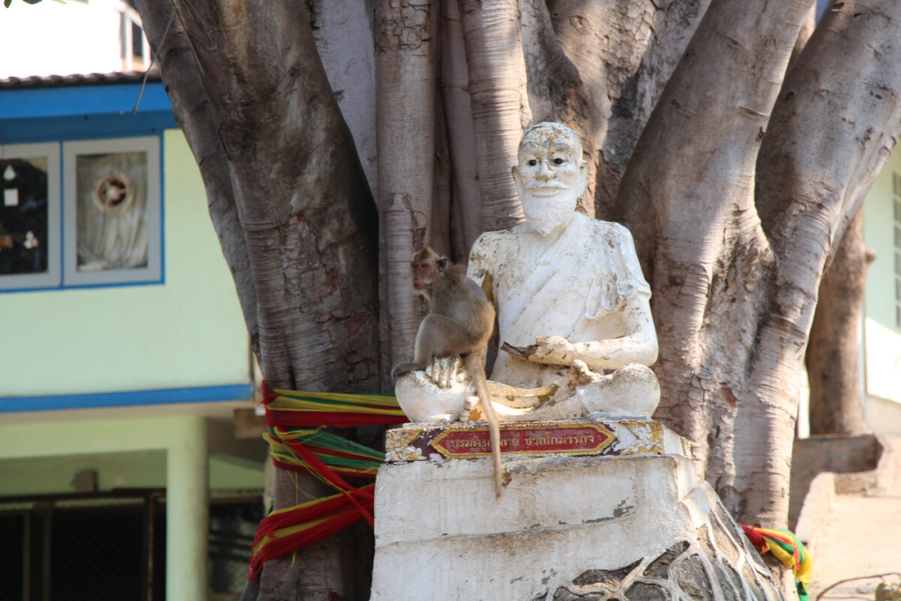
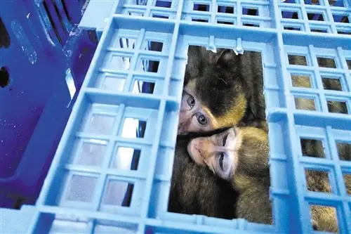

# 数百只恒河猴从泰国寺庙中消失，可能被贩卖至美国做实验

数十年间，泰国东北部宛萨喷县的丹法木河庙，一直是成群的恒河猴的家。每天早上，僧侣们用大米和水果喂它们，游客们则给它们香蕉，以及从当地街头小贩那里买来的种子。然而，近几个月来，当地人来送食物时注意到，迎接他们的猴子变少了。当地媒体报道称，有数百只猴子凭空消失了。

_（泰国曼谷寺庙的猴子）_

**有人夜晚进入寺庙偷猴子落网**

英国《卫报》2月26日报道，宛萨喷县首席警官普拉查·桑克朗说，官员们正在调查这个谜团。

2月中旬，有人看到三个人在寺庙里形迹可疑。普拉查说：“我们接到报警说，有人晚上进入寺庙偷五只猴子。”等到警察赶到现场时发现，其中两只猴子已死亡。

他说：“审讯时，这些人说他们觉得猴子很可爱，于是想收养它们当宠物。”目前案件还缺乏定罪的证据，来指控他们非法捕获贩运，案件仍在调查中。

普拉查称，近日寺庙消失的猴子越来越多，据不完全统计，有数百只猴子不知所踪。由于泰国森林范围过于庞大，目前还没有找到有效的方法统计猴子数量，猴子在树林中上蹿下跳，难以计数。警方猜测，寺庙猴子大量消失，有可能是因为季节变化，或者带水果的游客减少了，导致猴子迁徙到其他地方。

但是当地民众并不这样认为，他们担心，动物买卖才是猴子消失的罪魁祸首。泰国野生动物之友基金会的创始人埃德温·维克说，这些猴子可能被抢到边境去做买卖了。他说：“老挝那边的一些农场经常出现这种情况，以至于一些猴子甚至在当地灭绝。”

_（泰国北部洛伊省。）_

近日，泰国北部那空沙湾，警方逮捕了两名试图用镇静剂和食物诱捕9只猴子的男子。据报道，嫌疑人承认他们计划将猴子卖给柬埔寨的餐馆，他们预计每只猴子的报酬高达10万泰铢（约合19915元人民币）。

**泰国中部至少发生10起非法贩运猴子案例**

泰国自然资源与环境部野生动植物保护厅的官员阿内克·纳克索恩接受泰国媒体采访时表示，任何有猴子的地方都容易被猴贩子盯上，目前泰国中部至少发生了10起非法贩运猴子的案例。

他说：“无论是旅游景点还是非旅游景点，比如有猴子的寺庙，其实都在我们的监视名单上。”我们将在地方安装监控，以此作为预防措施。警方也可以通过监控第一时间发现行为可疑的人。”

阿内克介绍，那空沙湾那起9只猴子被盗的案例中，两人被捕后，官员们将这些注射了镇定剂的猴子转移到当地一个避难所，但其中一只死于镇定剂的作用，另一只被狗咬死。其余7只目前由国家公园部门照顾，恢复好后放回野外。当地人说，一只猴子之所以被狗咬死，是因为有人没关笼子。

一名卖猴子食物的小贩说，由于走私者一直在捕捉和出售这些动物，过去几年猴子的数量急剧下降。他说有时猴子父母被带走，留下幼崽只能饿死。

班普特菲赛居民表示，那空沙湾有座山曾经饲养了10万多只猴子，但由于这些走私团伙的存在，现在只剩下不到1万只。她说，官员们应该加强该地区的巡逻，在所有猴子都消失之前逮捕这些走私者。

**实验猴价格飙涨5到10倍**

自疫情出现以来，贩卖猴子（主要是长尾猕猴）已成为泰国日益令人担忧的问题。2022年，栖息地的丧失以及非法捕猎加剧，导致长尾猕猴减少。世界自然保护联盟正式宣布长尾猕猴为濒危物种。

动物保护专家表示，猴子的减少加上新冠背景下，美国实验室出现“猴荒”，猴子的身价水涨船高，于是一些贩运者打起了它们的主意。

疫情之前，贩卖猴子的情况并没有像现在这么严重。如今泰国野生动物之友基金会每两三周就会收到一次涉嫌贩运猴子的报告。

维克说：“在非法野生动物市场上，之前长尾猕猴的价格非常低，每只20或30美元，而现在价格上涨了5到10倍。”根据美国艾维克投资银行的估计，2023年，美国实验猴成本将上升到2万至2.4万美元。

_（猴子被捕后关在笼子里。）_

维克说，猴贩子通常每次捕捉不超过10只，“然后（他们）把这些抓来的猴子关在笼子里，或者放在袋子里，只要它们能在里面呼吸就行，直到(他们)等到有人拿货。”出货量从50只到100只猴子不等。

这些猕猴被运过边境，通常到了柬埔寨，然后以饲养的猴子的名义出口到美国。2022年11月，包括一名柬埔寨管理野生动物官员在内的8人在美国被捕，并被指控从野外捕获猕猴，将它们带到繁育设施，在那里获得虚假的出口许可，然后将它们卖给美国的实验室。据称共有2634只野生长尾猕猴被进口到美国，价值936万美元。

**“这是一种生物掠夺”**

灵长类动物学家、Peta（善待动物组织）高级科学顾问莉萨·琼斯-恩格尔介绍，与老鼠
、兔子相比，猴子最接近于人，也是用于实验最为理想的动物，得出的效果也更好。类似于传染性比较强、危害比较大的疾病就需要用到猴子，这也是近来新冠爆发后对猴子需求高涨的原因之一。

琼斯-恩格尔表示，美国正在打击此类犯罪。

美国制药集团公司查尔斯河实验室是世界实验动物最大供应商之一，上周，查尔斯河实验室表示，已收到美国司法部发出的传票，该传票涉及对柬埔寨灵长类动物供应的调查。

除了对猴子的非法贸易采取更严厉的行动，美国还通过了一项新的法律，即食品安全现代化法案2.0，该法案取消了药物在用于人体试验之前必须在动物身上进行试验的要求。

琼斯-
恩格尔说，如此一来，预测美国药品在猴子身上进行试验的成本将会变得更加昂贵。此外，把猕猴从野外移走有可能引发新的流行病，而且对生态系统和当地社区有害。猴子是捕食者也是猎物，还是种子传播者。它们其实是保护人类健康的缓冲器，而美国却把它们从东南亚的森林中偷出来。“这是一种生物掠夺”。

文/罗葳蕤

