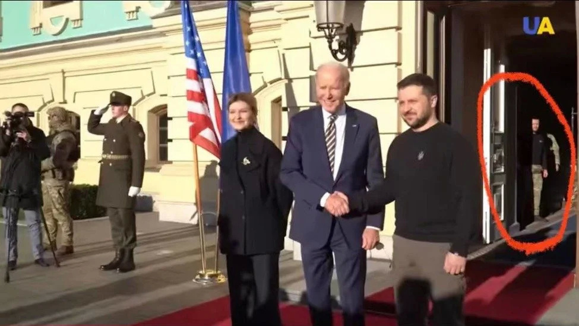
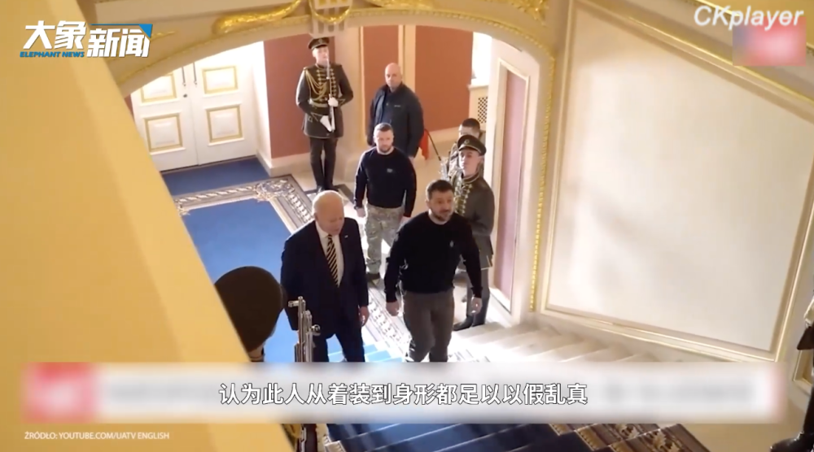
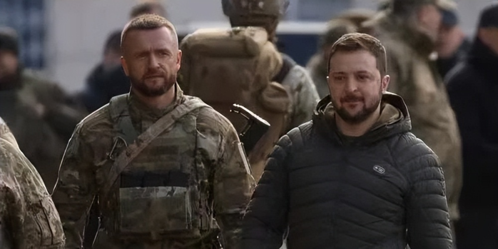

# 注意看：这个疑似泽连斯基“替身”的男人，其实是他的保镖

据波兰《事实报》公布的视频画面显示，近日会见拜登的泽连斯基实际是他的替身。

俄罗斯国家广播电视公司电视主持人索洛维约夫称泽连斯基的替身出现在了在拜登访问基辅期间的镜头里。

索洛维约夫称，这名替身甚至都没有躲起来，在所有公共活动中都与泽连斯基在一起，包括在与拜登会面期间。这是泽连斯基可以勇敢地前往巴赫穆特与赫尔松的原因。

替身看上去与泽连斯基有几分相似，专门在外露面以免被暗杀。只有在室内严密保护时，泽连斯基真身才得以出现。想来，演员出身的他对此应该非常内行。

不过，更为滑稽的是，居然有外国网友称，所谓的拜登可能也是替身。

乌克兰独立新闻社2月25日报道，俄罗斯顶级宣传员因找出了泽连斯基的“替身”而引发轰动，但事实并非如此。

报道称，被称为“替身”的人是泽连斯基的贴身保镖顿涅茨，他已经成为了乌克兰的全民偶像。

顿涅茨在TikTok上的人气非常高。乌克兰网友们纷纷表示，他看起来很有男人味，帅气且有担当。

（大象新闻、凤凰网等）

编辑：赵珊珊

