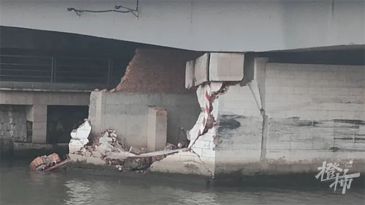
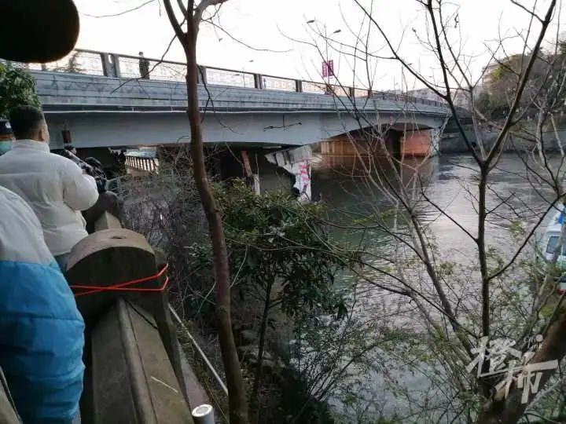
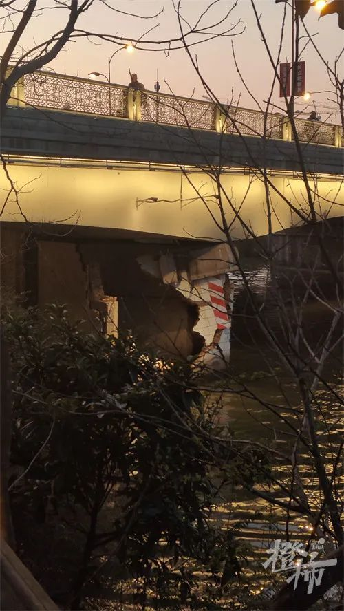
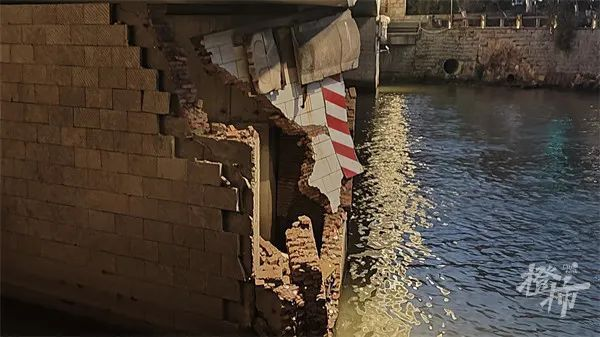
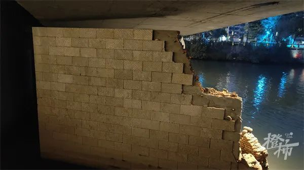

# 浙江杭州一货船撞上桥墩：受损桥墩外部墙体开裂，内部结构裸露在外

今天下午周大伯爆料，艮山运河公园，一条船撞了桥墩，桥墩被撞裂了。

橙柿互动记者陈彬现场核实： **艮山桥南侧桥墩东侧出现明显碎裂痕迹。**

傍晚5点50分，位于运河南侧、艮山桥东南侧的艮山运河公园沿岸，已经拉起了警戒线，有工作人员告诉记者，
**桥下沿河的游步道已经禁止通行，“这里有安全隐患，已经不能通过了。”**

橙柿互动记者看到，目前桥下仍有船只航行， **桥上车辆、行人正常通行。**

爆料的周大伯说，原来有一艘空船停在艮山桥东侧，不久之前被拖走了。

_周大伯 摄_

橙柿互动记者观察到，受损桥墩外部墙体已经开裂，但从近处观察内部结构，未能看出有损坏。

从近处看，部分砖体整块掉落水中。还有大块墙体挂在桥墩上，内部结构裸露在外。

对比未受撞击的北侧桥墩，正常来说是看不到桥墩内部结构的。

从现场来看，艮山桥南北两座桥墩，分别由大桥墩和小桥墩组成，两者并不相连，与桥面的支撑点彼此分开。这次受损的，是艮山桥南桥墩的小桥墩。

截至发稿前，游步道以及公园内的警戒线已经撤掉，行人可以正常在桥下通行。

具体事故原因，橙柿互动记者正在进一步了解当中。

橙柿互动·都市快报记者 陈彬

