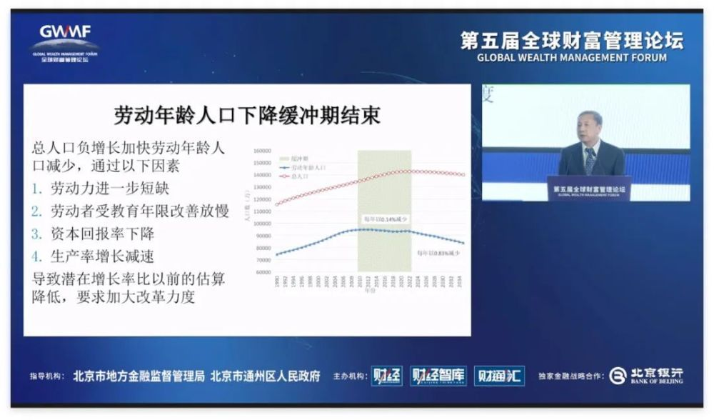

# 社科院专家：延迟退休核心不是晚一点领养老金，而是提高就业

在蔡昉看来，人口存量可以提供更多的机遇。

第十三届全国人大常委会委员、社科院原副院长、社科院国家高端智库首席专家、央行货币政策委员会委员蔡昉

2月26日，在由《财经》杂志、《财经智库》、财通汇联合主办的“第五届全球财富管理论坛——经济重构中的财富管理态势”上，第十三届全国人大常委会委员、社科院原副院长、社科院国家高端智库首席专家、央行货币政策委员会委员蔡昉表示，
**我们要关注人口负增长，但并不需要过于悲观，核心是创造条件，让其他因素也发生变化，用质量替代数量，用生产力替代要素投入。**

蔡昉进一步指出，更深度的老龄化带来的一个新的冲击——需求侧冲击，特别是消费需求逐渐成为经济增长的常态化制约，不是周期性，国际称之为“长期停滞”，其标志性表现是低利率、低通胀，低增长、高负债率。这些因素或许因疫情、通货膨胀有所改变，但最终还有可能回到本身发展线，这背后的根本原因是人口老龄化。当然，中国会以自己的方式表现出一定的特征，而我们的应对策略是从供给侧和需求侧同时发力。供给侧，我们的目标是挖掘生产要素的供给，让劳动力更充分，资本使用得更有效率，要素的配置效率更高；而需求侧，最核心的是促进全体人民共同富裕。

同时，蔡昉还针对“人口存量”、“创造性破坏”、“人口抚养比”等热议问题发表了观点。

**在蔡昉看来，人口存量可以提供更多的机遇。九亿多的劳动年龄人口等既是劳动力供给的源泉，也是消费市场的基础，通过改善收入分配，提高了这部分人的消费能力和消费意愿，国内大循环也就更具有可持续的动力与可靠性。**

创造性破坏方面，未来的生产力的提高更多地靠创造性破坏。而创造性破坏可以破坏落后产业，可以破坏没有生产力的企业、过剩的产能，甚至一些不再应该存在的岗位，但是不能破坏人。因此，我们需要建立一个覆盖全民、覆盖全生命周期的社会福利体系，它可以从社会层面保护住所有的人，让微观层面不再需要保护落后。

蔡昉表示，人口负增长、老龄化改变了一些东西，如人口抚养比。人口抚养比的含义是，劳动年龄人口能够支撑多少退休人员。人口抚养比在逐渐地变化，劳动年龄人口越来越少，退休人员越来越多，两者之间的比例就发生了变化。在人口负增长时代，人口抚养比发生变化更快。这根本地改变了社会保障体系的思路，养老保险、医疗保险都还具有现收现付的性质，在人口抚养比发生变化的情况下，现收现付制度就不可持续了，养老保险必须要有新的认识与新的设计。

**以下为部分发言实录：**

**蔡昉：**
大家上午好，在两位领导的致辞之后转入宏观问题，给大家提供一个背景，就是现在我国的基本国情发生了哪些重要的变化，可能不是根本的变化，至少方向性发生了变化。在这个基础上，微观经济活动有不同的表现，也应该有不同的策略。

讲了好多年中国人口就要转入负增长，到了真正确认中国人口转入负增长，我反而没有太多说了。但最近，在讨论中会遇到很多不同的看法，大家有不同的认识，有人说这个没有什么意义，没有根本性的变化；也有的人认为，这个引擎消失了还有下一个引擎。我认为，认识非常重要，所以今天重点讲一讲如何认识，认识确立了也就知道如何应对。

**我国进入人口负增长时代**

最新数据显示，中国人口的负增长时代已经来临，因为2021年我国的人口自然增长率非常低，是千分之0.34，接近于0。当时还不知道2022年的数据，也就不知道2021年不是峰值。去年，我们终于知道了自然增长率是负的千分之0.6，也就是说人口已经在减少，2021年就是中国人口的峰值，从那之后我国就进入人口负增长。有宣传报道中称，这是61年来的第一次，但与61年前的情况对比没有太大的意义，因为1960年我国遭遇了一些困难。所以我国人口负增长是冲击型，之后会反弹而且会有较大的补偿，但是这次人口负增长标志着一个新时代的来临，也就是说它是不可逆的。从此之后，我国人口就是每年都会减少，或许个别年份出现一点小波动，但这一趋势不可改变。

**从这也可以看到两个转折点：第一个是人口从正到负；第二个是老龄化进入到一个节点。**

国际上通常将60岁及以上人口占比超过7%的社会称为“老龄化社会”；超过14%成为“老龄社会”，也就是把“化”字去掉了；超过21%就是“高度老龄化社会”，日本就是高度老龄化社会。而预计我国在2030年会超过21%，实际上，我国在2021年就超过了14%，这意味着，我国不是走向老龄，而是进入到老龄化社会，其中有非常重要的两个点：第一是人口负增长，第二老龄化跨越了一个关键的节点。

怎么认识人口负增长？如何认识不仅影响认知也影响制定战略和策略。经济学讲实证，实证是把证据、经验、特征化事实告诉大家，怎么判断当然自己可以决定，不要简单地说，这种变化是好事还是坏事，它既可以是好事也可以是坏事，最重要的是认识到人口生育率自然的变化过程，讲人口转变就是指生育率从高到低的变化的过程，这个过程全世界都在发生。

把现在进入到联合国统计中的200多个国家放在这，横坐标是人类发展指数，也就是经济社会发展水平，包括人均GDP、预期寿命、受教育程度。纵坐标是总和生育率，人类发展水平越高，生育率也就越低，这是直接相关的。因此，发展的过程就是生育率不断下降的过程，但生育率下降到一定水平积累到一定的年份，人口就是负增长。中国在1992年总和生育率已经降到了2.1这个更替水平，也就是说，2.1以下就不能新成长和死亡的平衡，但它有一个惯性，这个惯性持续到去年终于进入了负增长，它是一个自然发展的过程。

中国也有一些特殊的国情，让这个水到渠成的过程，变得更复杂一点更紧迫一点。我国有未富先老的过程，生育率下降、老龄化、人口转入负增长都来得比人均收入水平阶段早一些，也就是，我国超前于发展中国家甚至中上发展中国家甚至超前于某些发达国家，这是一个挑战。另外一个挑战是，比原来的预期早。联合国根据各国政府提供的官方数据进行人口预测，直到2019年，它的预测还是我国人口峰值接近2030年才到，但现在发现提前了至少五年以上，这是一个不期而至的人口负增长。未富先老和不期而至两者叠加带来了额外的挑战，需要高度重视。

**一些人认为，中国不增长，被印度超过了，但我国还是世界上最大的人口国家之二，很多国家加起来也赶不上中国。我国劳动力人口9亿多也是任何国家赶不上的。但当人口对经济增长的影响的时候，这个经济增长指的是变率，是一个变化，而不是总量不是存量，因此讲经济增长要关注它的变化，影响经济增长的人口因素，正增长符号为正，零增长还是负增长，这三者之间是质的不同。**
举个例子，蓝色这条线是现在比较符合实际情况的人口的总量，现在已经到达了峰值。按照原来联合国的预测，那条虚线的部分，它预测的峰值要晚一些，从两者之间看，当我国的实际情况已经是负值负数的时候，原来脑子里想的那个还是正增长，但是这个正和负之间差别太大了，因此这些改变了我国的经济发展方向，改变了动能，枯竭了原来依赖的经济增长动力。比如劳动力，因为人口负增长以后劳动力增长也就进一步减慢，因此劳动力更加短缺，机器就要替代人，机器替代人太快了的投资回报率就要下降，我不断地引用白重恩教授的数据，这些年的投资回报率显著下降。

**简单而言，人的数量不够了质量可以补充，人力资本受教育程度可以提升，中国劳动力群体的素质是靠新成长劳动力改善的，是增量改善。**
因为新成长劳动力增长越快，总的人力资本改善速度越快，当人口负增长劳动年龄人口负增长的情况下，新成长人力资本减少，总量人力资本增长速度也会明显放慢，当剩余劳动力没那么多的时候，劳动力从农村向城市从中西部到沿海的转移速度也就放慢了，这个也就改变了劳动生产率提高的一个途径，
**过去劳动生产率的提高是靠资源重新配置，急风暴雨式的大规模的劳动力从低生产率转向高生产率，以后劳动生产率的提高越来越依靠有生略太创造性破坏，让没有生产率的死去，让有生产率的提升**
，它的方式也会转变，而后一种方式，这是更难的，这是又一个认识。

劳动力数量不足可以用质量来代替，提供更好的教育，前面我说了它在短期内这个还是负的作用，新成长的人少了，人力资本改善得也就慢了，还可以用机器替代人，用人替代ChatGPT还可以提高生产率，有人说它可以达到90%的水平，除了Top10之外依靠新的人工智能可以把那90%的人的生产率有所提高，这都对。但经济学的一个基本思维就是假设其他条件不变，因为并不是因为人口的数量减少了质量就随着数量减少自然上去，没有变，其他的都没变，只是数量减少。

举一个不太准确的例子，历史上有个晋惠帝，他在荒年的时候说老百姓吃不上粮食，皇帝说干嘛不让他吃肉丸子，大家都嘲笑这个思维，其实这个思维在这的含义就是说出现灾荒之前假设老百姓吃一半的粮食一半的肉，出现了荒灾，假设只是作物受影响了，畜牧没受影响，粮食都没了，肉泥还在，还可以吃肉，但是至少少了一块粮食，这就叫假设其他条件不变，但事实上其他条件也变，因为畜牧业牲畜要靠饲料喂养，因此作物减产了畜牧业也受到影响，这些都会下降。它的含义是既要关注人口负增长，不要认为它是耸人听闻，当然也并不需要过于悲观，而核心是要创造条件让其他的因素也发生变化，也就是说用质量替代数量，用生产力替代要素投入。

另外，遇到的人口负增长还有一个外来挑战——经历了三年疫情的冲击，我国经济宏观微观上都受到了一些损害，如从消费的层面看，家庭的资产负债表遭到了破坏，在很长时间里居民没有足够的能力也没有很强的意愿去报复性消费、补偿性消费，因此需求因素可能会不振，这是一个信心的问题，也是一个能力的问题。与此同时，
**当人口负增长的时候，从宏观上又设定了一个大格局，也就是说需求侧的冲击制约越来越变成了一种常态，因此短期复苏的需要和宏观背景变化造成的新的制约形成了同频共振，加大了经济复苏和长期经济增长的难度，这也是值得高度关注的问题。**

**供需两侧面临着的经济增长挑战**

2011年中国的劳动年龄人口就是15-59岁到达了峰值，从那以后就是负增长，因此劳动年龄人口负增长劳动力就短缺，成本就提高，企业的比较优势就下降，加上其他因素等等，做一个增长方程式的时候，所有的变量其实都变成了负的，合并起来那个左手边的因变量也就变成了一个不利的情况，从那之后中国的潜在增长率就是下降的，实际增长率也是逐年下降的。但是其实从2011年到2021年为止，在没有出现总人口负增长的时候，大家看这个阴影的部分，我国的劳动年龄人口的减少速度还是比较慢的，也就是缓冲期。但一旦总人口负增长，劳动年龄人口蓝色的这条线也就加速减少。所有在过去十年里遭遇过的供给侧的冲击今后都会以更大的力度来冲击，供给侧的冲击是仍然存在的，这是刚才我列举过的影响供给侧经济增长、影响潜在增长率的一些因素，劳动力、人力资本、资本回报率、劳动生产率的提高速度等。

如果，我国供给侧的冲击，过去部署供给侧的结构性改革，应对那种新常态还有一定的经验，并且过去十年是成功的，但人口负增长更深度的老龄化带来的一个新冲击是以前我们没有重视，也不太有经验的——就是需求侧冲击，也就是说需求特别是消费需求越来越成为经济增长的常态化制约，不是周期现象。

经济衰退的时候无非就是需求不足，都是周期现象，但现在不是周期现象，在国际上把它叫做“长期停滞”，标志性的表现就是低利率、低通胀、低增长、高负债率，这些因素或许因为疫情因为现在的通货膨胀会有所改变，但是最终还有可能回到这样，根本原因就是人口的老龄化。

中国也许会以自己的方式表现出一定的特征，在过去这些年里我国的经济增长速度、人口增长速度还有居民消费是同步下降的，同步下降到未来再往后展望，有一些因素就进入到负增长了，对经济对消费需求的影响一定是力度更大，这些都应该值得注意，因此应对策略是从供给侧和需求侧同时发力，既推进供给侧结构性改革，过去说从需求侧大多数讲管理，宏观经济政策针对需求侧进行需求侧管理，未来也有相当多的改革，特别是党的二十大部署的改革任务里有很多属于需求侧的改革或者供给侧需求侧相统一的改革。

最后，列举几个改革。

**从供给侧，目标是要挖掘生产要素的供给，如何让劳动力更充分，如何让资本使用得更有效率，要素的配置效率更高，无非就是投入和生产率。**

第一，劳动力。因为很多对中国经济进行预测的人都认为中国经济将来不会太快，甚至有可能赶不上美国，其中最主要的因素是说中国人口老龄化，劳动力供给是负的，但是说错了，从劳动年龄人口来看它是负增长，
**但是对中国来说，新增劳动力核心是从农业向外转移，把处于剩余状态的劳动力转向生产率更高的就业岗位。**
国际上，随着经济发展水平的提高，农业就业比重是下降的，比如发达国家的就业比重平均是3%，我国的农业就业比重是23%，因此最多的情况下，未来走向现代化的途中可以转出20个百分点，而一个百分点对应的就是700多万劳动力，潜力其实比很多国家的劳动年龄人口的正增长还要大得多的多，大家可以随便算一算，一个百分点相当于好多国家的全部劳动力，20个百分点，很多集团国家加起来的总量都比我国低。

第二，市场主体要更加方便地进入和退出，让他们根据生产率来决定他们要不要进行继续生存，要不要退出，这就意味着创造性地破坏优胜劣汰，这是我国未来提高生产率的主要途径。除此之外，
**劳动力供给还有延迟退休年龄等，当然对这批人的核心不是让他们晚一点领取养老金，核心是提高他们的就业能力，让他们能够增加收入，提供更多的劳动力供给，做出更多的贡献。**

第三，需求侧来看，
**最核心的就是促进全体人民共同富裕，而这个共同富裕第一个是提高居民收入特别是低收入群体的收入水平，扩大中等收入群体，同时使城乡之间、地区之间、不同所有制之间、不同职业身份之间、不同家庭之间的基本公共服务供给均等化**
，这些东西都得到逐步提升的情况下，消费能力就提高了，消费意愿消费倾向也会相应地提高，因此可以打破消费制约的瓶颈。

很多人关心人口的增量，也有人关心人口的存量，其实增量和存量各有特色，增量可能多一些挑战，存量的确可以提供更多的机遇。我国有14亿多人口，有9亿多的劳动年龄人口，这些因素是劳动力供给的源泉，也是消费市场的基础。通过改善收入分配提高了这部分人的消费能力和消费意愿，就意味着国内大循环更具有可持续的动力，更具有可靠性。除此之外，前面我说了未来的生产率的提高更多地靠创造性破坏，但是可以破坏过时的产业，可以破坏没有生产率的企业、过剩的产能甚至一些不再应该存在的岗位，但不能破坏人，因此建立一个覆盖全民、覆盖全生命周期的社会福利体系，它可以从社会层面保护住所有的人，与此同时能够让微观层面不再需要保护落后。

第四，人口负增长、老龄化改变了一些东西，同时也改变了人口抚养比，人口抚养比的含义是劳动年龄人口能够支撑多少退休人员，人口抚养比在逐渐变化，劳动年龄人口越来越少退休人员越来越多，两者之间的比例就发生了变化，人口负增长时代这个比例发生的变化更快，因此，
**要根本的改变社会保障体系的思路，基本养老保险、医疗保险都还具有现收现付的性质，在人口抚养比发生变化的情况下，现收现付制度就不可持续了**
，就像前天周小川行长讲到的养老保险必须要有新的认识与新的设计，谢谢大家！

**张燕冬：**
我想问两个问题。这几年，一直跟您保持沟通，在经济各方面的观点。关于“中国人口会步入负增长”，您在前几年不断呼吁要求要怎么样去避免，政策要怎么样配套，但现在真的负增长，您好像比过去显得坦然了，这是为什么？是因为存在就是合理的思维，还是要去想新的应对方法吗？谢谢。

**蔡昉：**
其实大家都说改革，说政策调整，说制度建设。这些因素的核心是动力有多强，关键在于制度需求。过去都说，幼稚性的制度变迁，其含义是如果有足够强的制度需求，这个改革的成本相对低，收益相对大，净收益就是正数。因此，当目前人口为负增长已经出现了，从思想上，可以认识到人口负增长是与过去不一样，也能够认识到在哪些具体的领域挑战是什么，有多大。在这种情况下，相应的制度创新、制度建设就会被诱发出来。所以，终究还是要走到这一步，这是一个自然过程，既然走到，就应该提高人们对它的认识，深入研究，相应的新的办法就可以涌现出来，甚至过去在设想改革没有想象到的一些东西，现在也可以实现了。

举一个例子， **都说劳动力不足要用人力资本来替代，越是发达的经济体越是依赖人力资本，而不是依赖体力劳动。**
历史上，有过很快的人力资本的积累，主要靠两个：第一个是普及九年制义务教育，这是大规模的急风暴雨式；第二次是高校的扩招。这两个因素过去了，未来提高人力资本。一般经济学家就用人均受教育年限来代表人力资本，如何再提高人均受教育年限，我认为是延长义务教育时间，向前延长三年到学前，当然，那个时候就可以把儿童的理财用上，向后延长三年，把高中纳入义务教育。而义务教育的含义是第一免费；第二在适当的情况下带有强制性。这样的情况下，就可以在新成长劳动力，虽然人少但是他们的受教育时间更长。

过去只说便宜话，特别是政府官员会说学者只会说便宜话，各个方面都需要钱。算一个账，人口负增长意味着我国抚养比就改变了，其中还有一个义务教育抚养比，就是应该受义务教育的人口和能够支撑他们的劳动年龄人口之比，在未来到2035年之间每年以2.2的速度降低。与此同时，按照新的测算，中国未来的潜在增长率是可以达到4%以上的，到2035年之前。保持公共教育支出，不算老百姓支出，公共教育支出占GDP4%这个标准，未来到2035年之前至少每年以4.3%的速度增长，因此教育的财力基础是4%点几的增长速度，负担率是2.2的负增长速度，这是个机遇，扩大义务教育是完全可为，这就是带来的新的机遇。

**张燕冬：**
您刚才回答的问题是供给侧和需求侧结合的这个点面，从发达国家工业革命中期和后期的经历来看，他们在社会矛盾非常冲突、农村人口大量进入城市的过程中，事实上提供了强有力的公共服务，而且逐渐将社会向半福利社会过渡。现在，中国也面临着这样的问题，要解决老百姓的后顾之忧，这是核心问题。而您刚才讲到的教育，如果实行义务制教育以及解决养老保险医疗等方面问题，公共财政的支出比例将会扩大。现在经济的复苏比较艰难，在这种情况下，今年外需又不好，又要把前途落到建设性，同时公共支出为老百姓提供的公共服务也要增加，这种悖论怎么解决，因为这个问题很多人都在提，尤其是您提的非常多，但始终很难看到有突破的地方，有请。

**蔡昉：**
人口负增长其实带来一些新的机遇、新的思路和新的紧迫性。大家都知道福利国家最典型的是北欧国家，北欧国家福利国家的产生的一个重要的机缘就是他早在上个世纪的三十年代就出现了人口的停滞，虽然不能算负增长，但是人口停滞，
**在那个时候大多数人还认为人口减慢是好事，但是尼尔达尔这些人就看到了人口停滞对经济是不利的，英国的凯恩斯也看到人口停滞对经济增长是不利的，美国的汉森也看到了同样的问题。这些人形成了通过建立福利国家改善收入分配能够保持居民的消费能力和消费意愿对于经济增长是有好处的，所以这些学宏观经济学的都觉得凯恩斯是宏观经济学的鼻祖，是研究周期问题的强调需求侧，凯恩斯其实本来有机会创造一门以需求侧为核心的长期增长理论，但是他错过了，最后他说了一句不该说的话，说长期看“我们都死了”。**

事实上，未来的长期增长应该更加关注需求，而制度建设对应的就是建立中国式福利国家，这个福利国家强调一点，当讲福利国家的时候就是基本公共服务，但用福利国家这个概念虽然有人不爱听，大家不习惯，但是它的核心是说它有一些共同的经验、共同的教训，这样就可以放在一个共同的框架中去认识它、研究它。谢谢。

