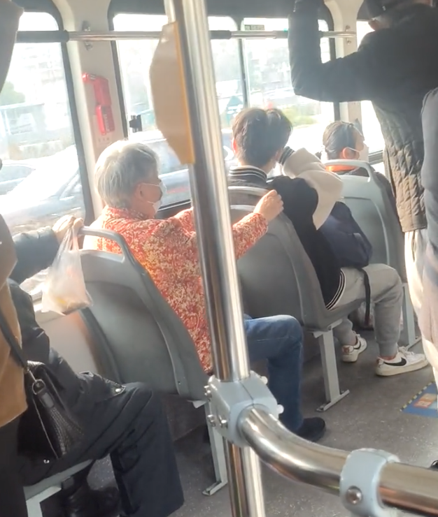
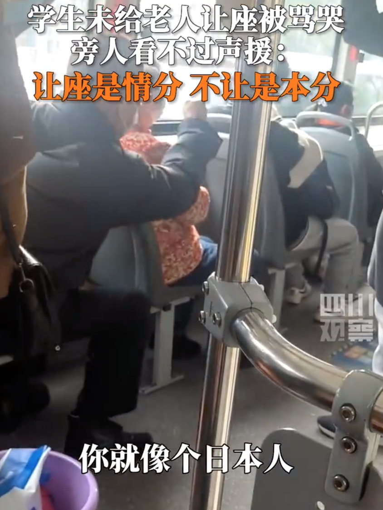
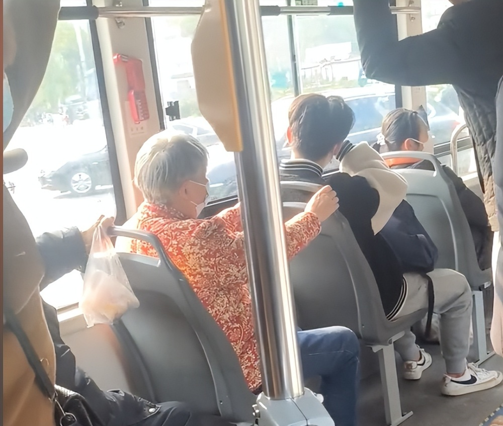

# 长沙一学生在公交车上未让座被老人骂哭，目击者：老人不仅辱骂还打人

2月26日，根据四川观察报道，2月25日在湖南长沙，一公交车上男学生因未给老人让座，被老人骂哭，引发网友热议。

根据目击者拍摄视频显示，一名戴着帽子的老人，对着坐在其前面的男学生破口大骂：“让老人站着，像什么话，你是个什么东西，你有觉悟吗？混蛋！”

老人恶劣的言语让被骂的男孩在座位上偷偷抹眼泪。

公交车上的其他乘客看不过，与大爷讲理：“大爷，让座是情分，不让是本分，现在的学生压力也都很大的。你说得这么过份，有必要这么上升吗？”也遭到老人的恶语相向：“你给我滚蛋，你滚蛋，你没有资格讲话。这是国家规定的，老年人座位。”

视频拍摄者还表示，老人称男孩不让座位是卖国贼，不止把男孩说哭了，还动手打了男孩，一位老奶奶看不下去了，主动跟男孩换了位置，让男孩坐到了前面。

对此，网友也纷纷表示“让是情分，不让也不违法”，“可以让座前提是你值得我尊重”。

**【来源：九派新闻综合四川观察、拍摄者社交账号、网友评论】**

