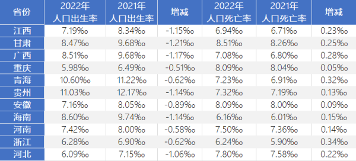

# 11省份去年常住人口变动一览：出生率全部回落，河南河北减少39万人

全国人口负增长的背景下，各省份常住人口变动情况引人关注。近段时间，陆续有11个省份公布了2022年末常住人口规模和人口出生率数据，浙江、安徽等9省份实现正增长，合计增量约为86.04万人，河南、河北2省份人口减少，合计规模达-39万人。

_2016年10月2日，浙江省杭州市，杭州西湖断桥人头攒动。_

常住人口正增长的省份中，浙江以37万人的增量领跑，安徽、江西、广西的人口增量都达到10万级，分别为14万人、10.58万人和10万人。另外，海南去年末常住人口增加6.56万人，贵州增加4万人，甘肃增加了2万人，青海增加1万人，重庆增加0.9万人。

其中，浙江、安徽等省份人口规模的扩大得益于机械增长。如浙江去年自然增加人口仅为0.3万人，新增净流入人口规模约为36.7万人，而安徽自然增长人口为-5.7万人。

目前公布了2022年末常住人口变动情况的省份中，河南2022年末常住人口比2021年末减少11万人，与2021年减少58万人相比，降幅缩小；河北2022年末常住人口比上年末减少28万人，与2021年减少16万相比，降幅扩大。

另外，相较于上一年，上述11个省份2022年人口出生率悉数下降，人口死亡率普遍略有上升。

