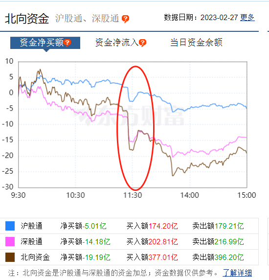

# A股盘中跳水！春季行情进入鱼尾阶段？4个原因致超3900只个股下跌

中国基金报 泰勒

兄弟姐妹们啊，今天这个行情依旧低迷，中午还一度跳水，全天成交只7500多亿，超3900只个股下跌，头都摇断了。

三大指数今日继续调整，创业板指午后一度跌超1%。今日成交7541亿元。截止收盘沪指跌0.28%，深成指跌0.73%，创业板指跌0.79%。

两市共1057只个股上涨，3915只个股下跌。

按照马后炮的惯例，依旧来找找原因。

第一、2月月底了，市场资金偏紧张，国债逆回购最高摸到了5%，交易所逆回购利率大幅攀升。上交所GC001触及5.4%，深交所R-001利率触及5.33%。一定程度影响了市场。

第二、北上资金流出，中午的时候一度出现直线砸盘。

第三、上周五，美国公布的1月PCE物价指数加速增长，美联储加息50个基点的风险正在上升，市场分析，接下去如果美元继续升值、人民币贬值，也会导致外资流出。

第四、春季行情进入鱼尾阶段。中信建投陈果老师昨晚分析了。当前美国延续韧性的家庭消费支出下PCE超预期回升，市场对于联储的紧缩预期得以强化，美元、美债的连续走强也扭转了人民币升值趋势，外资结束连续14周净买入，此外，地缘政治风险与城投债波动对投资者情绪周期的影响同样值得警惕，从多方面因素综合评估，本轮春季行情正进入难赚钱的鱼尾阶段。

