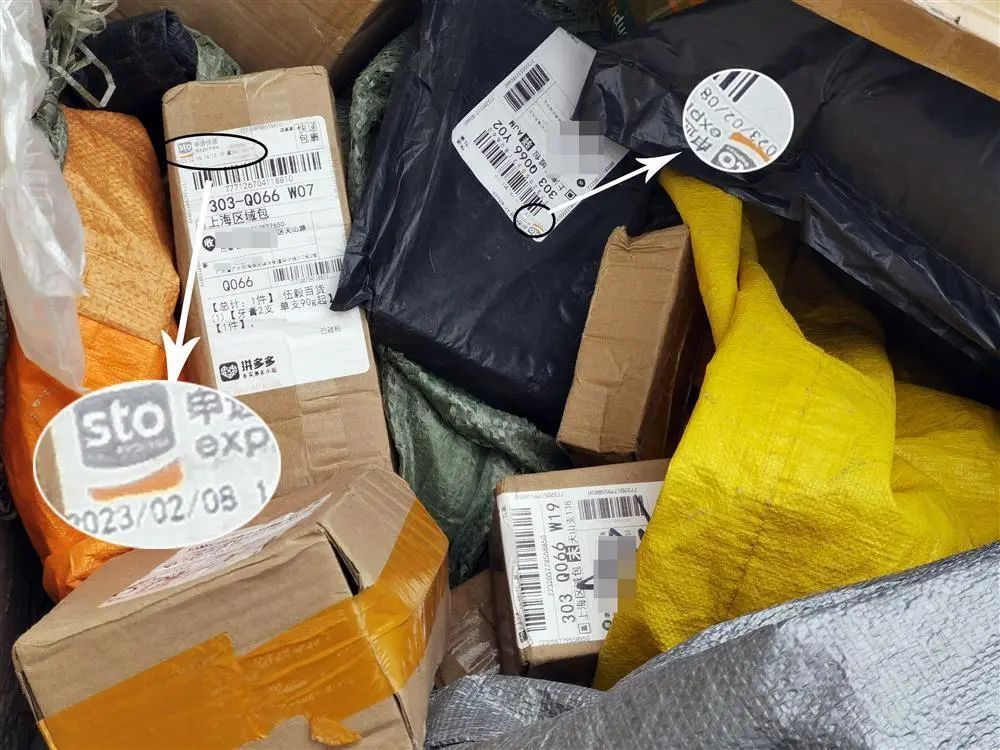
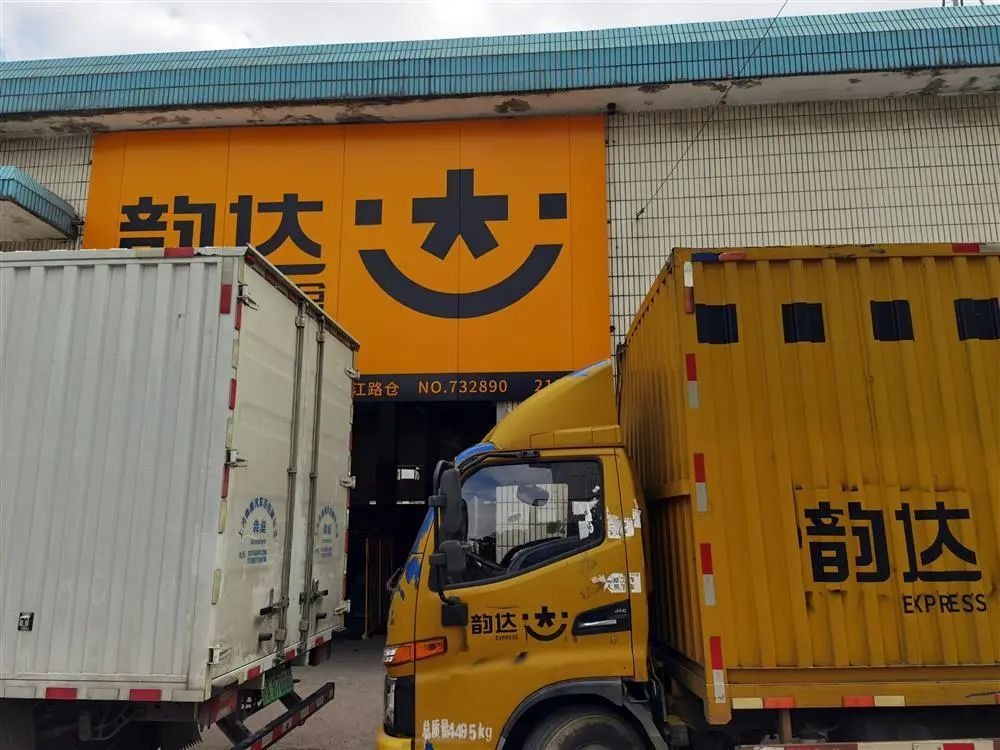
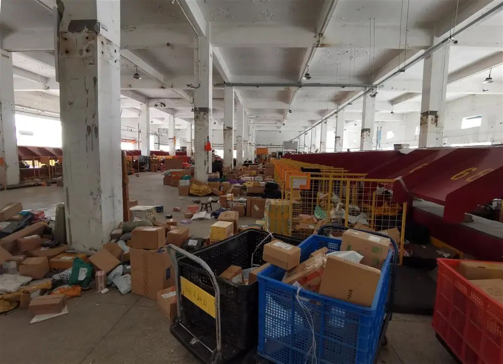
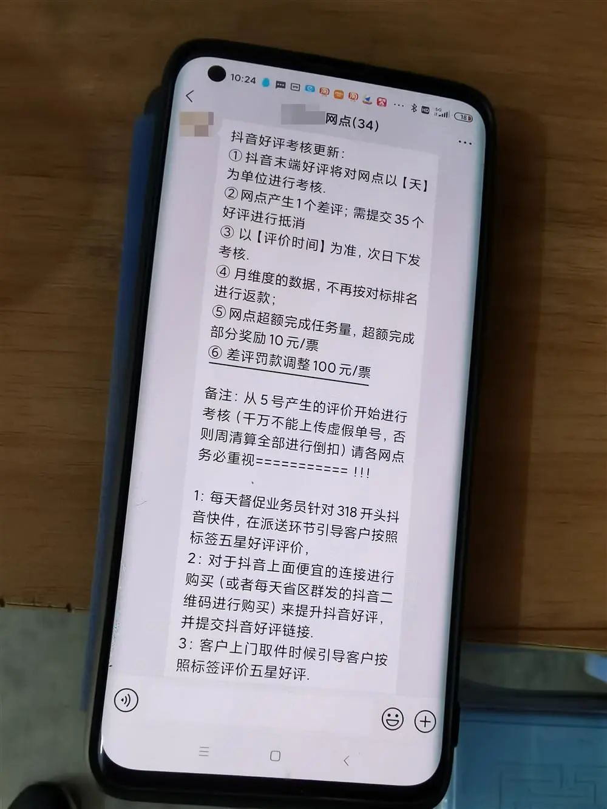

# 上海市民吐槽“包邮区”快递10多天没送到，客服：那你投诉去吧

你最近网购了吗？快递多久能收到？春节假期后 **多家快递企业的快件积压和派送延迟现象，在互联网上发酵。**

一些快递企业在回应中称，之所以出现积压与延迟，是因为个别网点员工节后返工不及时、疫情影响仍在持续，出现了短期人手不足现象。快递企业承诺将尽快采取措施，清理全部积压快件。

半个多月过去了，上海的快递派送服务恢复正常了吗？记者通过12345市民服务热线了解到，快递服务仍然是目前市民的投诉焦点之一，
**每天仍有大量市民反映快件迟迟未派送、快件破损或丢失纠纷不能解决等等。**
粗略统计，从2月1日至2月20日，仅“12345”就收到市民相关投诉逾17000例，行业问题非常突出。

事实上，每年春节过后，末端网点普遍面临人手短缺，都是快递行业最为紧张的时刻。但从快件积压和延误情况来看，今年的形势似乎更为恶劣。这背后，除了人手短缺，是否还有更深层次的原因？

**浙江寄上海，10多天还没到**

江浙沪“包邮区”寄快递“隔天到”，再远的区域则三天左右到，是不少上海市民对于快递服务的惯常印象。但最近两个快递的时效，“刷新”了汪先生的认识。他在天山西路一家企业上班，2月上旬他在网上给自己购买了一双鞋子和一条短裤，商家陆续通过申通快递发了货。
**没想到，在路上走了10来天了，鞋子和短裤仍不知道在何处。**

汪先生的另一个单号为“773205119452280”的件情形类似， **2月9日**
从广东中山寄出后，同样一番折腾后于2月15日抵达申通“上海虹桥机场公司”，此后一直未能正常进入派送流程。2月20日前后，汪先生两次通过“12345”，要求催促申通派件，但迟迟未有回音。眼看着购物平台即将自动确认收货，
**2月21日** ，他以“未收到货物”为由在购物平台上发起了退款申请……

“疫情也平稳了，春节过去都快一个月了，到底怎么回事？”市民徐女士2月9日托家人从老家辽宁，通过申通寄了一份重要物品到上海虹桥商务区中骏广场，该件直至2月20日件依然没有送到。期间，她多次拨打“12305”，并转接到申通进行催派。申通对于延误的解释是“运力不足”，她要求申通提供网点地址以便于她自取，被申通一口回绝。
**一来二去，客服索性扔了一句“那你投诉去吧”，便挂了电话。**

除了申通快递频被投诉之外，记者梳理大量“12345”投诉发现，韵达快递也仍然是投诉的主要对象。从2月8日至2月15日期间，市民吴女士多次通过“12345”反映，称她相继有4个外省市发往上海的韵达快递，抵达“徐汇区美罗城公司”后均长时间卡在了“派送中”。如单号为“433035639632383”的韵达快件，1月31日就从广东发出，2月4日上午抵达徐汇区美罗城公司后就显示开始派送，但吴女士一直没有看到件在哪。反复投诉后，2月15日，该件才转由“富民公司”重新派送，抵达吴女士手中。

此外，目前，EMS、圆通等其他几家快递企业也仍然收到零星的投诉。

**快递延误多因区域网点异常**

快递派送异常，是否只是因为“人手短缺”？记者顺着上述几则投诉的快递物流记录进行了调查。

**汪先生和徐女士的申通快件，长时间卡在了申通“上海虹桥机场公司”。**
搜索网络信息显示，申通虹桥机场公司位于闵行区北翟路3318弄118号，这里是闵行区华漕镇的王泥浜村。2月21日，记者沿着村主干道一路向北，在很里侧近博恒路处，找到了虹桥机场公司所在处。院子里停了两辆卡车，卡车旁的空地上，多处散落着或成包、或拆散的快件，凌乱地堆在地上，少说有数百上千件。仔细查看快件面单，这件快件大多是2月5日、2月8日时发出的，快件看着已灰扑扑，应是堆在这时间不短了，积压的情况可见一斑。

_△申通“上海虹桥机场公司”院子里停了两辆卡车，卡车旁的空地上，多处散落着或成包、或拆散的快件，凌乱地堆在地上。_

_△仔细查看快件面单，这件快件大多是2月5日、2月8日时发出的，快件看着已灰扑扑，应是堆在这时间不短了。_

往院子里走，一辆卡车货厢挨着厂房样的分拣操作间，车上快件刚卸了一半。操作间很大，除了车身旁刚卸下来的快件之外，操作间里快件可谓“堆积如山”：入口处还是一堆堆零散堆放，到里侧则杂乱地垒在一条传送带两侧，
**大量成包的快件还没有来得及拆包，积压的量少说有数千件。几名妇女坐在“快件山”中，他们自称是200一天请来的临时工**
，正在分拣积压件，将收件人不要的要退回的电商件理出来重新打上面单。

_△2月21日，申通“上海虹桥机场公司”分拣操作间里快件可谓“堆积如山”。_

怎会如此大面积积压？办公室一名工作人员解释：一是招工不顺导致复工晚；二是由于人手不足和派件距离较远等原因，该网点正将长宁区域的派件业务分离出去。据另一名工作人员称，申通总部仍然按照此前的模式分配快件，超过了网点的派送能力，导致了大量积压。“已经在将长宁区域的件拉走了，再有个三四天应该能把积压件处理完毕”，工作人员辩称。

**而韵达这边，记者也找到“徐汇区美罗城公司”的经营者**
，弄明白了吴女士的件卡在“派送中”的原因。美罗城公司位于肇嘉浜路853弄小区里侧，该网点负责周边100多个小区和40余个商务楼的快件收寄派送，日均经手快件量在2500件左右，雇用了10名快递员。2月21日记者在现场看到，场地里已空空如也，快递员的电瓶车都停在了车棚里。经营者称，该网点从2月5日起就已停止了运营。

据称韵达从去年年底起，在徐汇区启用了“网格仓”模式，即将快件直接运至设于临江路的网格仓，加盟公司快递员直接到网格仓取件开始派送，不再由加盟公司用车直接从青浦拉回快件自行分拣。美罗城公司经营者称，韵达给他的派件费是1.9元每件，而他给到快递员的则是1.4元每件。改用网格仓模式后，韵达每单派件额外收取了0.3元的费用，这大大压缩了网点的派件利润。加之年后快递员只回归了7名，韵达又出台了派件超过36小时则无派费的惩罚规定，一系列因素促使下，
**美罗城公司决定停止运营。**

_△图为韵达位于徐汇区临江路的网格仓。_

据称，尽管美罗城公司2月5日已停止运营，但在临江路的网格仓里，快件仍源源不断分配往属于美罗城公司的5个格口，无人配送导致快件一度大量积压。

**“网点异常”情况胜于往年**

投诉量这么大，这是否意味着今年春节后，快递企业出现问题的网点很多？

以韵达为例，官网显示， **韵达在徐汇区共设有9家公司。据记者了解，春节后除美罗城公司外，港汇公司也停止了运营。**
2月21日，记者在韵达徐汇区临江路网格仓里看到，前期积压的快件韵达已调配其他区域快递员基本清理完毕。尚在运营网点的格口运作有序，传送带正自动地将快件分配到格口里，但美罗城公司和港汇公司的格口依然空着，韵达只能暂时关闭两家公司所负责区域的快递业务，以避免出现快件积压。

_△2月21日，记者在韵达徐汇区临江路网格仓里看到，前期积压的快件韵达已调配其他区域快递员基本清理完毕，尚在运营网点的格口运作有序。_

一些韵达网点的经营者向记者透露，尽管韵达公开回应称“关停2000多个网点的消息不实”，但实际上 **经营上出现问题的网点是不少的，数量上远胜于往年。**
快递企业总部运营成本向网点转嫁后，导致网点经营出现困难，一些网点虽然尚未停止运营，但也只是勉力维持。究其深层次原因，网点经营者们认为与快递行业的低价恶性竞争、利润率太低不无关系。

另一方面，多名网点经营者反馈， **今年春节后招人难的现象也较为突出。**
快递员尽管收入不算低，普遍每个月都能拿到上万元左右，但是随着快递企业经营压力增大，对于快递员的处罚措施也愈发严厉。“淘宝的物流投诉、消费者的热线投诉，最终都会落到对快递员的处罚，快递员一个月被罚上千的都有”，一名经营者称，快递员觉得“受气”转而去送外卖的现象不少见，“春节都过去一个月了，按照往年的节点，招人早都结束了。现在还讲人手紧缺，就是招不到了。”

_△随着快递企业经营压力增大，对于快递员的处罚措施也愈发严厉。图为一家快递企业针对某短视频平台快件的考核规定。_

**大量投诉背后确实暴露了快递行业的一些深层次问题。**
快递行业专家赵小敏向记者分析，快递行业的发展高度依赖电商的高流量，但“去年是个分水岭”。随着电商自身的发展遇到瓶颈，快递行业面临的挑战也是过去五六年来最大的。接下来几个月是快递行业的淡季，局部产能过剩、企业经营差异进一步分化拉大，都会给快递网点的经营带来更大的压力。在这种情况下，快递企业应该跳出原有的运营理念，采取一些新的战略和行动，经营要以市场和末端为中心。如果还是依靠单一的价格战模式应对，无疑会损害品牌，带来更大范围的网点波动，进而造成新一轮快件积压、延误等现象发生。

赵小敏建议，邮政管理部门应该关注到快递行业的变化，督促相关企业主动采取措施，针对可以预见的网点波动应该要有预案，以保证快递服务质量，维护消费者的权益。

**解放日报·上观新闻原创稿件，未经允许严禁转载**

作者：毛锦伟

