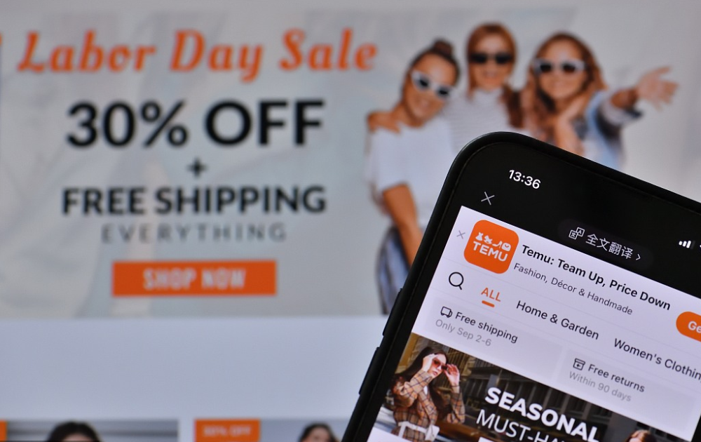

# 两家中国公司改写美国电商格局？价格战、洗脑神曲，TEMU照抄拼多多

_来源：视觉中国_

**划重点：**

  * _1_ 前期以“低价+补贴”策略快速进入新市场，随后通过“烧钱”的营销手段，提高用户感知度及客单价；TEMU正通过复制拼多多的“打法”开拓北美市场。
  * _2_ 在TEMU整个跨境电商链条里，商家的备货量决定了平台SKU的丰富度，而商家能将价格压多低，很大程度决定了TEMU的交易量和未来的利润率。能否让供应商和平台一起成长、赚钱，是TEMU能否快速开拓其他海外市场的变量之一。
  * _3_ 只要TEMU“低价+补贴”的策略不变，没有工厂或者直接从1688选品的“中间商”就面临被逐步淘汰的窘境。
  * _4_ 由于TEMU的杀入，SHEIN压力陡增。SHEIN正洽谈筹集30亿美元的融资，其估值已从此前的1000亿美元降至640亿美元。

**作者 ｜ 张睿 编辑 ｜ 康晓**

**出品 ｜ 深网·腾讯新闻小满工作室**

半年前，当拼多多低调杀入美国市场，业界普遍并不看好，毕竟阿里巴巴、京东等巨头在海外也收获甚微，但TEMU的快速崛起超出预期。

从上线到访问量7000多万，拼多多旗下跨境电商平台TEMU只用了5个月的时间。美东时间2月12日，TMEU的广告片《Shop like a
Billionaire》登陆NFL年度总决赛（超级碗），据推算，亮相2次的TEMU 要花费1400 万美元，近1亿人民币。

拼多多正在美国市场像素级复制国内的打法。《Shop like a Billionaire》风格像极了此前拼多多在国内打造的广告洗脑神曲《好想你》。

从最近三个月访问量来看，美国老牌本土电商网站Wish如今已被TEMU和另一家来自中国的公司SHEIN远远甩在身后。

据《深网》观察，拼多多前期以“低价+补贴”策略快速进入新市场，随后通过“烧钱”（百亿补贴等）的营销手段，提高用户感知度及客单价，是其快速崛起的利器之一；从拼多多在“超级碗”上一掷千金可以看出，TEMU正通过复制这一方法论，迅速开拓美国“低价”生活消费市场。

**值得注意的是，撑起TEMU发展速度的，不仅在于拼多多复制了自己过往的成功经验，也包含背后庞大供应商群体的配合，供应商保证了TEMU商品在价格和SKU丰富性上对海外消费者的吸引力。**

**由于TEMU掌控核价权，供应商在合作中颇为被动，供货被不断压低价格，赚钱并非易事，目前，已有部分商家因不赚钱对未来持怀疑态度。**
“前期我们上TEMU是为了清库存，但这仅是我们基本需求，如果账面长期打不平甚至亏钱，慢慢就没了运营TEMU店铺的热情了。”有TEMU平台商家对《深网》表示。

**“全面复制拼多多”**

在快速崛起的TEMU身上，能看到拼多多的影子。

**首先，通过“社交裂变”实现新用户快速增长，是拼多多的传统手艺，TEMU也把这套玩法搬到了美国市场。**

TEMU推出早期，用户邀请5位新用户下单，自己可以获得 20
美元奖励，后期要得到这一奖励需要邀请7位新用户下单。现金诱惑让TEMU的这一玩法在Facebook、Instagram上相关社区流行开来，这也为TEMU带来了一波新用户。

新用户打开TEMU后，会发现各种折扣和优惠政策扑面而来，此时，拼多多惯用的“低价+补贴”策略开始发生化学反应。

上线之初，TEMU新用户前三单可以获得30%的折扣，并获得免费配送服务。而据TEMU老用户反馈，三单之后，老用户还能领取40%的折扣码，每单最多减40美元。

在商品价格方面，大部分日用家居类商品都在10美元以下；鞋、袜、帽子等配饰类价格集中在0.49-3美元之间；大多数女装商品价格集中在3-20美元之间。“衣架、台灯、餐具等小物件性价比超高。”曾有TEMU美国用户对《深网》反馈。

**当然，“社交裂变”仅是获取新用户的第一步，过往的经验证明，砸广告“烧钱”获客才是用户指数级增长的直接途径。**

据similarweb数据显示，今年1月，TEMU网站版流量大头来自直接流量（Direct），即用户直接访问temu.com网站，流量占比为45.78%，而转介绍流量最少（referrals），为1.1%。而在Google
Play中，TEMU APP主要流量来自搜索（Search），占比为60.1%；来自显示广告（Display Ads）的流量为0%。在Display
Ads上缺乏用户感知度，这也部分解释了TEMU为何会重金投放“超级碗”。

“超级碗”被称作“美国春晚”。根据 NFL 官方数据，2022 年“超级碗”的观众总数为 2.08
亿，接近美国人口总数的三分之二，广告曝光度极高。根据咨询公司 Kantar 测算，广告主在 2022 年超级碗上每投放 1 美元，就能获得 4.6
美元回报。

虽然目前不能测算TEMU此次广告投放的ROI（投资回报率），但同行却从TEMU的这一举动看到了野心。

**“两家中国公司的决战”**

从访问量看，上线仅5个多月，TEMU的访问量已经超过同样主打性价比的Wish。Wish
2011年成立于美国，创办之初就以低价模式聚焦全球的下沉市场。据Wish
2022年Q3财报显示，截至2022年9月30日，Wish注册商家超过25万，销售业务覆盖60多个国家，月活用户超过2500万，其中85%的买家来自北美和欧洲地区。

**不过，TEMU的对手从来不是Wish，在“一超多强”的美国电商市场，亚马逊和SHEIN才是TEMU进军海外市场的劲敌。从GMV
比例看，亚马逊在美国电商市场份额高达 41%。在性价比赛道，2012年成立的SHEIN的访问量是TEMU的3-4倍。**

**SHEIN以独立站起家，和供应商的合作以小单快反模式及柔性供应链体系为主。与TEMU对商家是否有工厂没有硬性要求不同，SHEIN在筛选OEM供应商需要有两次线下验厂、线下签约、审批等流程。**

据《深网》获悉，为招揽更多商家，TEMU的招商经理私下也会和SHEIN的服装供应商沟通。TEMU前期甚至还研究了SHEIN的小单快反模式，不过最终被取消。面对TEMU高举高打的进攻，SHEIN内部已经把TEMU作为一位重量级的竞争对手。

**由于TEMU的杀入，SHEIN压力陡增。有海外媒体报道，SHEIN正洽谈筹集30亿美元的融资，其估值已从此前的1000亿美元降至640亿美元。**
“SHEIN已经开始转型，通过ODM模式、OEM模式、OBM模式引入更多的商家，逐步从独立站向平台升级，这样才能重回千亿美金的估值。”有跨境电商行业人士对《深网》分析。

**对此，SHEIN官方对《深网》回应称：“不回复市场猜测，信息不准确。”**

尽管SHEIN的估值有所下滑，但对比Shopee等跨境电商去年市值跌幅可以看出，SHEIN估值缩水受俄乌关系及美股市场下跌等宏观因素的影响更大。

不过，SHEIN和TEMU的竞争不会止步于美国市场。据悉，TEMU卖家中心后台加拿大站已开始内测。未来，两家来自中国的电商在海外市场未来必有一场硬战。

**供应商面临洗牌：中间商、小商家将被淘汰**

据《深网》观察，TEMU和SHEIN的高速成长都离不开背后庞大供应商群体的支持。但从定价、清退、售后等多个环节来看，TEMU的供应商合作模式仍需进一步完善，保证商家有利可图。

与拼多多采用C2C、B2C混搭模式不同，TEMU采用类自营模式，即商家作为供应商只需备货到仓，TEMU负责商品定价、营销获客、履约（由合作方提供服务）等环节。

**因此，在TEMU整个跨境电商链条里，商家的备货量决定了平台SKU的丰富度，而商家能将价格压多低，很大程度决定了TEMU的交易量和未来的利润率。**

**站在TEMU的角度，把商家的报价压得越低，对TEMU越有利。**
“供货价至少要比1688网上同款便宜10%-20%。”有TEMU招商经理前期曾明确对供应商表示。

为了降低运营成本，TEMU还调整了商家邮寄到仓的运费价格。自去年12月12日0时开始，本来由TEMU平台承担的邮费，变为平台和商家各承担一半（需在后台选择平台推荐服务商），自己送货及自行委托第三方物流，需要自己付费。

**站在商家的角度，清库存、薄利多销等是入驻TEMU的初衷。**

**有商家对《深网》反馈，一些跨境电商商家此前把TEMU看做清库存的新渠道**
。“自去年12月开通TEMU后，店铺日销稳定在300单左右。单量算不上好，有卖家日销可达2-3万单。”曾在亚马逊卖美妆的商家透露。

**前期TEMU上的很多商品高销量是“以价换量”的结果，对质量等把控相对较松。而当TEMU快速增长步入正轨之后，对质量的把控越来越严，很多商家运营压力陡增。**

在产品质量方面，今年以来，TEMU明显加强了对商家的惩罚力度。

2月7日，已经做了4个月TEMU店铺运营的张华收到了平台发布的“商品质量事故处理规则”。该规则对商家可能出现的产品质量及安全问题做出详细的惩罚，例如，邮寄的商品有霉变、侵权等现象，一单罚款500元；大件与样品质量有出入，产品色劳度不够、贴错尺码标等一单罚款1000元；如果发现服装里有断针、玻璃片等危险品，每单罚款10000元。

**“能明显感知到平台对商家的管理越来越严格了。扣除清退滞销品带来的损耗，能否赚钱还是未知数，如果没有长期做跨境电商经验、且没有货源的商家不建议尝试。**
”供应商张华透露。

**如张华所说，滞销商品的清退也会给供应商造成新的损失。**

“一个月没有销量的商品会被邮寄退还给商家，且邮费由商家承担；如果商家同意降价处理，例如打八折甚至更低，商品可以留在TEMU仓库，慢慢销售。”商家林丽透露。

林丽预判，如果大量商品折扣处理，再加上本来定价就低，亏本是肯定的。“我的一些海外客户看到TEMU上的定价，会要求我降低批发价，否则就中止合作，这都需要取舍，里里外外的账目都要算明白。”

意识到目前供应商所面临困境，TEMU也在逐步调整商家管理政策及物流体系。但这类调整并没有解决小商家赚钱难的问题，只要TEMU“低价+补贴”的策略不变，没有工厂或者直接从1688选品的“中间商”就面临被逐步淘汰的窘境。

**未来能在TEMU生存的是实力雄厚的全能型商家，不仅要有供应链资源，还要具备产品开发及数据分析能力，这样才能以低成本保证商品质量，避免同类型产品低价竞争和内卷。**

在张华看来，现在商家想“爆单”比TEMU刚推出时更难。“只有你店铺的商品足够多，TEMU才会让你积极参与各种平台活动。如果品类太少，买手很少会推你的店铺和商品，避免卖爆后，商家备货不足。”

（应受访者要求，张华、林丽为化名）

**腾讯新闻出品内容，未经授权，不得复制和转载，否则将追究法律责任**

