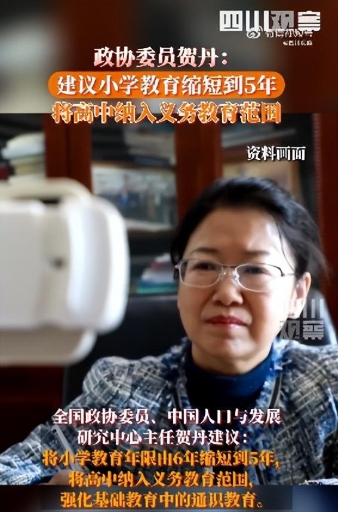

# 全国政协委员：建议小学教育年限缩短到5年，将高中纳入义务教育范围

2月27日，据四川广播电视台“四川观察”视频报道，2月25日，全国政协委员、中国人口与发展研究中心主任贺丹在接受采访时表示，根据中国人口与发展研究中心人口决策大数据实验室预测，到2035年，我国0—17岁低龄人口存量将比2020年减少1亿人，届时教育资源支出会发生很大的结构性变化。优化教育资源配置，需要前瞻性考虑人口变动的趋势。建议小学教育缩短到5年，将高中纳入义务教育范围。

据光明网消息，近日，多地民政部门公布的2022年度婚姻大数据显示，各地初婚平均年龄普遍推迟，基本接近30岁，而杭州、扬州、常州结婚登记平均年龄都超过30岁。

作为老委员，对于婚育延迟相关问题，贺丹等多位人大代表、政协委员曾提出缩短教育年限，其中贺丹委员建议小学教育缩短到5年，将高中纳入义务教育范围。

缩短教育年限建议的进展情况如何？贺丹委员介绍，建议提出后，教育部给予了非常积极的反馈。“可能我们人口变动，对教育方面的影响，对教育资源配置的方面的影响是最大的。”

贺丹委员介绍，根据中国人口与发展研究中心人口决策大数据实验室预测，到2035年，我国0—17岁低龄人口存量将比2020年减少1亿人，届时教育资源支出会发生很大的结构性变化。优化教育资源配置，需要前瞻性考虑人口变动的趋势。

贺丹委员说，在制定教育强国的发展规划中，很多专家们的意见和建议，政协委员、人大代表的建议，都在教育部门的考虑之中，她期待着在教育方面，大家能享受到更多好的政策。

“我们也在积极地支持教育部门制定相关政策，给他们提供一些人口变动的基础数据。”贺丹称，政策的制定有利于教育资源的配置和教育深度的改革，有利于办好人民的教育，实现树德立人，“我觉得这些都是非常利好的消息”。

**【来源：九派新闻综合四川广播电视台“四川观察”、光明网】**

