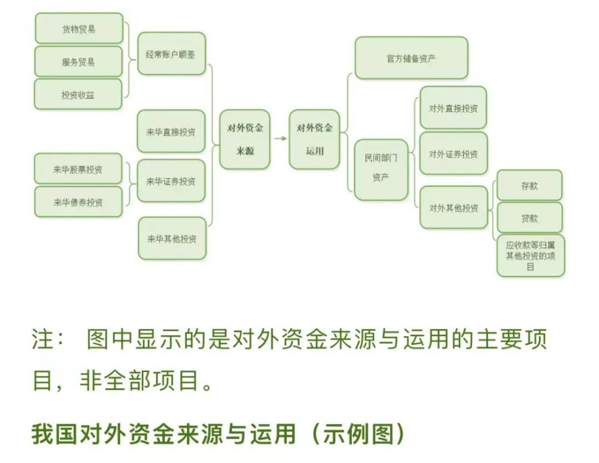
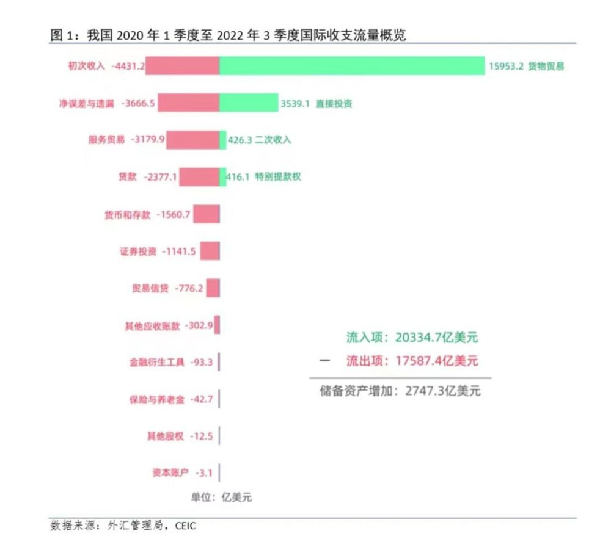

# 我国2万亿美元顺差去哪儿了？国际收支平衡表中藏着不易察觉的真相

近日，网络上有质疑声问“我国两万亿美元外汇去哪里了？”简单来说，质疑者的核心观点是，“2020年到2022年，我国贸易投资顺差有将近1.9万亿美元之多，但是这笔顺差资金所形成的外汇在外汇存款、结售汇数据、外汇储备、外汇占款中都找不到。”

2月27日，《中国外汇》杂志发表了一篇署名为钟汇研的文章，对这一问题作出了详细的解释。这篇题目为《顺差去哪儿了？跨境贸易投资顺差去向解析》的文章，通过对国际收支平衡表的分析，详细拆解了我国近三年来，近1.9万亿美元的顺差来源以及资金的运用情况。

**结论是，“无论是从理论角度还是数据比对的实践角度，近三年我国对外资金来源都可以找到对外资金运用的相关项目，两者基本能够匹配。”也就是，流入的和流出的，基本都能对得上。**

近日，中国民生银行首席经济学家温彬也在一篇研究报告中对这一问题进行了解释。他认为，造成这一质疑的主要原因是，我国主要的流入也就是顺差的部分，高度集中，而且在舆论宣传中经常被提及，大众关注度很高；而流出的部分，也就是逆差，却相对分散在各项流出或资产项目中，每一项都不大，甚至不太受人关注，容易被化整为零，但事实上加起来后的规模并不小。

该研报通过对2020年一季度到2022年三季度共11个季度的国际收支平衡表分析指出，
**顺差基本盘中，主要是货物贸易顺差和直接投资顺差，而这笔资金最终在流出一侧，分散在了“初次收入逆差、服务贸易逆差、贷款、货币与存款资产净增加、证券投资逆差、贸易信贷、应收账款、衍生工具流出、保险与养老金、其他股权流出等”项目中。**

_（资料来源：《中国外汇》钟汇研署名文章）_

**根据上述两篇文章，下面我们展开来说说：**

这两篇文章分析的基础均是基于国际收支平衡表，按照国际统一标准，国际收支平衡表采用了“有借必有贷、借贷必相等”的记账原则，是对涉外经济交易最全面的记录。

**首先是，近1.9万亿美元的顺差是怎么来的。**

相对于流出端的零碎、隐秘，资金的来源也就是流入端几乎是一目了然的。钟汇研署名文章中表示，近三年来，经常账户顺差、来华直接投资净流入是我国主要的对外资金来源。

根据国际收支平衡表，2020年到2022年，经常账户顺差、吸收来华各类投资合计形成对外资金来源约2万亿美元。其中，包含了9800多亿美元的经常账户顺差，其中最大头的是货物贸易顺差；此外还有我国吸收跨境投融资合计1万多亿美元，包含了直接投资资金流入近7800亿美元，还有外资买入境内债券和股票等来华证券投资。

温彬的测算是，根据2020年一季度至2022年三季度共11个季度的数据进行分析，顺差基本盘中，11个季度的货物贸易顺差和直接投资顺差分别为15953亿美元和3539亿美元，总和为19492亿美元。

**讲清楚了资金的来源，下面就是这笔外汇资金去哪里了，也就是资金的运用。**

钟汇研文章中指出，“跨境贸易投资顺差超八成转换为我国民间部门对外投资，境内企业、银行等持有的境外资产增加。”

简单来说，就是境内的企业、银行等拿着外汇去境外投资了，主要的渠道有直接投资、证券投资、其他投资（包括存贷款）等，这是“藏汇于民”的重要表现。通过数据拆解来看，近三年，我国对外直接投资近4400亿美元，对外证券投资和对外存贷款等其他投资合计达1万多亿美元，加起来，基本上就是1.9万亿美元顺差80%的规模。

那么，剩下的20%去哪里了呢？钟汇研文章中表示，这部分主要是官方部门对外投资，表现为外汇储备的增加，但是这又不能简单将外汇储备余额的变动来做加减，因为余额还受到汇率折算和资产价格变动等估值因素的影响。

_（资料来源：民银研究报告《外汇都去哪儿了？解析近3年国际收支平衡表）_

温彬在研报中对流出的各项给出了详细的分析。首先是大家熟知的逆差项：服务贸易与证券投资，近11个季度，服务贸易逆差规模为3180亿美元，证券投资净流出规模则在1142亿美元，但是减去这两项逆差后，还有将近1.5万亿美元的规模无法解释。

他进一步表示，还有容易被忽略的重要流出项——初次收入，相比之下，“初次收入”虽不起眼，甚至往往被忽略，然而其逆差规模却一点儿也不小。过去11个季度中，初次收入逆差达到4431亿美元，可以说是“消失的外汇”中的最大项。而投资收益的巨大差异，主要与我国在海外，以及海外在我国的投资头寸和收益率差距有关。据温彬测算，由于投资头寸和收益率的差距，过去11个季度，平均每个季度我国的投资收入逆差在410亿美元左右。

初次收入下面的分项包括了雇员收入——顺差1.7亿美元，很小，只占零头，大头是投资收益，逆差则达到4511亿美元。其中，我国在海外的投资获益流入（贷方）6002亿美元，而外国在我国的投资收益流出（借方）则达到了10512亿美元。

此外，还有不被人注意的资产与应收款项——其他投资，过去11个季度中，其他投资项形成的“逆差”（其中许多实际是资产的净增加）达到4656亿美元，其中又可以分为货币与存款、贷款、保险与养老金、贸易信贷和其他应收款5项。

在除去其他投资项后，顺差的未解释部分还剩下约6500亿美元，基本上包含了净误差与遗漏和储备资产增加两项。其中，比较难解释的是“净误差与遗漏”，温彬表示，净误差与遗漏由会计技术处理获得而非来源于实际统计，因此只能猜测其组成部分，但各组成部分的占比难以测算。目前主流观点认为其中包含了以下几方面：一是统计误差；二是线下资本外逃（现金“蚂蚁搬家”或地下钱庄等）；三是出口少收问题（延迟收款、应收坏账、虚报出口、境外代收等）；四是进口多付（虚假贸易等）。

综合上述两篇文章，流入的和流出的，通过对照国际收支平衡表，能够对得上。

事实上，对于国际收支反应的资金来源和运用问题，并不是新鲜的话题。外汇局此前曾多次作过科普类的专栏，进行详细的分析。

在2021年半年度国际收支报告中就有一篇《全面准确看待国际收支反应的资金来源与运用》的专栏文章，其中提到，“从资金来源看，我国经常账户顺差以及各类外资净流入，是我国形成对外资产和开展对外投资的基础”，并指出“从资金运用看，我国民间部门对外资产明显增加，官方储备资产小幅增长”。该文章详细分析了2021年上半年的资金来源与运用，并得出结论：第一，国际收支自主平衡格局更加稳固，不再是国际收支高顺差对应储备高增长的模式。第二，对外资产持有主体多元化稳步推进，不再是储备资产高居半壁江山以上的局面，近年来储备资产在我国对外资产中的比重合理回落。

钟汇研在署名文章也最后提到，未来，随着我国深度参与国际大循环，跨境资金往来将更为活跃。观察贸易投资顺差流向等问题，立足国际收支平衡表、从资金来源与运用角度看，才能够得到更为准确、客观、科学的结论。

