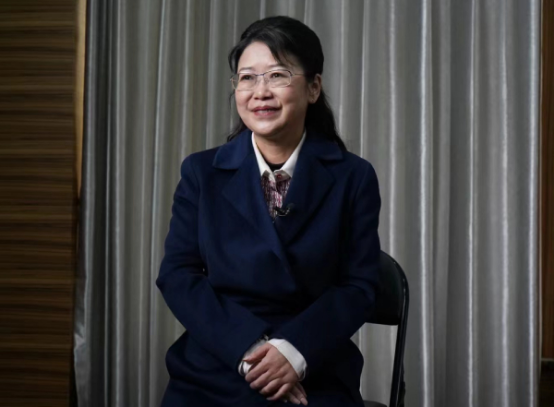

# 政协委员贺丹：建议小学教育缩短到5年，将高中纳入义务教育范围

党的二十大报告总结了中国式现代化的五个特征，首要特征是“人口规模巨大的现代化”。

2月25日，全国政协委员、中国人口与发展研究中心主任贺丹在接受采访时表示，人口规模巨大是我国的基本国情，中国人口与发展研究中心在不断深入学习贯彻党的二十大精神，加强研究如何在现代化过程中利用好我国人口规模巨大这一基本国情。

_全国政协委员、中国人口与发展研究中心主任贺丹
罗炎/摄_

在她看来，人口规模巨大，虽然带来了服务保障方面的压力，也为经济发展提供了强力支撑。

贺丹委员表示，不要太担心人口数量，要关心人的发展，人们的受教育水平、职业发展、就业状况、收入状况，这些是支持经济发展的最大潜能和动力所在。

“在中国式现代化的道路上，我们有信心能够利用好我们的人口资源，用好我们14亿人口的磅礴之力，促进国家的发展，促进家庭的健康。”贺丹委员说。

近日，多地民政部门公布的2022年度婚姻大数据显示，各地初婚平均年龄普遍推迟，基本接近30岁，而杭州、扬州、常州结婚登记平均年龄都超过30岁。

作为老委员，对于婚育延迟相关问题，贺丹等多位人大代表、政协委员曾提出缩短教育年限，其中贺丹委员建议小学教育缩短到5年，将高中纳入义务教育范围。

缩短教育年限建议的进展情况如何？贺丹委员介绍，建议提出后，教育部给予了非常积极的反馈。“可能我们人口变动，对教育方面的影响，对教育资源配置的方面的影响是最大的。”

贺丹委员介绍，根据中国人口与发展研究中心人口决策大数据实验室预测，到2035年，我国0—17岁低龄人口存量将比2020年减少1亿人，届时教育资源支出会发生很大的结构性变化。优化教育资源配置，需要前瞻性考虑人口变动的趋势。

贺丹委员说，在制定教育强国的发展规划中，很多专家们的意见和建议，政协委员、人大代表的建议，都在教育部门的考虑之中，她期待着在教育方面，大家能享受到更多好的政策。

“我们也在积极地支持教育部门制定相关政策，给他们提供一些人口变动的基础数据。”贺丹称，政策的制定有利于教育资源的配置和教育深度的改革，有利于办好人民的教育，实现树德立人，“我觉得这些都是非常利好的消息”。（光明网记者邱晓琴）

来源：光明网

