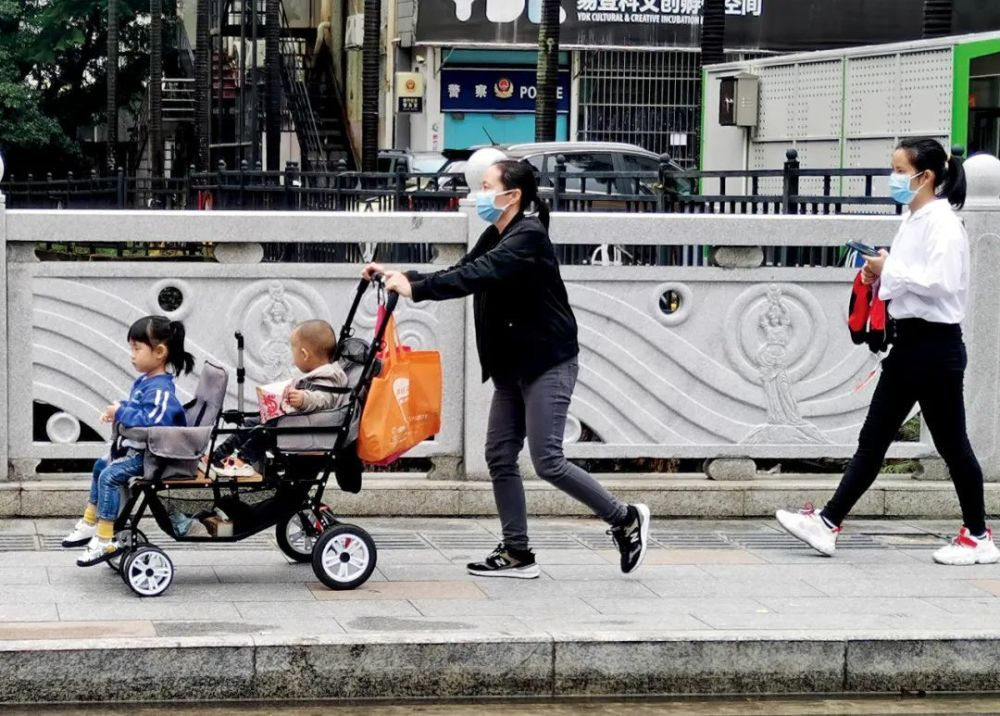

# 教师过剩、高校关停，人口如何影响教育？

2023年以来，北京、广州、济南、大连多地发布了义务教育学位预警。北京2023年政府工作报告提出，2017~2022年北京已累计增加了18万个中小学学位，并计划在2023年继续增加2万个中小学学位。这些学位压力源自2016年“全面二孩”政策实施当年出生人口的大幅增长。

但故事的另一面是，在短短一年生育高峰后，从2017年起，我国出生人口持续快速下滑，从当年的1723万人降至2022年的956万。出生人口大幅波动，也对不同教育阶段产生一系列连锁反应，香港大学社会工作与社会行政学讲座教授、特区政府前人口顾问叶兆辉形容为“多米诺骨牌效应”，他警告说，出生人数下降首先会影响幼儿园，然后是中小学和大学，最终影响到劳动力。

中国进入人口负增长时代之后，教育如何应对人口之变？各地政府又该如何根据学龄人口变动趋势科学规划未来数十年的教育资源配置？城乡之间的教育差异是否会进一步拉大？

北京师范大学教育学部高等教育研究院副教授、中国教育战略学会区域教育分会理事乔锦忠曾专门调研人口变动与教育资源配置的关系，并参与教育部多个司局政策咨询、省市县教育规划编制和政府评估。就相关问题，他近日接受了《中国新闻周刊》的专访。

_最先感受到人口负增长的就是学前教育。图/视觉中国_

**2035年义务教育在校生或减少3000万**

**中国新闻周刊：2022年，中国正式进入人口负增长时代，随着新生儿持续下滑，学龄人口会相应减少，人口变动将如何影响不同阶段的教育资源需求？**

**乔锦忠：** 其实早在20世纪90年代，中国总和生育率就已降到2左右，这个数字至少达到2.1，才能达到人口正常世代更替水平。2016
年，国内实行“全面二孩”政策，但效果并不理想，政策效应很快释放完毕。2017年开始，全年人口出生数持续下降，2018年又比2017年减少200万人，2020年、2021年都比前一年减少200万左右，未来中国出生人口持续下降的趋势基本是不可逆的。

现在妇产科已经从过去的床位紧张到过剩，幼儿园这两年也没以前那么难上了。所以，最先感受到人口负增长的就是学前教育，目前这个阶段受到的冲击最明显，但从更长期来看，义务教育未来受到的影响最为严重。

我们团队用模型预测了2020~2035年义务教育阶段的学龄人口变动，发现全国义务教育阶段在校生数先短期缓慢上升，在2024年达到峰值约1.46亿，随后呈现加速下降趋势。2025~2028年平均每年学生以一两百万的量级在减少，2028~2035年每年减少三四百万的规模。具体而言，小学学位需求峰值出现在2024年，比2020年多出了约485万，初中学位峰值稍晚，出现在2029年。最终至2035年，义务教育阶段在校生规模将比2020年的1.4亿减少约3000万。实际上，当时我们做预测时使用的总和生育率数字是1.5，但2021年的总和生育率已经降到了1.15，现实可能比我们所预测得还不乐观。

**中国新闻周刊：在校生减少3000万，学校是否也要相应减少？**

**乔锦忠：**
事实上，自2003年以来全国义务教育阶段学校数一直呈减少趋势，2020~2035年期间将继续延续这一趋势，而且下降速度逐步加快。预测表明，2035年全国小学、初中需求数分别为9.28万和4.79万，较2020年分别减少5.14万和0.38万。显然，人口负增长对小学影响比初中要大，因为小学在规划时分布更密、服务半径更小，所以总体基数上也更大，而初中辐射的面积更大一些，所以存在更多冗余空间。

**中国新闻周刊：也就是说，由于生源减少，12年后，小学数量将至少减少一半，未来哪些学校可能会第一波关停或倒下？**

**乔锦忠：**
人口萎缩较为严重的地区小学可能会最先收缩，这主要与学校所处地理位置和社会环境有关。另外就是民办小学可能也会“死掉”一批，尤其在民办校占比较高的地区，有的地区民办学校在校生数甚至超过了公办学校，这可能与当地政府的财力相对较弱，对公共教育的投入不够有关。但在义务教育阶段，还是应该回归公办，这两年国家在政策上在积极调整，在引导和督促地方政府切实承担法定的教育责任。

总的来说，未来教育供求关系一定会发生根本性变化，带来的结果有两个：一方面是学校出现招生困难，部分会倒闭；另一方面，随着生源减少，学校自然而然就要转向小班化教学，班级规模会缩小，生师比也相应降低，老师也终于有条件从主要关注班级控制，转向更关注每个个体，这客观上有利于提高教育教学质量。世界上其他经历了“人口塌陷”的国家在教育上也都经历了这样一个趋势：未来中国的义务教育肯定要走小班化、提升质量的道路。

**中国新闻周刊：日本少子化趋势从20世纪80年代起就变明显，从1990年代起，日本教育理念发生显著变化：开始提倡“宽松教育”，小学广泛引入“体验式学习”。中国现在每个教育阶段还是很“卷”，未来随着教育供求关系变化，是否也会走日本这种路径？**

**乔锦忠：**
有很大的可能性。未来升学会变得更容易，学生也不需要那么紧张，我们在教育的节奏上也会把控得更好一些，学生也从单纯关注分数和排名转向关注知识本身，不再需要陷入各种竞赛的怪圈中，这有利于整个义务教育阶段办学质量的整体提升。

还值得注意的一点是，在教育供求关系变化过程中，办学条件标准调整的时机很重要，因为各地所需学校数量的多寡既与学龄人口规模有关，也与办学条件标准有关。比如现在教育部规定小学班额不超过45人，中学不超过50人。未来这一标准到底应何时调整、怎么调？个人认为应尽量避免在学位需求波动较大的年份，简单大规模建设或撤并学校。政府在建设和撤并学校时，还应灵活调节办学标准，共同应对学龄人口增减。适时调节办学条件标准，比如对班额的调控，能使学校供给保持相对稳定，有一定量冗余，避免财政资源浪费。如果仅为了满足高峰时的需求，过量新建学校，学龄人口在达峰后迅速下降，大量新建学校可能就会形成资源浪费。

**中国新闻周刊：学校数量减少同时，这一过程中师资配置会发生哪些变化？**

**乔锦忠：**
与在校生数变化趋势类似，2020~2035年我国义务教育阶段专任教师需求量总体减少，按现行生师比标准，到2035年全国将有约150万小学教师、37万初中教师过剩，小学教师需求量过剩较大，初中教师先短缺后过剩。

为应对这些过剩，除缩小班级规模、降低生师比外，未来应在稳定部属和省属师范大学招生计划的同时，逐步减少师专和高职高专的师范生招生，保持一定的师资规模和质量。另外，师资培养体系也要调整，调整师范专业设置，扩大音、体、美、劳、通用技术、学前、托育和特教等学科招生人数，减少文化科目招生计划。实际上，现在的师资供给存在较为严重的结构性缺编，语数等大课类老师相对容易过剩，而艺术、体育、科学等小课类老师更为短缺。

**2031年城区在校生规模或超过村镇**

**中国新闻周刊：你谈到了义务教育阶段在校生、学校数量和师资需求总的变化趋势，具体到城乡间会有明显的差异吗？**

**乔锦忠：**
未来学龄人口在不断减少，但城市化还会继续推进，根据我们的预测，学生的城市化率要比人口城市化率要高出十几个百分点，也就是说，有些成人不一定在城市生活，但他们的孩子可能在城市上学。预计2031年前后，全国城市在校生总量会超过乡镇和农村，此后一直领先，这是一个分水岭。在这之后，国内义务教育将总体进入以城市教育为主体的时代，到
2035 年城市在校生比乡镇、农村将多近1000
万。不过，全国各地进入城市教育为主体的时间会有差异，发达省份会早于2031年进入，中西部落后地区可能会晚一点，因此各地在教育规划和资源配置时应因地制宜，因时而动。

这一过程中，农村小学生减幅最大，2020~2035 年间年均减少67.45万人，2035年较 2020 年减少约 1079.18
万。村小需求数也呈快速下降趋势，到2035年所需学校数可能还不足2020年一半，只需3.55万所。未来农村地区会有大量教育资源是闲置状态，除了保留必要的教学点和乡村小规模学校以外，在脱贫任务完成后，建议不再向农村地区倾斜教育资源，当然对于必要、需保留的教学点和乡村小规模学校，在经费上应按照高于一般学校办学条件的标准投入，以更好保障有特殊需求的儿童。

但在大方向上，总量上，资源一定要向城镇倾斜。未来15年内，义务教育阶段学龄人口会不断向城市聚集，根据测算，与2020年相比，城区在2026
年（高峰年份)需新建小学4000
所，2030年(高峰年份)新建初中4000所。城镇地区教育公共财政预算事业费所需增加额远大于农村地区，2020~2035年年均增加555.25亿元。不过，随着整个社会老龄化加剧，养老、医疗、卫生保健方面不断增长的财政需求肯定会挤占教育经费，这也是没办法的，人口结构的变化未来必然会影响到教育经费在整个财政支出中的占比。

未来教育资源的配置要充分考虑农村向城市转移这个大趋势，调整一定不能过于滞后。调整过程中，城市化率是一个非常关键的参考指标。在逆城市化现象出现之前，把教育资源优先投向城区是更有效率的，也能更好保障最大多数的学生接受更优质的教育。

**巨型大学难再见**

**以就业为导向的高校或大量出现**

**中国新闻周刊:
人口结构变动最终也会影响到高等教育。比如在以私立高校为主的日本，受少子化影响，很多大学也面临招生不足和运营艰难的情况，进而刺激了一些大学恶性竞争，为了抢生源，无底线降低招生门槛，以至后期日本大学内出现了“过于弹性化的招生机制”，并导致一流大学大学生不会分数式计算等“学力崩溃”现象。中国与日本不同，高等教育以公立为主，随着义务教育阶段的生源危机延伸至大学，会对中国高等教育产生哪些一系列的连锁反应？**

**乔锦忠：**
日本的这种情况在未来的中国也可能出现。随着少子化现象日趋严重，未来中国高等教育的总体规模会萎缩，部分办学质量不高，又无特色的高等学校会面临关停并转的局面，高等学校的数量将会有所减少，学校的规模将变小，像现在吉林大学、山东大学和浙江大学等巨型大学将很难再看到，同时高等教育的毛入学率会进一步提高。

虽然我国的高等教育系统以公立大学为主体，而且最顶端的教育资源永远是稀缺的，但未来大学之间的竞争也会加剧，预计不久的将来“双一流”建设高校之间的竞争将更为激烈。当然这种情况的出现，同时也为高等教育本身可能提供了系统优化和提高质量的契机。

当未来学生数量减少，学生选择权更多的时候，必然会激发各个高等学校增强内部改革的动力。中国当下的高等教育系统整体是缺乏弹性的，特别处在金字塔尖的高校，自身进行内部改革的动力和意愿不强，基础学科不能沉下心来长期坚持攻艰克难，应用学科对市场和供求关系的变化不敏感。随着学龄人口的减少，高等教育的毛入学率和普及程度的进一步提高，高等教育必然会进入买方市场，届时学费收入会减少，政府提供的资助可能也会减少，各高校为了生存需要，必然会调整战略进行差异化发展。

此前在高等教育大众化的过程中，尤其是1998年高校扩招中，产生了很多后续问题。由于我国高等教育大众化的启动非常仓促，没有按照科学的节奏来走，简单快速摊大饼的发展模式加剧了高等教育内部的结构失衡。按照国外经验，工程、医学，甚至师范教育本应是精英教育，不是任何层次的学校想办就能办，但现在低层次的工程、医学和师范教育比比皆是。从结构上看，真正学术性的高等学校占比不应太高，更多的高校应以培养应用型学生为主，办学主要指向就业。因此，随着大学生的减少，未来以就业为导向的高校可能也会大量出现，学校会给学生提供更多和企业合作的机会。大部分高校会主动选择特色化的发展方向，满足学生多元化的需求。

另外，现阶段中国高等教育阶段的“放水”还是比较严重的，很多四年本科生实际上在校学习只有三年，剩下一年基本都在实习或社会实践。此外，对数学、物理等门槛较高的基础学科，如果严格按照学业质量标准，每年会有很多学生被淘汰。未来随着少子化和高等学校之间竞争的加剧，各学校为了生存会不断提高办学质量，建立相对完善的内部质量问责机制，强化教学过程监管。政府也应顺应形势而为，对高等教育结构调整和质量提升进行相应引导和问责。

发于2023.2.27总第1081期《中国新闻周刊》杂志

杂志标题：乔锦忠：教育如何应对人口之变？

记者：霍思伊 实习生/李金津

