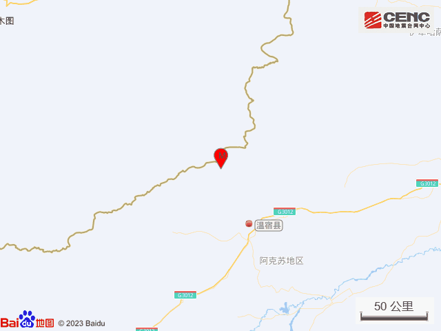
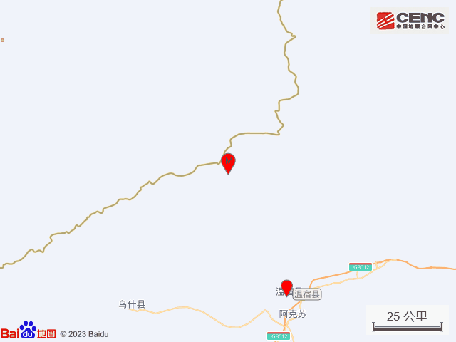
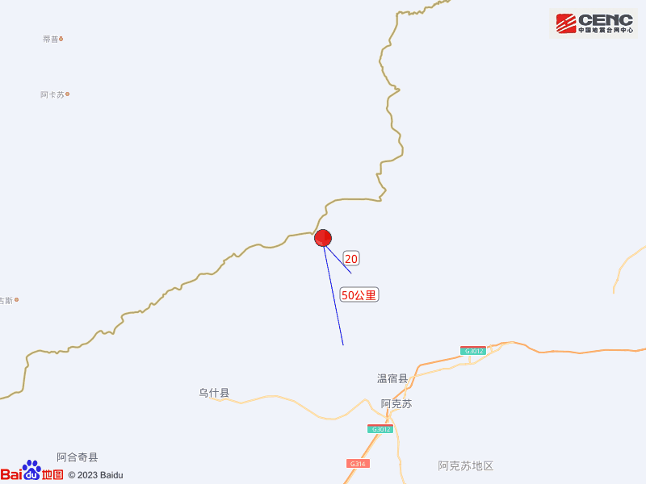
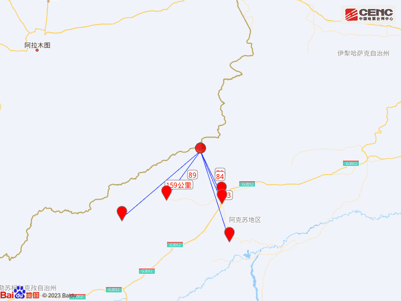
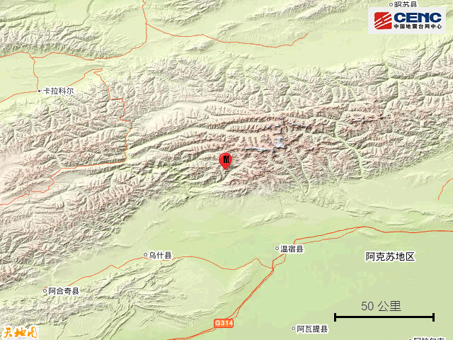
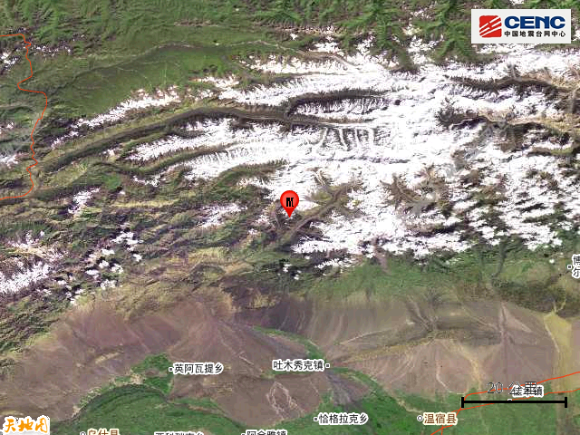
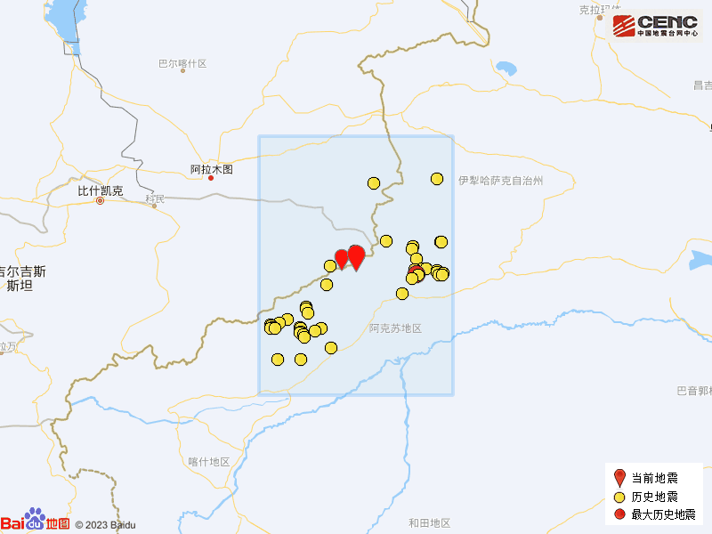

# 新疆温宿县发生5.1级地震：震中距阿克苏84公里 距乌鲁木齐670公里

据中国地震台网正式测定，2月27日7时58分在新疆阿克苏地区温宿县发生5.1级地震，震源深度10公里，震中位于北纬41.87度，东经79.85度。

本次地震周边10公里内的村庄有卡尔拉青、奇木库尔干，20公里内无乡镇驻地分布，50公里内的乡镇有吐木秀克镇、吐木秀克镇。

震中距温宿县73公里、距阿克苏市84公里、距乌什县89公里、距阿瓦提县143公里、距阿合奇县159公里，距阿克苏地区85公里，距乌鲁木齐市670公里。

震中5公里范围内平均海拔约3944米。

根据中国地震台网速报目录，震中周边200公里内近5年来发生3级以上地震共115次，最大地震分别是2022年12月29日在吉尔吉斯斯坦发生的5.4级地震（距离本次震中24公里）和2021年3月24日在新疆阿克苏地区拜城县发生的5.4级地震（距离本次震中106公里），按震级大小前50次历史地震分布如图。

