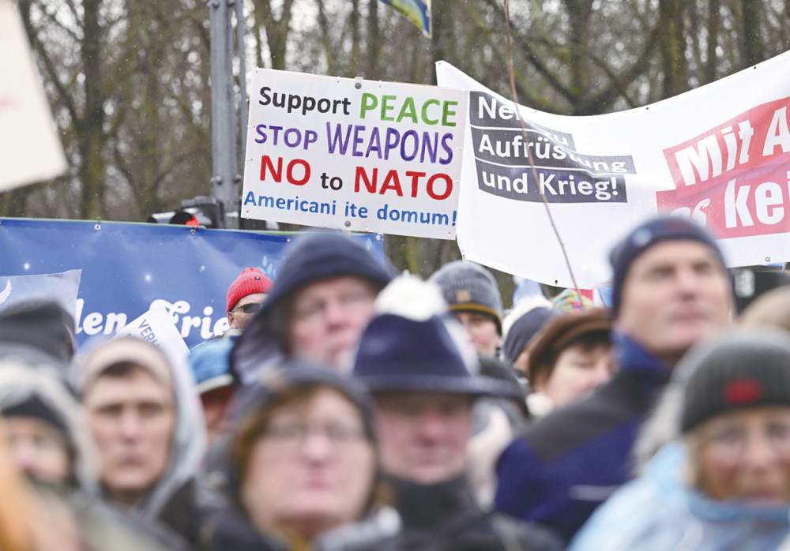

# 欧盟对俄实施“史上最有力”制裁，俄学者：欧盟的手段已几乎用尽

【环球时报驻俄罗斯特派记者 肖新新 环球时报特约记者 柳玉鹏
牧之】在经过一番激烈的讨价还价之后，欧盟25日公布极具象征性的第十轮对俄制裁方案。欧盟轮值主席国瑞典宣称，欧盟成员国共同实施了“有史以来最有力、影响最深远的”对俄制裁。不过，乌克兰方面则认为，欧盟制裁措施“过于软弱”。俄罗斯专家分析称，欧盟几乎已用尽一切手段，每轮制裁措施对俄造成的负面影响都呈递减趋势。同日，俄罗斯停止通过输油管道向波兰输送石油。俄媒认为，这是俄方对波兰持续介入俄乌冲突的反击。在俄乌各自酝酿新一轮大规模攻势之际，欧洲国家对乌克兰能否取得冲突胜利越来越持怀疑态度，并试图“鼓励”乌克兰参与和谈，但遭到乌方拒绝。

**对俄制裁手段几乎用尽**

欧盟第十轮制裁针对约120名个人和实体，制裁措施包括进一步限制军民两用产品和技术出口到俄罗斯，对支持俄乌冲突、传播俄罗斯宣传内容或向俄提供用于冲突的无人机的个人和实体采取有针对性的限制措施。欧盟声明称，制裁将限制出口包括导弹、无人机和直升机在内的俄罗斯武器中使用的电子部件，并禁止一些稀土矿物、电子电路和热像仪出口。对俄罗斯沥青和合成橡胶等出口商品，欧盟也实施了额外的进口限制。

对于第十轮制裁措施，欧盟成员国内部由于存在很大的分歧，因此拖到24日晚间才得以通过，为此额外举行了数场会议。法新社援引消息人士的话称，波兰想要全面禁止从俄罗斯进口合成橡胶，而意大利倾向于延长过渡期，以使其制造商有更多时间寻找新的供应商。最终，欧盟委员会将对自俄进口合成橡胶配额限制折中设定为56万吨。此外，在匈牙利的坚决反对下，欧盟第十轮制裁不涉及俄罗斯核工业。

对于欧盟第十轮对俄制裁，乌总统泽连斯基表示不满。据乌国家通讯社26日报道，泽连斯基在社交网络上称，欧盟制裁“过于软弱”，乌方希望欧盟对俄核工业采取果断措施，并加大对俄银行和军事人员的压力。俄常驻欧盟代表团25日表示，与以往所有制裁措施一样，欧盟此轮对俄制裁在未经联合国安理会批准的情况下通过，因而是非法的。欧盟首次将禁止过境俄罗斯运输若干货物列入制裁方案，此举只不过是试图对第三国贸易关系施加压力。这些行动有损国际贸易，人为地阻碍多年来形成的最佳货运路线。

虽然欧盟方面声称第十轮对俄制裁是欧盟历来实施的“最有力、影响最深远的”制裁，但《俄罗斯报》25日报道指出，欧盟本轮制裁缺乏战略必要性，对俄造成的经济损失和影响将比第一轮制裁小数倍。俄罗斯国立财政金融大学学者巴拉茨基认为，此轮对俄制裁已经尽可能地囊括此前数轮制裁未涉及的方面，但也表明欧盟几乎已用尽一切手段。每轮制裁措施对俄造成的负面影响都呈递减趋势。第十轮对俄制裁与其说旨在实现具体目标，不如说具有象征性。俄政治学家杜查克认为，此轮制裁再次反映欧盟内部矛盾，成员国间对有关措施仍有分歧和争论，几经沟通和协调，因而制裁最终能否达到预期目标存在疑问。法国《现实价值》杂志称，俄罗斯轻松地将西方制裁的后果消弭无形并重建经济，普通公民几乎注意不到有何变化，“在莫斯科一切如常，商店里货物充足，餐馆和夜总会都挤满了人”。

**俄对波兰断供原油**

波兰最大的石油公司奥伦石油25日突然宣布，俄罗斯已经停止通过“友谊”输油管道向波兰供应原油。该公司首席执行官奥巴伊特克25日发推文说：“俄罗斯已经停止对波兰的（原油）供应，我们对此有所准备。我们只有10%的原油来自俄罗斯，将用其他来源替代。”
奥伦石油称，它现在的供应方来自西非、地中海、海湾和墨西哥等。

“友谊”输油管道起点位于俄西南部萨马拉州，北线经白俄罗斯通往德国和波兰，南线经乌克兰通往捷克、斯洛伐克和匈牙利。去年2月俄乌冲突爆发以来，欧盟对俄施加多轮制裁。作为欧盟成员国，波兰无法通过海运方式购买俄原油和成品油，但“友谊”输油管道得到制裁豁免。

俄罗斯《共青团真理报》26日报道说，在俄罗斯停止通过“友谊”输油管道向波兰运输原油的前一天，波兰向乌克兰交付首批“豹”式坦克。俄方采取该措施并非巧合，而是对波兰方面有关行动的正当反应。俄《消息报》25日报道说，俄方的举措是对波兰持续介入俄乌冲突的反击。俄将进一步扩大对友好国家原油和石油产品供应。据报道，俄副总理诺瓦克今年2月中旬刊文表示，俄计划在2023
年向友好国家供应超80%的石油和75%的石油产品，俄罗斯将继续寻找新市场。

欧洲媒体注意到，波兰被“断供”石油后，德国接收的部分石油也要“看俄罗斯脸色”。哈萨克斯坦国家石油运输公司23日表示，该公司将通过“友谊”管道向德国出口首批2万吨原油，全年计划对德输送120万吨原油。

越来越多的欧洲经济学家和民众认为，欧盟对俄罗斯施行一系列制裁措施的反噬效应愈加明显，令欧洲经济雪上加霜，并面临严重的能源危机。据德国《法兰克福汇报》25日报道，德国首都柏林当天爆发大规模抗议示威活动，上万民众聚集在勃兰登堡门前，高举“谈判而非升级”“用外交官代替手榴弹”等标语反对西方向乌克兰提供武器，呼吁通过谈判方式和平解决冲突。

**英法德“鼓励”和谈，乌拒绝**

据德国新闻电视频道网站26日报道，乌克兰国防部情报总局副局长斯基比茨基证实，乌克兰计划在春季发动反攻。斯基比茨基说：“我们也有可能摧毁俄罗斯领土上的武器库或军事装备，例如在别尔哥罗德市周围。”他说，战略目标是在克里米亚和俄罗斯大陆之间的南部战线中打入楔子，反攻的确切时间取决于乌军的准备以及西方军援的力度。

不过据美国《华尔街日报》25日报道，欧洲国家对乌克兰能否取得战争胜利越来越持怀疑态度，英法德三国正在劝说乌克兰与俄罗斯展开谈判，并且开出主要条件。报道称，英法德三国认为，“加强北约与乌克兰的联系”是鼓励乌克兰同意与俄罗斯进行谈判的条件之一。英国首相苏纳克日前提出一个倡议，让乌克兰获得更多的先进武器装备，以便于在战争结束后能够保护自己；法国和德国随后表示支持该倡议，并希望此举可以增强乌克兰信心、激励乌同意与俄谈判。

泽连斯基仍拒绝与莫斯科进行任何谈判。据《华盛顿邮报》24日报道，泽连斯基当天被记者提问，如果俄罗斯总统普京来到谈判桌前，他是否会加入由土耳其斡旋的谈判，泽连斯基回答道：“我不接受。”泽连斯基还解释他无法再与俄领导人谈判的原因，“（普京）不是从前的他了。（谈判桌上）没人可以谈了。”美国有线电视新闻网（CNN）25日援引消息人士的话称，泽连斯基计划向美国发出武器“愿望清单”，其中包括F-16战斗机。不过，拜登24日在接受美媒采访时说，他“暂时”不考虑向乌克兰派遣F-16战斗机。

俄罗斯总统普京26日接受俄罗斯第一频道采访时表示：“他们（北约成员国）向乌克兰运送了数百亿美元的武器，这是真正地参与战争，意味着他们间接参与了基辅政权的犯罪活动……西方国家的目的只有一个，那就是分裂俄罗斯联邦。”

