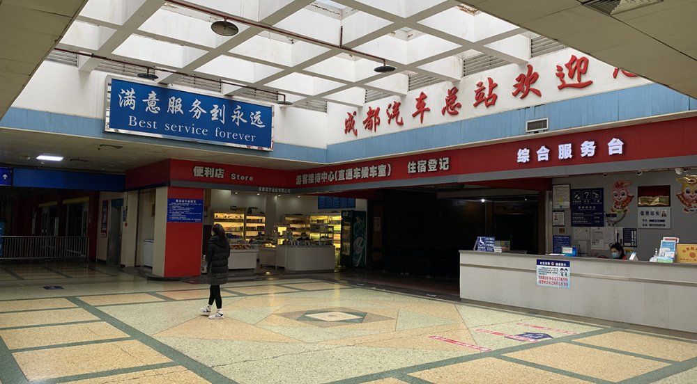
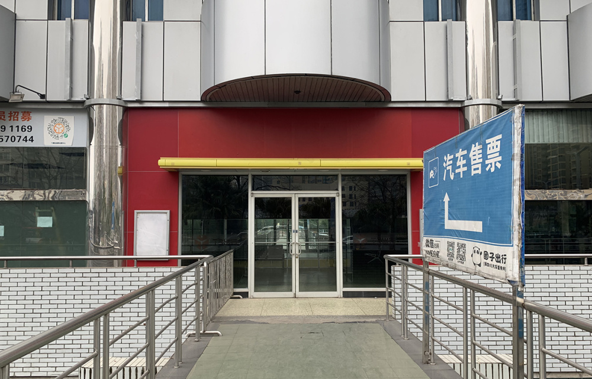
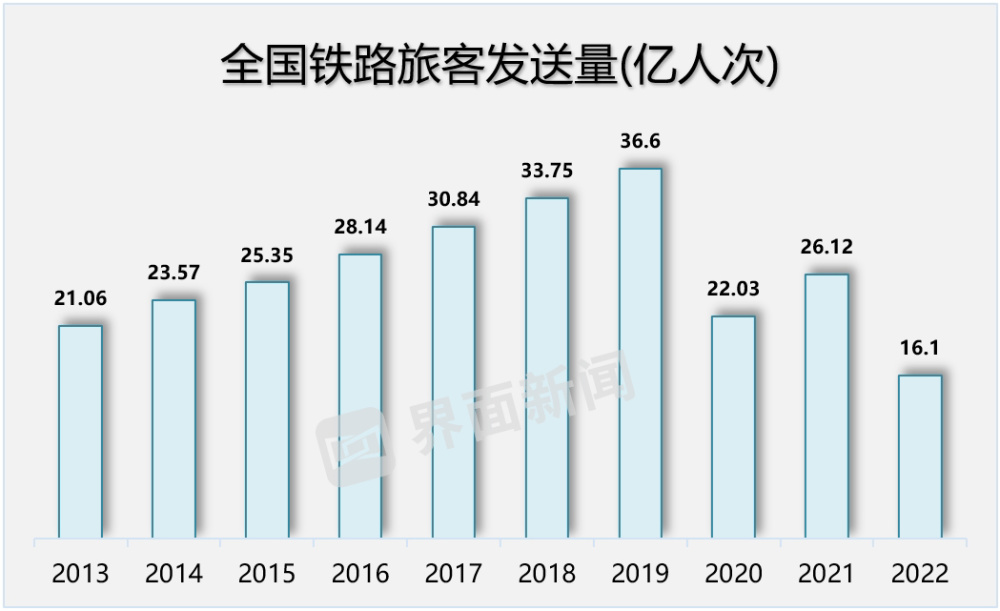

# 汽车站正在消失，客运大巴开往何处？

记者 | 唐俊

已经投运30年的海口汽车东站，拟于2023年4月份停止运营，将始发客运线路调整至海口省际总站（汽车西站），现在公开征求意见。又一个客运站可能即将“消失”。

高铁网络的完善、私家车的普及，让人们对于交通出行有了更高的要求，传统的客运大巴似乎跟不上快速发展的时代了。

乘坐公路班车的人越来越少，汽车站真的会消失吗？客运大巴又会开往何处？

客流减少，汽车站不断关停

据海南海汽运输集团统计，海口汽车东站周一至周四日均客流量仅五六百人次，即使在节假期也不过1000人次。

放眼全国，营业性公路客运已连续多年下降。交通部数据显示，全国公路营业性客运量在2014年达到顶峰190亿人次，后续每年下降，直到2019年只剩下130人次。疫情后，公路营运客流更是“腰斩”，2021年全年只有50亿人次。

在客流下降的最初几年，客车数量并没有显著降低，甚至在2016年还有所增长，运输企业在这段时间仍没有“减持”客车。不过到了2017年之后，客流的下降趋势传导到载客车辆上。

到2021年，全国只剩下58.7万辆营运客车，与2016年相比下降了30%。

_制图：界面新闻
唐俊_

按照2021年的客运量和客车量计算，平均每车每天运输的乘客不到24人。一般来说，中短途客运大巴每天有多个班次，折算下来每趟班车的乘客数量可能仅有个位数。

客流减少、车辆减少，导致客运站越来越冷清。仅在广州，从2019年至今，就有广州北站汽车客运站、越秀南客运站、永泰客运站、黄埔客运站、番禺客运站、流花车站、市桥汽车站、冲围客运站等汽车站陆续关闭。

没有关闭的汽车站，普遍人流稀少、外观陈旧、设施老化，似乎正等着“退休日”的到来。

成都汽车总站于1995年投运，当时是作为成渝高速公路的配套车站及成都市公路枢纽站之一，开行去往重庆及四川省内各个方向的班车，高峰期人流如织。

今年2月底，界面新闻记者在成都汽车总站看到，站内空空荡荡只有一人，站前小广场也只有几名乘客坐在阶梯上等候。车站一楼有一家麦当劳，去年仍在营业，今年已经关门。

_拍摄：唐俊_

_拍摄：唐俊_

成都汽车总站工作人员告诉记者，现在很多线路都已经取消或者减少班次，还在乘坐客运班车的大多是老年人，他们对于高铁不熟悉，仍保留了年轻时坐汽车的出行习惯。

高铁、私家车冲击

就在营业性公路客流不断降低的时期，铁路尤其是高铁，正在快速发展。从2013年到2022年，中国高铁里程由1.1万公里增加至4.2万公里。

快捷、舒适、准点的高铁列车，抢夺了大量的班车乘客。交通部数据显示，疫情前铁路客运量一直在增长，2019年比2013年增长了73%。疫情后所有交通出行都受到影响，铁路也不例外，但疫情期间铁路客流量的降幅显著低于公路客流的降幅。

_制图：界面新闻
唐俊_

只要有高铁开通，同一线路上的客运班车一般都会受到猛烈冲击。2019年成都至宜宾高铁开通，当时两地之间大巴车价格从106元骤降至60元，比高铁二等座整整便宜50元。

成都至宜宾的高铁只需1.5小时，而大巴需要3.5小时。即使大巴票价远低于高铁，也未能挽回这条班车线路的颓势。目前，成都汽车总站每天只有两班发往宜宾的班车，且上座率不高。

记者在车站时采访时注意到，有乘客咨询成都至宜宾汽车票时，工作人员都建议乘客去乘坐高铁，因为两班车发车要间隔6个半小时，而高铁最少间隔5分钟就有下一列车。

另外，公路网的完善和私家车的增多，也是班车乘客减少的一大重要因素。公安部数据显示，从2012年到2022年，全国机动车保有量由1.21亿辆增加到了4.17亿辆。

自驾出行不仅局限于中短途，长途自驾也在增多。交通部表示，今年春运自驾出行人数创历年最高。春运期间，全社会人员流动量中自驾人群占了66%，载客量约为31.38亿人次。

一家互联网汽车票务平台的负责人对界面新闻表示，据他估计，相比去年，今年春运期间，长途大巴线路有将近20%的线路不存在了；而相比于2019年，估计有一半的线路已经不再开行大巴车。例如，在携程平台上，已经查询不到北京至秦皇岛的班车。

把汽车站搬到门口

面对不断衰退的客流，公路客运行业也在寻求自救。既然乘客不愿再去汽车站坐车，那么就把车站搬到乘客家门口。

2015年前后，一种被称为“定制客运”的运输模式开始在全国各地兴起。所谓“定制客运”，是指运输企业通过互联网售票，灵活确定发车时间和上下车地点的运营方式。

与传统客运相比，定制客运最大的区别在于乘客无需再去汽车站乘车。在中小城市，定制客运一般可以做到上门接客，并送到最终的目的地。在超大城市，定制客运难以做到上门接送，仍需借助城市公共交通系统定点接送，站点一般设置在地铁站。

此种方式省去了乘客首尾两端的交通接驳，实现点对点运送，相当于把汽车站搬到了家门口。定制客运的运输服务和安全保障仍由运输公司承担，但已经摆脱了对于汽车站的依赖。

据业内人士介绍，定制客运一般在中短途线路开展，距离在150公里以内最佳，车辆一般是七座或九座的小车，便于灵活安排。

易来客运是四川地区的一家定制客运平台，目前接入了十多家运输公司，共有300多台车，运营约50条线路。易来客运市场总监罗晋文把高铁和私家车比作交通网络中的主动脉，定制客运就是毛细血管。

罗晋文对界面新闻表示，在干线运输上，不管是传统客运还是定制客运，其影响力都在减弱。但是在区县之间，以及未开通高铁的线路上，定制客运正在蓬勃发展。

即使是在疫情期间，虽然公路客运量整体在下降，但是其中定制客运部分在增长。上述互联网汽车票负责人对界面新闻表示，2020年和2021年，该平台上的定制客运业务量增长率接近100%。

该负责人认为，越发达的地区，传统公路客运受到的冲击越大，同样越早开始改变。前几年只是部分企业在探索定制客运，现在已经成为趋势，即使再保守的企业也开始做定制客运。“定制客运可以说是长途客运转型的唯一抓手。”

2020年交通部发布的《道路旅客运输及客运站管理规定》也明确提到，国家鼓励开展班车客运定制服务，并制定了一系列的服务要求，让定制客运可以合法开展、有法可依。

主要从事公路客运的上市公司富临运业（002357.SZ），其营业收入从2015年到2020年一直在下滑，2020年的收入仅相当于2015年的一半左右。目前，富临运业已将定制客运作为重点业务发展，推出了天府行定制客运平台。富临运业财报显示，2022年上半年，天府行平台日均客流量近1.4万人次。

目前，不少定制客运线路的客流量已经超过该线路上的传统客运，部分线路已全部改为定制客运。据罗晋文介绍，四川绵阳到三台的定制客运，日均乘客已突破一千人。

客运站还会存在吗？

疫情让本就艰难的公路客运行业雪上加霜。

2021年，全国营业性公路客运量为50亿人次，仅相当于高峰年份的1/4。交通部暂未公布2022年的客流情况，但由于去年多地疫情散发导致通行困难，预计客流将进一步降低。

从另一个角度看，也许最坏的年份已经过去。罗晋文认为，公路客运行业已经触底，未来几年会呈回升趋势。上述互联网票务平台负责人认为，今年营业性公路客运量将同比增长40%-50%，其中定制客运涨幅会更高。

在传统客运量减少以及定制客运不断增长的情况下，久经风雨的汽车站会彻底消失吗？

罗晋文认为，整体而言，汽车站数量会继续减少，但减到一定程度后会维持平衡，出行需求继续存在。在大城市中，汽车站仍会继续保留，但会集中成几个汽车站，这些车站可能与高铁、地铁等站点形成交通枢纽。

除了改变运营模式，也有企业试图从业务层面寻求转变。绍兴汽运集团三年前开启“全员接单”模式，全体员工通过自己的社会关系开发包车业务。杭州长运运输集团成立旅游总公司，承接商务包车、旅游包车，以及企事业单位通勤车业务。

富临运业在2022年半年报中称，已在眉山地区收购同行线路经营权，提升属地市场占有率，未来有望打破道路客运区域性多小散弱、各自为营的局面，实现多区域市场资源的有效整合。

