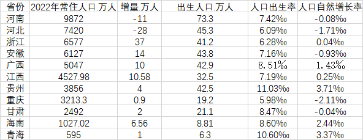

# 11省份最新人口数据：出生率均下滑，河北出生人口首次跌破50万

近期，各省份正陆续发布2022年的人口数据。根据第一财经记者梳理统计，目前已有11个省份公布了2022年的人口数据。在11个省份中，有9个省份实现常住人口正增长。从出生人口数据来看，各地出生率普遍下降，其中人口大省河北出生人口近几十年来首次低于50万。

河北省统计局近日公布的《河北省2022年国民经济和社会发展统计公报》显示，2022年末，河北全省常住总人口7420万人，比上年末减少28万人。

与2021年相比，2022年河北出生人口、人口出生率、人口自然增长率均进一步下降。公报显示，2022年河北出生人口45.3万人，人口出生率为6.09‰；死亡人口58.0万人，人口死亡率为7.80‰；人口自然增长率为-1.71‰，比上年下降1.28个千分点。

第一财经记者查阅《河北统计年鉴2021》以及2021年河北人口数据发现，2022年河北出生人口数是近几十年来（该统计年鉴公布有1978年及1980年以来历年人口数据）首次跌破50万。数据显示，在上世纪70、80年代及90年代初，河北曾有多年出生人口超过100万大关，其中1987年达到近几十年的最高峰——128万人，1992年跌破100万大关后，历年出生人口也均超过70万。从近十年来的出生人口数据看，在全面二孩政策实施后，2016年和2017年均超过90万，其中，2017年河北出生人口达到97.58万人，创下1992年以来的新高。

但到了2020年，河北出生人口仅为60.84万人，比上一年下降24.5%；2021年河北出生人口53.3万人；2022年跌破50万。相比2017年，5年来河北出生人口下降53.6%。

目前已有11个省份公布了2022年的人口数据。在11个省份中，有9个省份实现常住人口正增长。浙江、安徽、江西、广西人口增量均达到或超过了10万人。其中，浙江增加37万人。

**11省份2022年人口数据**

_数据来源：第一财经记者根据各地统计局数据整理_

对一个省份来说，人口增长包括自然增长和机械增长（即“人口净流入”）。去年，浙江自然增加人口为0.3万人，新增净流入人口为36.7万人。

杭州规划委员会专家委员会副主任委员汤海孺对第一财经分析，在全国人口减少85万人的情况下，浙江的常住人口仍有一个相对比较大的增幅，主要与浙江经济发展呈现比较良好势头有关，而且这个增量中杭州和宁波占了相当大比例。杭州、宁波这两大中心城市在全国主要城市中，经济发展、科技创新比较领先，人口流入多。

浙江之外，去年安徽常住人口增加14万人，江西增加10.58万人，广西增加10万人。

相较于上一年，已公布数据的11个省份2022年人口出生率悉数下降，人口死亡率普遍略有上升。其中，江西、甘肃、广西、海南、贵州、河北出生率降幅均超过1个千分点。在出生率普遍下滑、死亡率上升的同时，有多个省份人口自然增长率近几十年来首现负增长。其中，河南人口自然增长率62年来（自1961年开始）首次出现负增长。安徽和甘肃的人口自然增长率也是多年来首次转负。

