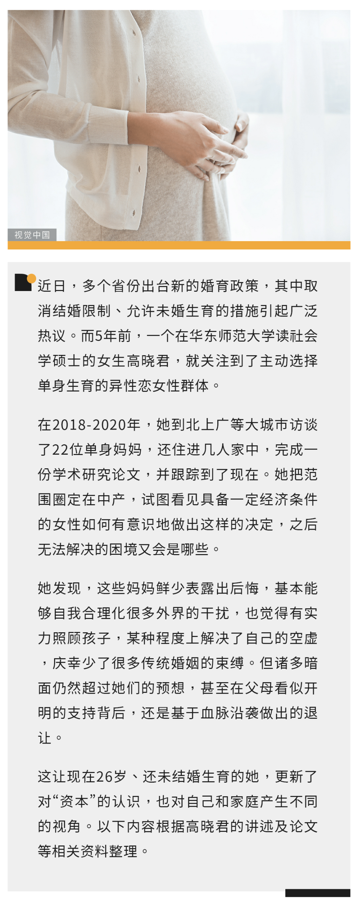
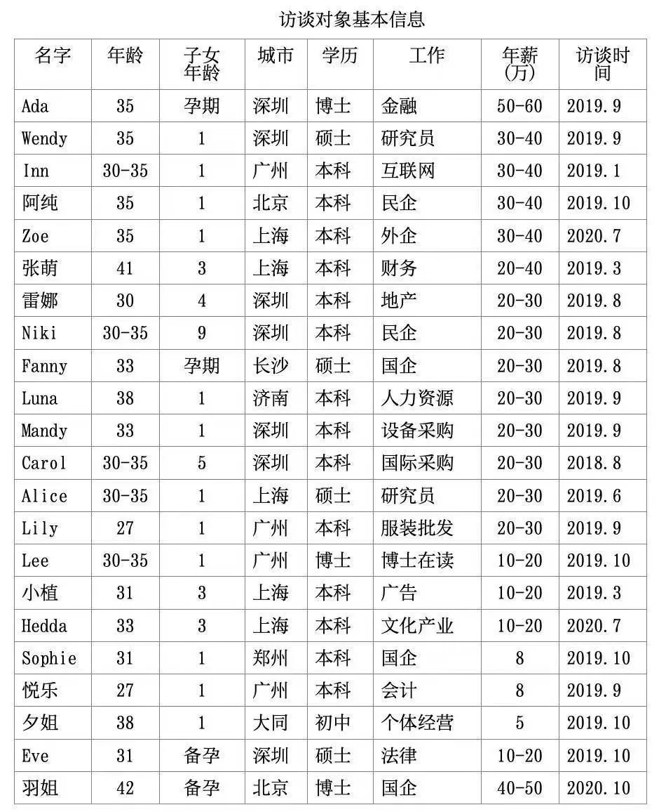
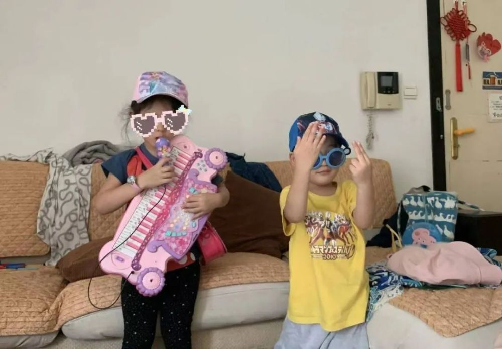

# 一份未婚女孩研究里的22个单身妈妈

**文|** 罗晓兰

**编辑|** 毛翊君

爱情和婚姻的冲突

我研一刚入学就确定了要研究单身生育。我成长在离异家庭，妈妈带着我，从乡镇到了城里。我觉得女性单身生育是非常有创造性的路径选择，已有的研究中，有少量侧重农村地区和底层阶级，我就主要研究城市里具备⼀定资本的女性。

但我一度想放弃。这在国内属于小众议题，我身边没有这类人群。我花了半年多找人，直到通过线人的推荐进入田野。

2018-2020年，我深入接触了22位单身生育的女性。她们主要生活在一线城市，基本是家庭中的独生女，年龄在27-42岁，学历多是本科，也有硕士博士，年薪大部分为20-30万，基本有一套或以上房产。

_●高晓君访谈时单身妈妈们的信息。讲述者供图_

她们挺想聊一聊的。我去了深圳、广州等5个城市实地访谈，包括我学校所在的上海，还住进了几个妈妈家里。以前我对她们的了解比较刻板和模糊，就那种精英女性形象，访谈后有了新认知。

她们此前有过亲密关系的尝试和对婚姻的期待。年龄最大的是个42岁的职场女性，本硕博都就读于国内名校，后来在国企做中层管理人员，年薪近50万，在北京有房产。她说之前一心忙读书和工作，恋爱没怎么考虑，30岁后相亲对象都比她条件低很多，她还是希望有爱情。生育机能下降也让她感到焦虑，最后决定通过辅助性生殖技术单身生育。我和她访谈时她刚取完卵子，后来进展不顺利，我也不好多问。

大多数受访者在婚前的亲密关系中怀孕，由于伴侣双方或各自家庭产生矛盾而中断了婚姻的进程。

Mandy接受访谈时33岁，在深圳做采购经理。她精致可爱，声音不大但底气十足，条理清晰。她和男友相处两年多，感情稳定，但怀孕后和对方家庭商讨结婚事宜时，男友的妈妈提出要先验小孩性别，男友还顺着自己的妈妈，她直接走了。

这些妈妈里，年龄最小的有两个，27岁，都在广州，孩子都1岁。要结婚时，一个男方家直接说生男孩才接受，“反正怀孕对自己的儿子没有损失”。另一个男方父母觉得未婚生育很丢脸，为反对婚事，甚至要去跳楼。男友起初很坚定，甚至下跪哀求，后来态度大转变，拉黑了她。她因为卵巢做过手术，能怀孕是奇迹。她难过得哭了，还去医院准备流产，但医生不建议，孩子月份久了，有了胎动，她也不舍得。

_●某个年轻的单身妈妈。讲述者供图_

有个济南的妈妈比男友大10岁，在被求婚后怀了孕。沟通婚事时，男方家庭要求儿媳低眉顺眼，因为不接受两人的年龄差，提出只登记，不给彩礼，也不办婚礼。男友觉得可以，她觉得不被尊重，拒绝了结婚。

一个长沙的妈妈原本有个结婚对象，因为对方家是当官的，她说一句话能被他爸爸说上两天，她感觉胸口有块大石头，要疯掉了。去领证的前两天，她反悔了，后来去海外精子银行选精生子。还有月薪三四万的妈妈，不想用婚姻捆绑彼此，和伴侣约定是终生的好友，养孩子的话，“一个阿姨不够请两个，工资请三个阿姨也是够的。”

她们期待和相爱的人结婚，并且能够平等地与对方家庭相处，但当传统的父权规范要求自己做顺从的妻子和儿媳时，她们不想妥协，觉得不一定要进入婚姻的框架去折损自我。

她们感受到爱情和婚姻的冲突，最终调整了自我的期待，转向更为看重的事情——成为母亲。但也有年龄差异，偏年轻一些的女性会纠结，担忧有了孩子，以后难以进入主流的婚姻。

超出准备的困境

看到男方家的不尊重，Mandy对结婚犹豫了，去外地散了一趟心。她分析自己的性格比较强势，对方的妈妈同样如此。而男友并不如恋爱时的表现，更倾向于他家，结了婚两个家庭会干涉到自己的生活，以后肯定会有很多矛盾，她无法接受。

但怀孕时她已经32岁了，她觉得如果现在不生，可能以后都不会再生。之前工作比较轻松，每个月去外地出差一两周，顺便在四周玩玩，平时可以跟朋友逛街、喝下午茶，旅行说走就走。但她觉得生活没有寄托，孩子最终成了她的人生目标。

这些女性该有的都有了，有时会有一种虚无感。周边人婚姻生活的⼀地鸡毛，又让她们难以信赖婚姻，但觉得孩子能提供的亲密关系和联结感，是充满风险、不确定和理性的社会中难以获取的价值。有妈妈说，上天赋予女人的这个高级功能不能浪费。

决定单身生育，Mandy第一个想的是谁来帮自己带小孩，接着考虑经济能力。她的父母会尽可能地提供帮助，她没想孩子的父亲能做什么，直接算自己的薪资能否支撑养育孩子的费用。她年薪二十几万，和父母都拥有房产，一人独自养育小孩完全没有问题。后来，男方家知道小孩是男孩后，用200万礼金和房子赠与作为彩礼，希望双方结婚，Mandy不为所动。

此外，她们还会看自己是否做好心理准备。Mandy考虑过孩子是一辈子的责任，但不是为了保老，他们以后有自己的生活，可能不会回报任何东西。种种思考后，她仍然觉得可以独自生小孩。有人决定选精生子后，还特地养了猫，感受自己关照和爱护生命的责任。

在中国社会的主流文化中，单身生育面临着不同程度的制度阻碍、保障缺失、文化污名和生育惩罚。生育前，Mandy也害怕孩子上不了户口，她专门去咨询和调研，发现她所在的深圳是可以给单身生育的小孩落户的。

此外，她不确定是否要征收社会抚养费，想着即使要罚款，她也要生。最终Mandy没有缴纳罚款，顺利为宝宝上了户口，并且拿到生育保险，算是比较幸运的情况。

有的妈妈因为没有结婚证，孩子上不了户口，拿着法律法规去一条条地念，有人去了几次，最后办成了。2017
年，“国内未婚生育申领生育保险金第一案”当事人张萌，在上海向街道办申请生育保险，因为未在婚内生育，没能提供计划生育情况证明，不符合要求，申领被拒。她花了5年时间打官司，历经一审、二审乃至申请再审。最终，诉讼处于僵局，实践中的申请出现转机，她在2021年领到了保险金。

也有人考虑到只有几万块钱，走法律流程太折磨人，放弃了。但总的来讲，她们自主性很强，努力争取公共权力，收集相关的新闻，还去单身妈妈公益组织做志愿者。

真正独自孕育、抚养孩子，还有很多她们没想到的困难。

有个30岁出头的姐姐不知道自己怀孕了，喝了酒，医生说得保胎。她在床上躺了一个月，期间还见红了，那时跟伴侣分开了，只有朋友来照顾她。孩子生下来后，相比于主流的核心家庭，单身生育女性承接了更多的经济压力和照料责任。

张萌之前工作时，每天离家12小时，都靠阿姨照顾。单单是放学后，阿姨将孩子接到自己家照顾到晚上7点多，每月都要三千左右。疫情期间，她失业了，父亲也生病做了手术。她说因为经济形势不好，加上性别、年龄歧视，从去年到现在还没找到工作。不过，感觉她心态挺好的。

_●访谈对象雷娜。讲述者供图_

尽管劳动力市场给予这些妈妈经济上的底气，但为了照顾孩子，她们一定程度上要在工作上让步。访谈时雷娜30岁，孩子4岁。她在事业上很有野心也很有能力，工作横跨多领域，还拥有自己的咖啡品牌和教育工作坊。有了孩子后，她将工作从线下调整为线上，还放弃过去的人脉积累，从北京、上海回到深圳，方便出差时父母照看孩子。

几乎每天面对孩子，她有种看他看吐了的感觉，孩子6个月以前，她睡觉都背对着他。做田野时，我受邀在她家住过一段时间。当时是暑假，她在家开电话会议，尽管再三约定，儿子仍不时发出声音，表达不能和妈妈一起玩的不快，她只能不好意思地跟工作搭档解释。但她不认为这是妥协，而是看成一种积极的主动的调整。

上海的一个单身妈妈从事广告行业，为了解决女儿在上海的读书问题，她曾想通过社保积分入学，但规定不能违反当时的计划生育条例。她想买房，可要提供结婚证。有段时间，女儿成了跟她曾经一样的留守儿童。后来，她在周边城市买了房，从老家接来孩子和父母。但通勤时间长，她又辞职创业了。

在育儿社会保障缺失的背景下，不论女性是否在婚姻中，都是承接孩子养育照料的直接主体。对于职业女性而言，工作和养育往往难以兼得。但相较之下，少了男方和男方父母，单身妈妈还是有更重的抚育压力。不过Mandy也说到，即使走入婚姻，很多男人也没有用心陪孩子，要么忙死，要么就玩手机，觉得照顾孩子就是妈妈的责任。

自我构建“合法性”

文化歧视是另一个障碍。单身生育是对传统的性、婚姻和生育规范的挑战，这些单身妈妈或多或少会面临一定程度的文化污名，而家庭是她们直接感受它的窗口。

一个济南的妈妈38岁，做到了集团部门总监。生育后，孩子在她家乡上了她的户口，亲戚基本不知道。她坐月子时也不敢回去，怕给家人带来舆论压力。她妈妈也接受不了，一直想撮合她跟前男友结婚，“说是为你好，其实就是为了他们的面子”。

改变的过程很难，她反复跟母亲说，因为姐弟恋对方家不尊重她，还要求她服帖温顺。但母亲听不进去，还联系男友，放他进家里来，直到她要断绝母女关系。

仅仅就我接触的这些单身妈妈而言，都会提到孩子的性别因素，中、西部感受到的污名化相对更强。不过，大部分访谈对象没有这种耻辱感，她们比较强势，“真的有人来搞我，我也不是好惹的”。Mandy反而觉得骄傲，大大方方告诉周围人，觉得这样越不会有闲话。

我觉得，只有具备一定经济实力的女性，才有可能自我建构单身生育行为的合法性，从这个角度可以说，中产地位一定程度弥补了非婚的耻辱。

_●单身妈妈们中秋节聚会，邀请高晓君一起吃饭。讲述者供图_

⽗职的缺失也是个需要回答的问题。可能样本量有限，我的访谈对象的孩子年龄多在1-3岁，尚未发出有关父亲在哪里的疑问。大部分的受访者说设想过这情况，也做好心理建设，到时会坦然告诉孩子实情。

雷娜的孩子上幼儿园时，她给老师送去了绘本《超级大家庭——各种各样的家》。后来，老师说小朋友的视角简单，有人介绍自己的家庭成员包括狗狗，雷娜的儿子就说，我和妈妈还有外公外婆住在一起。

家庭文化观念认为，父亲必不可少。这些女性觉得，有经济条件给予孩子足够的爱与照护，弥补这一缺失。至于父亲的角色如何替代，有人说交给外祖父，或者请来男性朋友。但并非所有的未婚妈妈都能达到这样的条件。

有单身妈妈担心孩子被抢，与男方断了联系。有个妈妈甚至说要绝育，因为她查到孩子会判给没有生育能力的一方。还有一种情况，对方既不愿意小孩出生，也不愿意承担抚育责任。为了减少经济负担，最年轻的两个广州的妈妈就借助法律争取抚养费。其中一个男方家是本地人，要面子，通过妇联协商，一次性给了女方30万，希望这个孩子从没出现过。

另一方面，她们说单身生育也有好处。比如在教育和日常照护上有更多自主权，没公公婆婆干涉自己的育儿。同时，她们避免了传统婚姻文化赋予女性的妻子、儿媳等角色义务，诸如照顾丈夫和公婆、考虑他的家庭等。

有条件的支持

很多单身妈妈还是感到“庆幸”。有人说孩子治好了空虚病，更有动力工作了。有人体验到了一种奇妙的爱，让自己成长更多。Mandy觉得幸运，是因为生育后有更多时间跟父母相处。这个采购经理讲话自带气场，唯独讲到父母的支持时，声音哽咽，几度落泪。

父母观念比较开放，支持她不结婚生下孩子。在我的田野中，不是每个父母都这样，有人想去选精生子，父母劝说无果后，甚至让亲戚生一个孩子给她养。Mandy也说，父母觉得比起她不婚育，单身生育好像相对能接受。

担心父母帮忙带孩子太辛苦，Mandy中途犹豫过。中国长久的文化中，少有母系家庭承担所有的生育、照料职责。有2/3的访谈对象获得了父母的代际养育支持，但她们大部分会花很长时间去叙述对父母的愧疚。

很微妙的是，有些单身妈妈能获得父母支持，也是由于父权观念里的延续香火。一个单身妈妈在28岁意外怀孕，想流产但被母亲劝阻，其中一个原因就是她家没有男孩，而她生下的孩子可以算作自家的血脉。另外两个单身妈妈的父母能最终接纳，也有孩子跟随女方姓氏的缘故。

Mandy生育后和父母同住，父母是照料小孩的主力，孩子的奶粉、衣物等花销主要是她负责，她还可以有自己的生活，比如放儿子在家自己出去玩玩。在她的成长过程中，父母为她提供了良好的经济条件，在她18岁时送给她一套100多平米的房子做礼物，鼓励她自由做自己。

也有女性难以获得这样的支持，或认为它不能带来理想的养育帮助，就会借助市场的力量。张萌和父母同住一个小区，但因为教育理念不和，从坐月子开始她都找了育儿阿姨来协助。

经济能力使得她们有更多资源来帮助育儿，比如聘请月嫂和育儿嫂。此外，还存在“姐妹互助”群，交流选什么精子银行，如何避免孩子被抢走，怎么争抚养费等等。在深圳和广州，熟悉的妈妈们会互赠孩子衣服，有的在周末轮流帮忙照看几家孩子，有的上门照顾孕期妈妈、提供经济帮助，有的还会用冷链邮寄母乳给缺奶的妈妈。

_●单身生育的母亲互相串门，孩子们在一起玩。讲述者供图_

也有人只能靠自己。有个妈妈被骗婚，生育后才发现对方有家庭，连婆婆和买婚房时的售楼处工作人员都是对方雇人扮演的，骗了她60万。像被雷劈上了头，她说“这个孩子的出生是罪恶”。父母也对她指指点点，怕同小区的亲戚看见，不让她和孩子回家住，还商量将孩子送人。

她是沪漂，年龄30+，以前很骄傲，觉得给家里出力很多，还帮忙给弟弟买了房。后来发现，这些都换不来爱，一度很消极。父母一开始帮过忙，但老想控制她。现在她一个人带孩子，靠自己在上海买了套一居室。她不苛责自己了，说尽力去爱女儿，还准备努力换套两居室。她打赢了骗婚官司，但追回钱款太难。

“资本”

我访谈的大部分单身妈妈都是标准的城市中产阶级女性，具备不进入传统婚姻家庭场域的资本。这也是让我自责的点——研究只是印证了“有钱人的生活简单又快乐”。我落入了窠臼，觉得女性要独立，过上幸福快乐的生活，就得有钱。

其实，我真正访谈了大约30个人，其他人没有类似条件，或是太过被动地单身生育，我不知道怎么处理，纠结的时间比写论文的更长。那个被骗婚的妈妈，我没有把她写进论文里，当时担心增加她和这个群体的耻辱度。

看到她们在困境中一点点去突破和挣扎，我感觉无能为力。那会儿受限于年龄、阅历和能力，如果是现在做，我会将那些复杂的、暗面的东西都呈现出来。

_●高晓君在广州做田野时，某个访谈对象给她拍的照。讲述者供图_

因为种种因素，我研究生毕业后做了房地产中介，想赚钱在上海买房。虽然曾经业绩大区第一，月薪小10万，但赚钱很快让我感受到抽筋剥骨的痛，人都异化了。干了一年多，之前的魔咒破除了，我也参与了一些公共事件，去做志愿者，意识到不同阶层的人都有自己的力量，最近辞职了。

我更理解我妈妈了。她为了工作，从我小学四年级开始，就将我送到了寄宿学校，我以前挺怨恨她的。因为毕业后没有选择稳定的工作，加上沟通问题，我俩冷战过大半年。现在她也会让我去读博，或当老师，稳定地结婚生子。

我是山东人，老家比较传统，小时候男女分桌坐。现在我也会自我调侃，像我这样没进体制又辞职的无业游民，在老家的婚恋市场应该像烂菜叶吧。其实，我只是试图寻找我的出路，⼀直在挣扎，想做有意义的事。做了田野，有了这种母性的观察后，我觉得不结婚有小孩，也不失为⼀种选择，还养了猫。

这几年，我跟部分访谈对象保持联系，有人和之前闹掰的对象复合了，有人和新伴侣结了婚，也有人还在打官司，跟男方争取抚养费，但都在好好照顾小朋友。外部环境同时在变化，陆续有省份解除生育登记的限制，报道也多了，但对她们的保障还是不够的。不过，群里讨论得最热火朝天的，还是一个人生小孩怎么做好准备。把自己的生活过好是最重要的。

接下来，我计划继续读博。在读书之前，我要跟我妈妈多相处⼀下，书写我们的生命故事，也打算做⼀些针对底层女性的扶助工作。比起结构中拥有更多资源的精英女性，她们更需要帮助。面临更大的污名，没有很强的经济能力，她们要如何生活下去？或许会抛弃子女。最重要的是，她们是如何变成这样的。但我不想一味将她们当成受害者，也会看到她们的自主性，至少先关注。

（为保护隐私，文中人物皆为化名，⼈物信息已进行模糊化处理。部分信息出自高晓君论文《女人当家？——单身生育和性别角色的重新协商》，发表于《妇女研究论丛》，2022年第3期。）

版权声明：本文所有内容著作权归属极昼工作室，未经书面许可，不得转载、摘编或以其他形式使用，另有声明除外。

