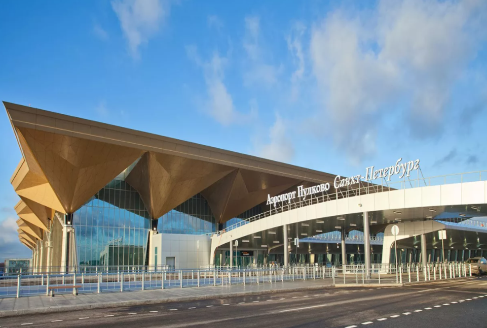

# 俄媒：圣彼得堡普尔科沃机场周围空域因“不明飞行物”被关闭

【环球网快讯】据俄罗斯《消息报》28日最新报道，由于圣彼得堡普尔科沃机场附近出现“不明飞行物”，以该机场为中心半径200公里的空域关闭。

据俄新社28日最新报道，圣彼得堡普尔科沃机场暂停进出航班。一名消息人士告诉该媒体，圣彼得堡普尔科沃机场周围空域关闭至莫斯科时间28日13时20分（北京时间28日18时20分）。

_圣彼得堡普尔科沃机场，资料图_

