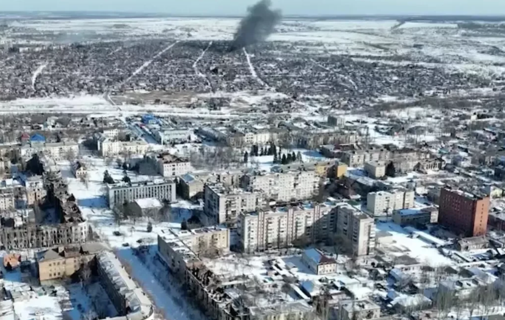
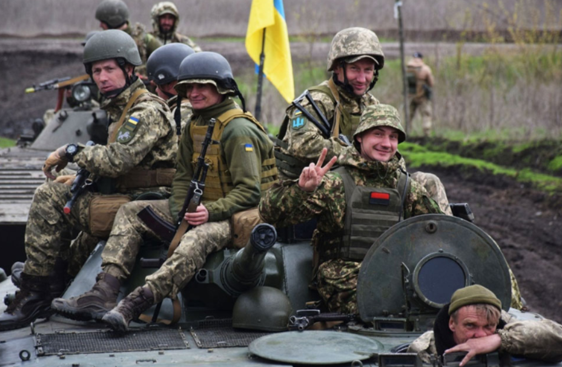
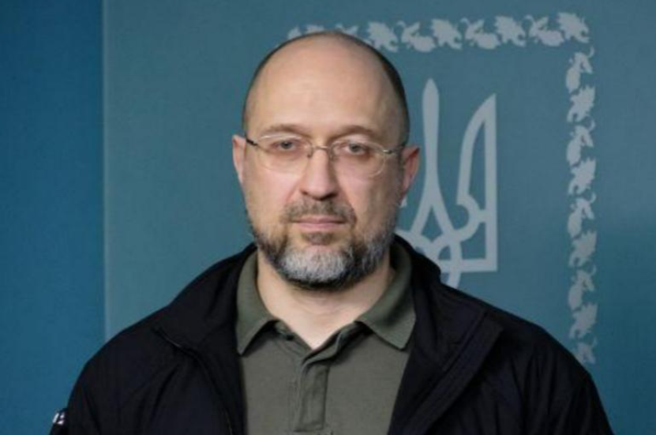
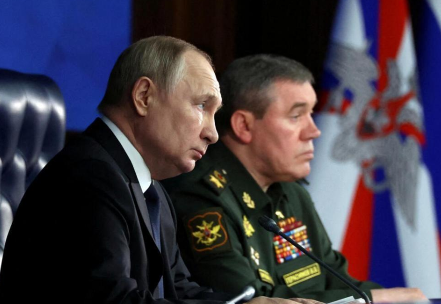

# 俄方：乌司令部下令炸毁大坝，为阻挡俄军进攻不惜淹没乌平民住宅

【南方+2月28日讯】 俄乌冲突踏入第二年，战况依然胶着。随着俄罗斯的春季攻势愈演愈烈，乌克兰在正面战场屡屡受挫，为了赢得主动，开始剑走偏锋。

**水淹俄军**

据俄罗斯卫星通讯社报道，为了阻止俄雇佣兵瓦格纳集团的进攻，乌克兰司令部要求巴赫穆特驻军炸毁该城市西北部的一座水坝。瓦格纳PMC的新闻官称，大坝被炸毁后，水库里的水涌入居民区，当地居民的私人住宅和地下室旋即被洪水淹没，巴赫穆特及周边地区的居民面临直接危险，瓦格纳集团的行动也暂停。

根据俄媒发布的视频，一名瓦格纳集团的排长25日称，俄罗斯军队正在向巴赫穆特市中心推进，距离市中心只剩不到两公里。但他也表示，战况很激烈，并未如预料的那样顺利。

据悉，巴赫穆特在顿涅茨克东北方55公里处，是为顿巴斯乌军提供补给的重要交通枢纽。如今，乌军为了阻止瓦格纳集团的进攻而炸毁水坝，不惜切断自己后方的补给通道，连乌克兰民众的安危也置之度外。

这一幕与去年的赫尔松战役有相似之处。

2022年11月，俄乌在赫尔松地区陷入胶着。据环球时报报道，当时，为了“破局”，乌军使用美国提供的“海马斯”系统炸毁了距离赫尔松不远的新霍卡夫卡水电站，赫尔松顿时被淹没。最终，俄军被迫放弃赫尔松，退回至第聂伯河右岸。

当时乌军能夺回赫尔松，炸坝起到了决定性作用。如今，巴赫穆特战役已经持续数月，随着今年俄军加大对该地区的进攻力度，巴赫穆特乌军的处境越来越艰难。眼看巴赫穆特即将被攻破，乌军选择再度炸坝。

**乌总理：未来百年不会与俄和解**

乌军的行动越来越出格，乌克兰政府官员的言论也越来越带有敌意。

据环球网报道，乌克兰总理什梅加尔近日接受德国《焦点》周刊采访时称，乌克兰在未来100年内不会与俄罗斯和解或合作。

报道称，什梅加尔在谈及俄乌冲突时声称，乌克兰是一个“拥有国际公认边界的主权国家”，不会向“侵略国”妥协，“唯一的妥协方案就是俄军从乌克兰撤出，恢复至1991年边界。”

对于乌克兰总理这番言论，尚未看到俄罗斯方面作出回应。

俄乌冲突已持续了整整一年。这一年以来，除了美西方部分国家外，国际社会普遍支持俄乌双方通过对话谈判和平解决问题。

俄方表示从未拒绝任何形式的和谈，但“不会以乌方条件为基础进行任何谈判”，将继续进行特别军事行动，直至达到目标。乌方则明文禁止与俄总统普京进行谈判。双方都没有准备好和谈，局势紧张程度加剧。

与此同时，以美国为首的北约多国还在不断火上浇油，向乌克兰提供军事援助，并不断加强在俄罗斯周边的军事部署，进一步挑战俄罗斯的底线。

【审核】邹非序

【校对】罗健鹏

