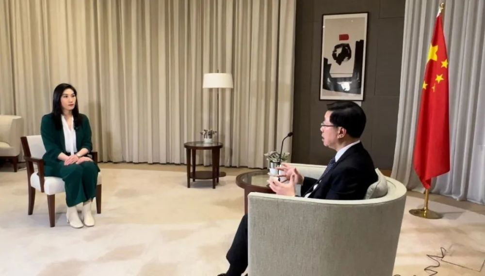

# 口罩令解除前夕，李家超向内地同胞喊话

2月23日，香港特区行政长官李家超“旋风式”访问广深，并且强调“首次访问只是个开端”。对于李家超会如何抓住国家发展机遇，推进香港融入国家发展大局，外界十分关注。

时隔五天，李家超再次向外界发出“香港声音”。

2月28日下午，李家超接受人民日报、新华社、央视、大公文汇全媒体、深圳卫视等内地与香港媒体联合采访，对当前两地热议的话题作出详细阐述，为香港发挥独特优势、加速融入国家发展大局描绘了一幅清晰的路线图。

3月1日起，香港将全面取消“口罩令”。对此，李家超难掩兴奋，在采访开始前和结束后两次提及，并且感慨万千地说：“现在的香港，比起2019年以前，更美、更健康、更有活力。”

李家超还笑道：“明天不戴口罩了，更开心……希望你们回去以后，告诉内地的同胞，香港就是自己的地方，来这里看到自己的文化，也看到不同的文化，太美的地方了。”

他充满激情地对广大内地同胞说：“香港欢迎你！”

**软硬结合——香港的“成功密码”**

“香港是个很有趣的城市。”谈 到香港的吸引力，李家超 这样对深圳卫视驻港记者丘倩怡说道。

“在食物方面，我们是饮食天堂；我们是一个24小时不停的城市；我们是交通很方便的地方。”李家超说：“在香港生活，在香港工作，在香港发展，都会很有趣。”

富有趣味，正是香港最大的魅力，也是香港软实力的重要表现。正因如此，香港才能不断地吸引全球游客，吸引各国人才，吸引中外企业的投资。“我们不单单是要‘拼经济’，也可以生活得‘有味道’，这个也是香港的优势”，李家超说。

要吸引人才来到香港，以文化艺术为代表的软实力是重要手段；而以科技创新为代表的硬实力，才能真正将人才留住。 **软硬结合，正是香港的“成功密码”。**

李家超表示，特区政府日前发表了打造国际创新科技中心的蓝图，相信无论是香港、还是外国的企业和人才，都会从中看到机遇并加以利用。

在人才方面，去年年底，香港特区政府发布“高端人才通行证计划”（高才通计划），旨在吸引国际人才赴港发展。李家超表示，特区政府有许多引入人才的计划，未来希望每年至少引入3.5万位的高端人才。

科技创新，是香港需要保持的优势。李家超提到，香港的基础研究十分发达，本身拥有5所世界百强大学，基础研究上成绩非常优秀，有70%的科研成果被评为优秀成果。“香港有16个国家重点实验室，也有22个是中国科学院与香港高校的联合实验室”，李家超强调。

李家超还说，目前香港在科研的投入大约占到GDP的1%， **将来的目标是“翻一番”，最好能达到2.5%**
。他表示，科技创新不能只靠政府投资，也要吸引民间投资。李家超称，特区政府正考虑成立一个共同投资基金，引进一些中外的龙头企业，建立好香港科技创新的生态圈。

**大湾区城市强强联手 更快更远更高！**

单单保持原有优势并不足以支持香港将来真正实现经济社会的高质量发展，香港还需要依托粤港澳大湾区，发挥“背靠祖国、联通世界”的独特优势，积极融入国家大局。

在采访中，李家超多次展望粤港澳大湾区的发展前景，并将香港与大湾区其他城市的合作形容为“强强联手”。

李家超强调，粤港澳大湾区各城市有着不同的优势，取长补短、优势互补，实现共赢。李家超用“区位优势”来形容这一点，他表示，大湾区内部城市不需要浪费时间相互竞争，而是优势互补。与其它地方相比可以更快发展。

“就像一个队伍，我是可以跑得远的，另外一个队伍，可以跑得快的，另外一个队是可以跳得高的。那么我就不需要浪费时间既要我的成员跑得快，又跑得远，又跳得高。我们联手的时候，既跑得快、跑得远，又跳得高。”

从科技创新成果落地的角度来讲，共建粤港澳大湾区是香港完善链条的必由之路。李家超提到，《施政报告》中提出要设立100亿港元“产学研1+计划”，以加速科研成果落地商品化。他强调，香港在上游研发方面具有优势，而大湾区内地城市在中下游制造方面具有优势，利用大湾区城市互补的特性，香港能建设好科研产品落地的完整链条。

此外，科技创新也需要金融手段的支持，而香港作为国际金融中心，在这方面更具优势。李家超表示，对于外资而言，香港是进入内地市场的一个跳板，许多海外企业都希望进入内地不同的城市，因此也能助力两地科研产业的发展。

**深港合作 “换位思考”达至共赢**

在上任后发布的首份施政报告中，李家超提出“北部都会区”将以“国际创科新城”为主题，各界预期将形成“南金融、北科创”的香港新格局。

对此，李家超答深圳卫视时说，香港希望更积极主动去推动和参与大湾区建设，“特别是和深圳”。他表示，上任以后已经成立融入国家发展大局督导组，主要是发挥指导、指挥、统筹的作用，领导方面从以往的1个人，变成“1+3”，“以期更积极、更主动地融入大湾区建设。”

此外，李家超说，香港跟深圳已经组成19个专班，其中1个是针对北部都会区的建设。北部都会区的建设不单是香港新的引擎，更是高质量发展的地方。“跟深圳融合起来，互相呼应，协同效应可以让整个北部都会区的发展更快、更强、更有效益。”

而在河套地区，深港正在加速推进“一区两园”建设工作。李家超表示，如果河套模式成功的话，可以应用到其它合作领域的项目中，整个大湾区在融合方面可以提升得更高。

另外，李家超还谈及日前访问深圳时与深圳市领导的会面。他表示，对深圳的访问让他印象深刻，“（深圳）发展得很快，政策出得很快，政策的落地成果非常好”。他表示，深港经济要实现高质量发展，科技、人才、教育等方面环环相扣，
**而区域合作具有“激发性”，相信深港的合作能够激发出整个大湾区的活力** 。

李家超说，香港跟深圳是一脉相承的，多年的合作其实让两座城市在很多方面已经融合起来。他继而谈到，所谓“融合”，
**指的是双方知道各自的优势和限制，能够用优势补足对方的限制**
，而在思考政策的时候也会换位思考，确保是共赢的方案。李家超举例说，深港共同建设前海合作区，深圳在金融方面可以通过香港去服务全国。

主笔丨陈淼松，深圳卫视直新闻主笔

记者丨丘倩怡 、黄俊强，深圳卫视直新闻驻港记者

