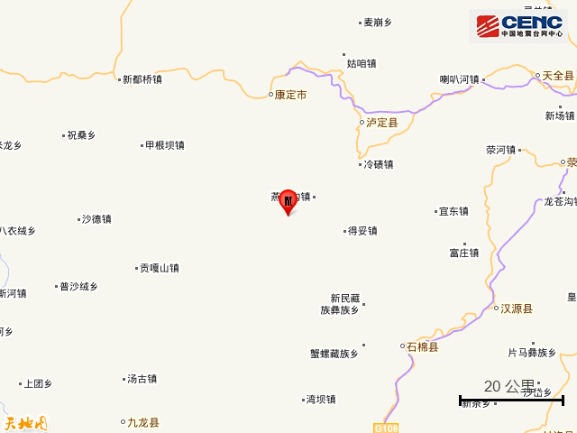
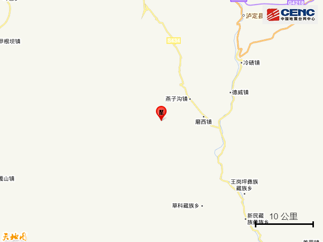
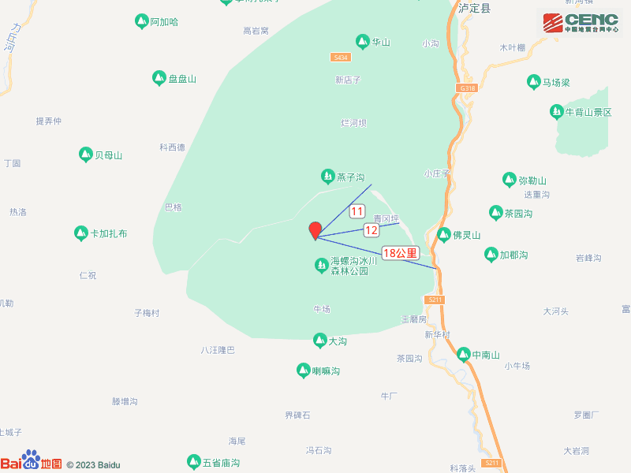
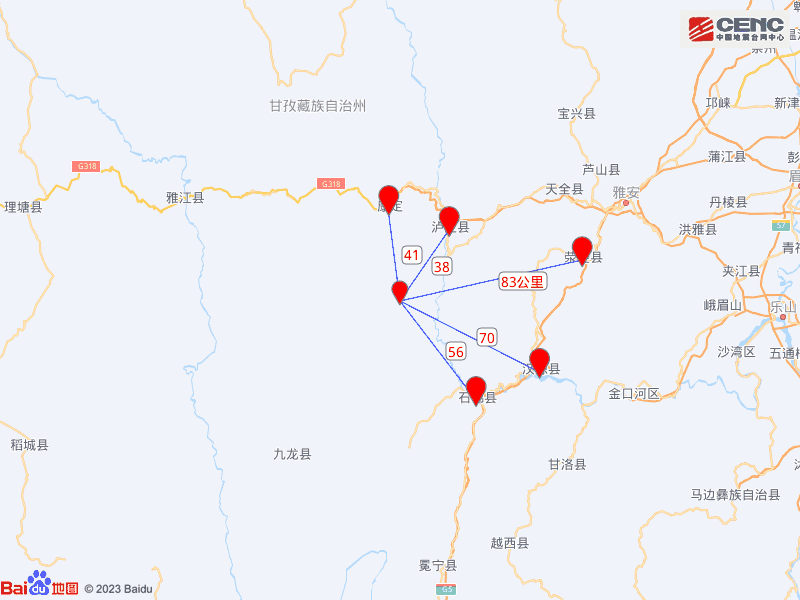
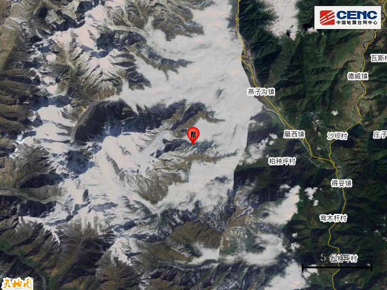
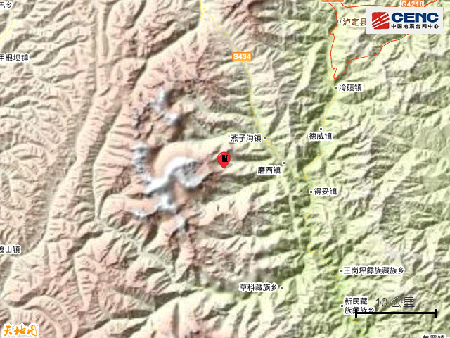
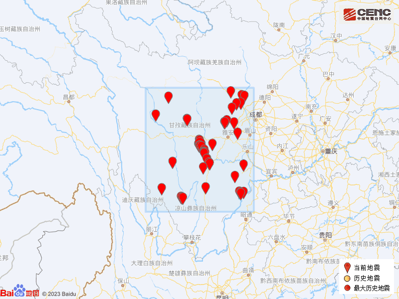

# 四川甘孜州泸定县发生4.8级地震，震源深度8千米

**速报参数：**
据中国地震台网正式测定，2月28日22时46分在四川甘孜州泸定县发生4.8级地震，震源深度8公里，震中位于北纬29.63度，东经102.01度。

**附近村镇：** 本次地震周边5公里内的村庄有青石板，20公里内的乡镇有燕子沟镇、磨西镇、得妥镇。

**周边县城：**
震中距泸定县38公里、距康定市41公里、距石棉县56公里、距汉源县70公里、距荥经县83公里，距甘孜藏族自治州47公里，距成都市229公里。

震中地形：震中5公里范围内平均海拔约3984米。

历史地震：根据中国地震台网速报目录，震中周边200公里内近5年来发生3级以上地震共97次，最大地震是2022年9月5日在四川甘孜州泸定县发生的6.8级地震（距离本次震中8公里），按震级大小前50次历史地震分布如图。

