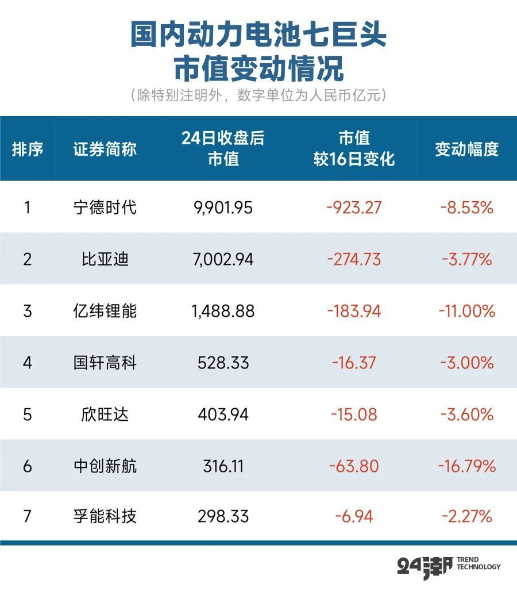
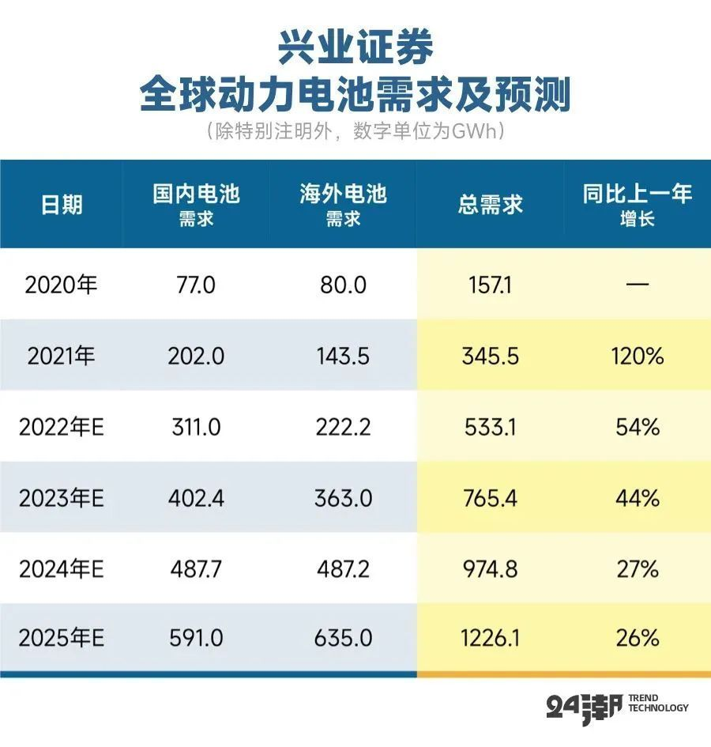
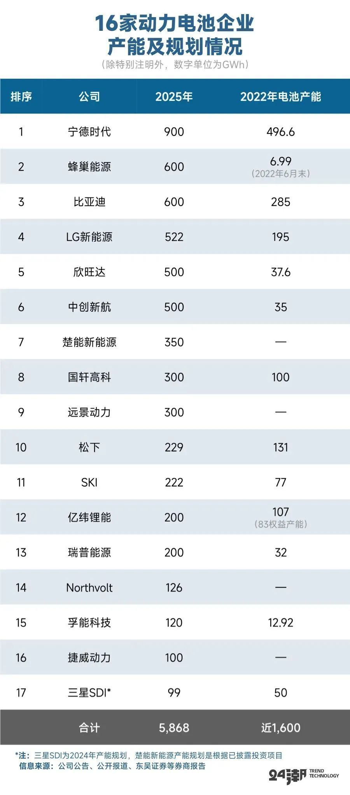
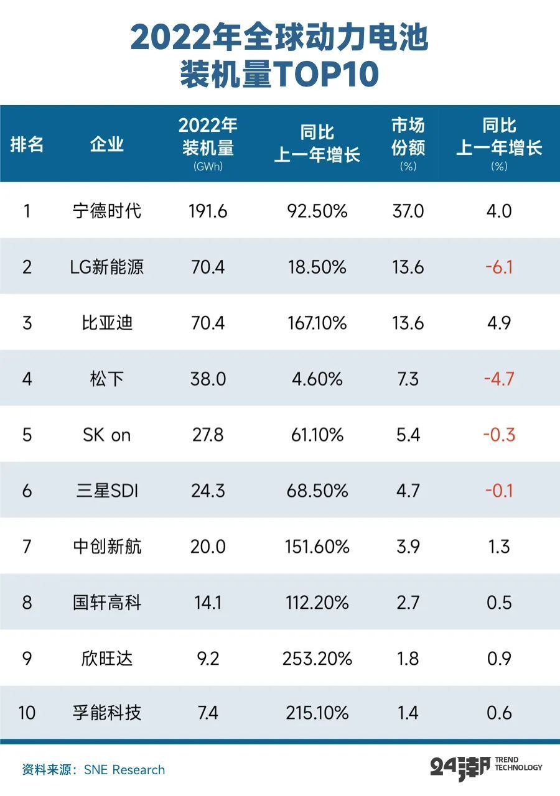
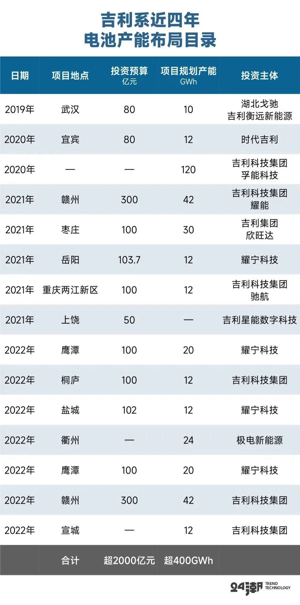
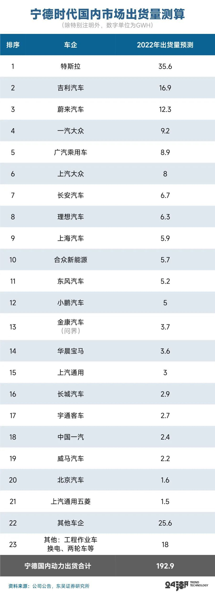
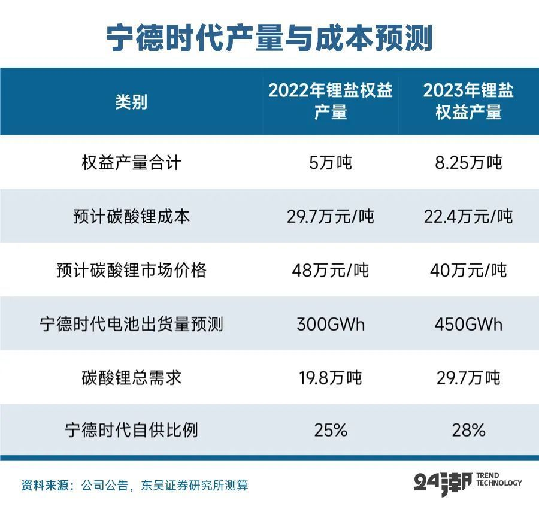
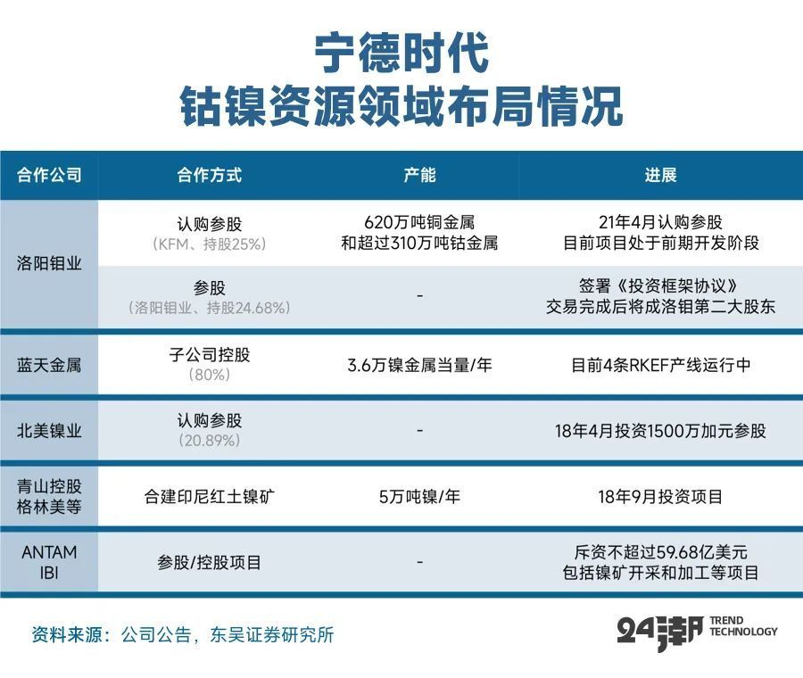

# 拆解宁王“锂矿返利”战略，新一轮降价潮或在酝酿中！

**划重点：**

  * _1_ 综合产业发展趋势以及各企业产能规划情况，未来动力电池领域出现严重产能过剩几乎已成定局。
  * _2_ 供应链博弈加剧、产能疯狂扩张、产能过剩隐忧等因素都在加速重构产业新格局，各家为了保持自身的产业地位，惨烈的价格战争几乎已不可避免。
  * _3_ 宁德时代该 “锂矿返利” 计划将对其余动力电池企业产生较大压力，特别是对资金实力不足、尚未掌握上游锂资源的动力电池企业。

“其实宁德时代这次就是针对核心客户搞了一个让利活动，根本没有大家想象的那么复杂。”

不管宁德时代(300750.SZ)方面如何解释 “锂矿返利” 计划，外界都普遍将该计划视作其发动了一场新的价格战争。

时间回溯到十多天前，即2月17日，据36氪消息，多位产业链人士透露，宁德时代近期正向车企主动推行一个锂矿返利计划，该计划核心条款是：未来三年，一部分动力电池的碳酸锂价格以20万/吨结算，与此同时，签署这项合作的车企，需要将约80%的电池采购量承诺给宁德时代，并需要一定的锁定费用。

一句话，宁德时代试图以较低的电池价格绑定长期的客户订单。

而据上海钢联数据显示，即便上周电池级碳酸锂价格累计下跌2.75万元/吨，但截止2月24日电池级碳酸锂均价报40.75万元/吨。这仍是宁德时代
“20万吨结算价格” 的2倍多。

消息传出，震动整个产业及资本圈。

据24潮团队统计，在17日-24日这短短6个交易日中，宁德时代、比亚迪、亿纬锂能、国轩高科、欣旺达、中创新航、孚能科技等7家企业市值全线下跌，市值合计蒸发1484亿元，降幅达7%，而同期上证指数上涨0.56%。其中，降幅最大的动力电池企业中创新航、亿纬锂能市值降幅均在10%以上。

在产业端，据悉目前蜂巢能源已推出10%降价计划，部分供应商已收到该公司要求配合降价的邮件。亿纬锂能则表示，下游客户基本上还是尚未盈利的状态，因此作为主要供应商，公司会在战略上给予一定支持，在利润上部分让利下游，公司今年在动力电池方面不太追求更高的利润率，希望在客户端的市占率能够提升。

可以预见的是，接下来动力电池企业之间的价格竞争很可能会进一步加剧。

市场普遍认为宁德时代该 “锂矿返利” 计划将对其余动力电池企业产生较大压力，特别是对资金实力不足、尚未掌握上游锂资源的动力电池企业。

实际上，宁王此次推出 “锂矿返利”
也多是迫于竞争环境的变化！纵观近年动力电池产业布局及发展趋势，供应链博弈加剧、产能疯狂扩张、产能过剩隐忧等因素都在加速重构产业新格局，为了保持自身的产业地位，惨烈的价格战争几乎已不可避免。

首先，我们先了解一下产业竞争大格局与发展趋势。

根据兴业证券分析认为，预计2025年超2000万辆，在新能源车市场高景气度的背景下，动力电池装机需求同步上升。今年全球动力电池需求预计将达533GWh，到2025年将超1200GWh，“十四五”
期间CAGR达50.8%，正式迈入TWh时代。

高工产业研究院(GGII)的市场预期则要更为乐观，据其预测，2025年全球新能源汽车渗透率将达到25%以上，将带动全球动力电池出货量超过1550GWh。宁德时代掌门人曾毓群此前更是预测，到2030年，全球动力电池装车量将达到4800GWh，若1GWh的电池值10亿元，那么届时动力电池市场将是一块价值近5万亿的
“蛋糕”。

但即便是再乐观的市场预期，也抵不住动力电池领域疯狂扩张浪潮的冲击。

比如24潮团队统计，综合各券商及企业公告等数据发现，全球17家动力电池企业预计到2022年底产能合计将近1600GWh，仅这17家动力电池企业到2025年产能规划高达5868GWh。这近乎是2022年全球动力电池总需求量的11.33倍，且远高于上述需求预测！

而全球动力电池产业玩家远远不止于上述17家企业，根据中国汽车动力电池产业创新联盟统计，2022年1-11月我国共计51家动力电池企业实现装车配套，当前除了原有动力电池巨头持续加大投资外，很多汽车巨头也在动力电池领域投入重兵，试图重塑产业新格局。

比如据24潮不完全统计，近4年间吉利系对外至少公布了15个重大投资规划，动力电池产能规划超400GW，总投资预算超2000亿元。此外，诸如广汽集团、上汽集团等汽车产业巨头也都投入百亿资金入局动力电池。

若考虑全球范围内其他产业巨头发展规划，2025年全球动力电池企业产能规划很可能将超8000GWh，而这是上述兴业证券预测2025年总需求(1226.1GWh)的6.52倍，是GGII预测值的5.16倍！

综合产业发展趋势以及各企业产能规划情况，未来动力电池领域出现严重产能过剩几乎已成定局，而产能过剩的时点与竞争惨烈程度可能将超乎所有人的想象。

研究机构睿咨得能源(Rystad)副总裁邹钰屏在2月21日的会议上表示，2022年中国电池厂和整车厂出现不同程度的动力电池累库，其中电池企业电池库存约为80吉瓦时(Gwh)，整车企业电池库存约为103吉瓦时，合计库存183吉瓦时，动力电池产业链去库存情绪浓厚。

该分析的基础数据来自中国汽车动力电池产业创新联盟（下称电池联盟）和中国汽车工业协会，电池厂库存是电池产量与销量之间的对比，整车厂库存数据为电池销量与装车量、出口量之间的差值。

事实上，动力电池累库现象在2022年下半年已经引起市场关注，经过过去两年的争相扩产，国内动力电池产能快速增加，电池产量与装车量的差额也逐渐变大，这一数值也通常体现在企业库存上。据电池联盟数据，2018-2022年，该差额分别为13.6吉瓦时、23.2吉瓦时、19.8吉瓦时、65.2吉瓦时、251吉瓦时。

扣除约68吉瓦时的出口量，2022年国内电池库存为183吉瓦时，同比增加近两倍。2022年中国动力电池装车量为295吉瓦时，以此计算，当年电池库存量相当于全年电池装车量的62%。

产业形势已经变的非常严峻。

回归到宁德时代层面，韩国机构 SNE Research 数据显示，虽然 2022 年宁德时代动力电池出货量依然稳居全球第一，占比达
37%。但其2022年动力电池装机量增速已经远远落后于比亚迪、中创新航、国轩高科、欣旺达、孚能科技等竞争对手。

在国内，宁德时代的市场份额更是从2021年的52.1%跌落至48.2%。而比亚迪、中创新航等市占率则有所提升，其中，比亚迪2022年市占率相比2021年提升了7.25个百分点。

根据东吴证券测算，2022年前十大客户销量约占宁德时代国内市场的60%，而其中前三名、特斯拉、吉利汽车与蔚来汽车，都已有自己的动力电池扩张计划。

最新消息是，两位消息人士周五（24日）表示，蔚来汽车计划在安徽省合肥市新建电池工厂，规划产能40亿千瓦时(GWH)。

事实上，2021-2022年起部分宁德时代独供车企开始引入二供，为保证供应链稳定的正常现象，宁德时代在部分车企中配套份额下降。例如，自主车企广汽新能源已引入中航锂电，份额已超宁德时代；吉利汽车引入欣旺达、孚能；新势力小鹏汽车引入中航锂电、亿纬锂能等，蔚来、理想、国产特斯拉等独供车企也在陆续寻求二供。

欣旺达和蜂巢能源在今年2月份挤进了理想汽车的供应链，而此前理想汽车电池由宁德时代独家供应。

正常商业逻辑下，车企为保证供应链安全寻求二供，引入更多电池供应商，但这将导致龙头电池企业独供地位难以维持。

此外，据24潮统计，在2022年前三季度宁德时代的21个主要客户中，宁德时代只在8个客户中供应商份额占比超过80%，在另外8个客户中份额占比已低于50%。

回到 “锂矿返利” 计划本身，据了解，这一计划并不针对所有客户，只面向理想汽车、蔚来汽车、华为、极氪等战略客户。

事实上，这与宁德时代在上游布局及进度有很大关系。据24潮统计，近些年宁德时代在锂资源领域的投资已超百亿规模，有券商分析认为，宁德时代在上游锂资源的系列产业布局，对应300GWHh+电池需求，远期规划庞大，有效保证供应链安全。

但由于锂开采周期较长，且项目投产进程受制于多方面因素，实际运行进度可能不及预期规划，具有极高的不确定性。

比如根据东吴争取测算，到2023年宁德时代碳酸锂权益产量约为8.25万吨，而宁德时代自身碳酸锂总需求约为29.7万吨，自供比例仅为28%。

宁德时代方面也曾表示，随着锂矿开采量增加， “锂矿返利” 计划的客户名单也有望增加。

如上表所示，根据东吴证券预测到2023年宁德时代碳酸锂成本约为22.4万元/吨，这仍高于宁德时代锂矿返利计划中的
“20万元/吨”，可见宁德时代此次降价可谓诚意十足。

目前，1GWh铁锂电池大约需要590吨碳酸锂，1GWh三元电池大约需要690吨碳酸锂，如按1Gwh可装两万台车进行粗略计算，碳酸锂每调整10万元/吨将影响每辆车2950元至3450元的利润。要知道即便是比亚迪单车利润也仅在1万元左右，所以
“锂矿返利” 计划确实对车企有一定的吸引力。

但是，据华创电新最新调查显示，“目前已有8家主机厂收到返利方案，其中一家公司否了，其他7家还在评估，预计3家国企系主机厂先签署，另4家新势力认为优惠幅度不大，会观望。”

观望原因主要为：本次让利并不涉及基线价格谈判（基础价），电池定价是基础价+碳酸锂联动，车企认为这次让利，实际相当于降价4个点左右，而之前宁德报价比二线高10%，让利后还高6%，且有苛刻条件，而部分主机厂今年导入二供决心强。

产业大势基本已经确定，未来产业竞争将非常惨烈，或许一轮更为凶猛的降价潮正在酝酿中。

**附：宁德时代在上游材料端布局情况**

**参考致谢：**

财新-国内动力电池库存大增，宁德时代打响价格战

东吴证券-（宁德时代）全球电池王者风范尽显，动力储能引领星辰大海

经济观察报-“宁德时代“锂矿返利”计划的野心与风险”

