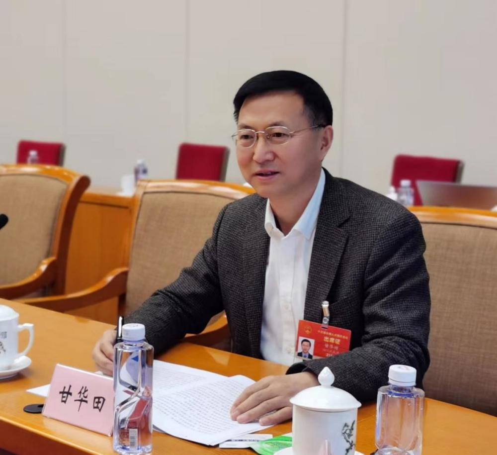

# 政协委员甘华田：建议推进6岁以下儿童、80岁以上老年人免费医疗

“我国80岁及以上的老年人口大约有3580万，仅占我国人口总数的2.52%，这个比例是比较低的。结合我国的综合国力、财政收入，我们认为对这一部分人群进行免费医疗是完全可行的。”

2023年全国两会即将召开，第十四届全国政协委员、四川大学华西医院教授甘华田告诉红星新闻记者，这次“两会”，他仍然十分关注民生问题，特别是“一老一小”问题，他将提交“关于将全民免费医疗列为基本国策，并尽快逐步推进6岁以下儿童、80岁以上老年人免费医疗的提案”，建议“尽快把全民免费医疗列为一项基本国策，制定出具体实施时间表，从制度安排上把它放在整个国家政策体系的最高层次”。

甘华田告诉红星新闻记者，建议把免费医疗作为基本国策，不是说马上要实行全民的免费医疗，而是要把它当作一个奋斗目标，从制度层面上做出安排，就像“耕地保护政策”、“对外开放政策”等基本国策一样，体现一种国家意志，彰显政府为解决“全民免费医疗”的决心，实实在在落实“以人民为中心”的思想，给人民以信心，让老百姓看到希望。

**观点：**

**全民免费医疗必然是绕不过去的话题和政策**

甘华田告诉红星新闻记者，随着社会的不断发展进步，全民免费医疗必然是我们绕不过去的一个话题和政策。因为几乎所有人内心深处都渴望着能够实行免费医疗，“吃五谷，生百病”，毕竟没有一个人能够说他（她）一生不生病。

_全国政协委员、四川大学华西医院教授甘华田_

与此同时，甘华田表示，目前，随着我国经济实力的不断提升，综合国力的不断增强，已成为仅次于美国的世界第二大经济体，实现全民免费医疗的基本条件已经具备。

“实际上，目前世界许多国家早已经实施全民免费医疗，我国近年来在陕西神木、湖南桑植县、麻阳苗族自治县等地试点实行免费医疗政策也取得了很好的效果，证明实施全民免费医疗在我国是可行的。”

**建议：**

**尽快逐步推进6岁以下儿童、80岁以上老年人免费医疗**

甘华田对红星新闻记者表示，一提出全民免费医疗，就有人担心医疗资源浪费，国家财政难以承担等一系列问题。

“这种担心不无道理，但不应该成为阻碍实施全民免费医疗的理由。实际上，如果我们找到一系列科学的具体操作方法，建立一套有效的保障制度和监督体系，上述问题就是杞人忧天。”甘华田如是说。

甘华田提出， **“全民免费医疗”，并不意味着完全免费，也不意味着完全由国家财政负担，而是一种保障水平更高、个人支付比重很低的全民医疗保险制度。**
“实际上，完全免费的医疗在世界上任何国家都是不存在的”。

“当然，我们也清楚知道，目前我国实施全民免费医疗还有一定困难，还需要一些时间，但是我们不能等待时间，应该积极有所作为才是。”

在甘华田看来，逐步推进6岁以下儿童、80岁以上老年人免费医疗是保障“一老一幼”的生命健康，是以人民为中心的发展思想的重要体现，也是积极缓解生育焦虑，应对人口老龄化的重要举措。

“尽管目前实施全民免费医疗还有一定困难，但选择一个合适的年龄段，对一些特殊人群，比如6岁以下儿童、80岁以上老年人逐步推进免费医疗还是可行的。”

**现状：**

**陕西神木等地已试点“免费医疗政策”**

据多家媒体报道，全国政协委员、北京中医药大学教授张其成已经连续3年为全民免费医疗提案。也有巴德年、李玲、武鸿麟等专家建议我国实行全民免费医疗。

2020年，张其成第一次提出逐步实现全民免费医疗。2021年张其成再次提出开展“全民免费医疗”试点。2022年，张其成又一次提出了逐步推进“全民免费医疗”。

在此前的提案中，张其成曾提到，因病返贫的潜在危机依然存在，医疗费用居高不下，过度检查、过度治疗、过度用药问题依然严重，医患矛盾没有得到根本解决。“全民免费医疗”是解决这些问题的“上上策”。

张其成的提案还写道，全民免费医疗并不会导致医疗费用提高。他指出，对世界各国医疗保健制度进行比较研究后发现，免费医疗不但不会造成浪费，反而会节省医疗支出，因为实行免费医疗的国家和地区有一套科学的医疗保健制度来杜绝“小病大医”。

正如甘华田、张其成所言，陕西神木、湖南桑植县、麻阳苗族自治县等地试点实行免费医疗政策。事实上，许多地方试点实行已有多年。

2009年，神木县人民政府印发了《神木县全民免费医疗实施办法（试行）》的通知，将民营医院引入医保，保证充足的医疗资源，并施以务实细致的医保控费手段。此前，也有媒体和专家学者们指出“全民免费医疗”，是一种保障水平较高的“全民医保”。

2011年8月2日，一纸《桑植县新型农村合作医疗参合农民乡镇住院全报销实施细则(试行)》的通知，正式宣告了该县医改到来。

据《三湘都市报》，为了防止类似神木县免费初期所出现的住院人数“井喷”及过度医疗的现象，由该县的县合作医疗管理委员会和46个乡镇定点医疗机构签订了《桑植县乡镇住院全报销服务协议》，加强对患者入院审查、住院治疗、出院报销等各个环节的监管，对各乡镇卫生院人均住院费、药品比例等项目定期考核，严格奖罚。并且按照患者日均费用和次均费用进行考核，实行基金总额控制，如患者住院日均费用应控制在80元以内，次均费用控制在950元以内。

红星新闻记者 王辰元 吴阳 北京报道

责编 邓旆光 编辑 郭宇

