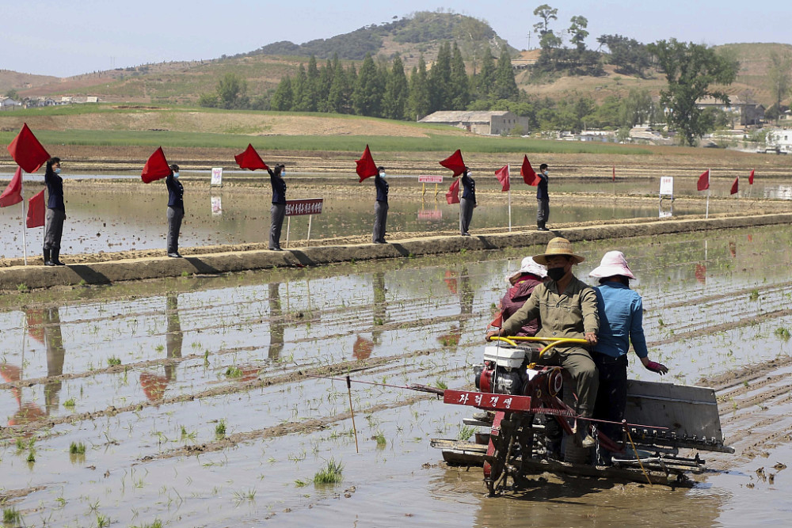

# 朝鲜计划几年内实现农业生产根本变革，外媒：朝正在饥荒边缘徘徊

_朝鲜，一农场的农民使用插秧机种植水稻。视觉中国
图_

当地时间2月27日，在朝鲜劳动党第八届中央委员会第七次全体会议扩大会议第二天会议上，朝鲜最高领导人金正恩表示，朝鲜将在未来几年内实现农业生产的根本性变革。

据朝中社报道，朝鲜劳动党第八届中央委员会第七次全体会议扩大会议2月27日继续举行，会上就农业问题进行讨论。金正恩表示，2023年实现粮食生产目标是当务之急，并强调稳定农业生产和转变生产方式的重要性，称其“为农业的稳定和持续发展奠定基础”。会议上没有详细说明朝鲜将具体采取怎样的措施，但金正恩表示，农业生产的根本性变革将在未来几年内发生。

_朝鲜平壤，一农场的农民在管理稻苗。视觉中国
图_

据半岛电视台与路透社报道，受自然灾害的影响，朝鲜长期面临较为严重的粮食短缺问题。近年来，极端天气引发的粮食歉收、全球疫情暴发后的边境封锁政策、朝鲜核武器发展引发的国际制裁，共同导致粮食危机的加剧。据半岛电视台援引美国约翰·霍普金斯大学的朝鲜分析网站“38
North”的研究报告，朝鲜2020年至2021年的粮食产量可能无法满足最低限度的人类需求，朝鲜目前正在饥荒的边缘徘徊。该报告称：“迄今为止的证据表明，朝鲜的生活条件严重恶化，以粮食不安全为核心的复杂的人道主义紧急情况持续加剧。解决朝鲜粮食不安全问题的长期方案，一定程度上取决于朝鲜核问题的处理。解决核问题可能会大幅减轻各国对朝的经济制裁，也能帮助朝鲜恢复与美国及其盟友的贸易往来。”

_朝鲜开浦镇的田野。视觉中国 图_

朝鲜官方媒体《劳动报》上周在一篇评论文章中呼吁，朝鲜应加强经济自主能力，将外部援助比作“有毒的糖果”，警告称“帝国主义”会利用援助作为“掠夺和征服”受援国的陷阱，进而干涉受援国的内政。

