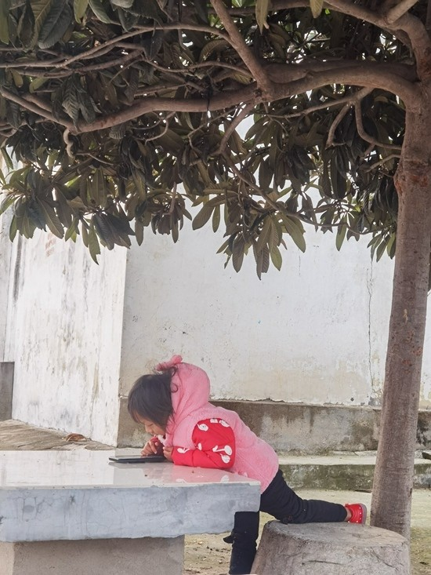

# 沉迷手机催生乡村“新问题少年”：“仿佛掉进手机里去了”

_课题组在中部省份某村庄调研时看到，两名小朋友围坐在一起观看手机短视频。本版图片均由受访课题组提供_

春节刚过，青少年沉迷智能手机的话题再度引发关注。武汉大学中国乡村治理研究中心夏柱智副教授课题组将目光聚焦于农村留守儿童。不久前，该课题组对外发布的报告显示，在调研的中部省份中，有九成农村留守儿童长期使用专属手机或者长辈的手机玩耍，其中，近七成孩子用手机看短视频，三分之一用来玩手机游戏。

“在农村，一些中小学留守儿童放假回家后，‘盯着手机不离手’成为常态。沉迷手机已经严重影响他们的身心健康，有的孩子为此面临‘精神和身体的双重冲击’。”该课题组呼吁，政府应当将通过积极干预、防止严重的手机沉迷作为关心与服务留守儿童工作的重中之重。

**沉迷手机低龄化 “仿佛掉进手机里去了”**

2021年以来，夏柱智课题组分赴河南、湖北、湖南、江西4省共10县（区）展开专题调研。调查显示，在中部省份的农村，留守儿童比例较高，部分占比超过50%，学校及家长普遍反映手机管理难，而对留守儿童群体使用手机的管理难度很大。

课题组面向河南、湖北、湖南三省九县（简称“三省调查”）中小学生家长开展了留守儿童手机管理问卷调查，共回收有效问卷13172份。调查显示，40.4%的留守儿童有专属手机，49.3%的留守儿童使用长辈的手机。

看短视频和玩游戏已成为留守儿童主要的上网娱乐方式，占比分别是69%、33.1%。与此同时，67.3%的家长认为自己孩子出现了手机沉迷的趋势，其中21.3%的家长认为孩子“严重沉迷手机，事态已十分严重”。

这份题为《农村留守儿童手机沉迷问题调查与对策建议》的调研指出，玩手机时间增多、触网年龄提前的情况，在留守儿童中正“愈演愈烈”。

课题组在贵州一所乡镇中学调研时发现，有的留守孩子为了打游戏连续5天5夜不睡觉。江西省某县六年级教师掌握的一份数据显示，全班学生中，周末在家玩手机10个小时以上的超过了一半。

夏柱智老家位于湖北鄂东地区的一个山村。令他意外的是，一次走访中，一名尚在读小学六年级的留守儿童已经开始“通宵”玩手机，放假了经常约同学整夜玩手机游戏。当地一位小学教师反映，假期里，不少男学生扎堆儿成群玩手游，玩到凌晨两三点，第二天起床继续玩。

课题组在湖南、湖北的部分乡村中小学进行班级统计后发现，几乎没有学生“从没接触过手游”，而每天玩超过两小时的占50%以上。

“10-15岁，成为留守儿童沉迷手机的危险年龄段，主要为小学四年级至初中三年级学生。”夏柱智介绍。

与此同时，沉迷手机的现象正在走向低龄化。

在湖北省阳新县枫林镇，课题组到当地家访，看到这个家中一个5岁的小孩一直盯着手机屏幕玩游戏，“眼圈发黑，却十分精神”。当被问及擅长哪些游戏时，他热情地展示起自己手机上的6款游戏App。

在一些农村地区，课题组经常看到，四五岁的儿童也能熟练下载和操作手机游戏，或者不断滑动屏幕观看短视频，“这些手机软件对低龄儿童来说非常有吸引力，而且进入门槛非常低。”

有受访家长对课题组表示，如今在农村，智能手机对孩子们的吸引力异乎寻常，只要家里有Wifi（无线网络），孩子们放学回到家拿上手机可以大门不出，“仿佛已经掉进手机里去了”。

_中部省份某村庄，一名小女孩独自在玩手机。_

**“游戏大神”比“学习尖子”更受追棒**

根据夏柱智的观察，近5年来，留守儿童沉迷手机现象愈发凸显。

“首先是互联网快速发展，在广大农村上网正越来越方便。”夏柱智注意到，以前在老家，安装无线网络的人家并不多，一些孩子常常寻找有Wifi的地方，挤成一排“蹭网”玩手机。近几年在部分村庄，几乎家家户户都安装了无线网络，留守儿童很难不触网。

其次是家庭管理缺位，导致留守儿童长时间使用手机。

调研发现，这些家庭祖辈大都没有能力或意识引导留守的孙辈正确使用手机。在农村，一些老人需要做农活儿或其他工作，很难全程看护孙辈。有的老人就将手机当作“电子保姆”给孙辈玩，缺乏对孙辈沉迷手机可能带来的危害的认识。

“真不知道当初我主张家里安装Wifi是对还是错。”在鄂西一个山村，66岁的蔡开梅（化名）陷入迷茫。

蔡开梅的儿子儿媳常年在外务工，2006年孙子出生后一直跟着她和老伴生活。2018年前，家里没Wifi，孙子就拿着手机去有网的堂哥家玩游戏。担心给亲戚家带来不便，她家也安装了Wifi，此后孙子假期就在家玩手机，常常是快开学时再赶作业。孙子手机一玩就到凌晨一两点，早上起不来，老人就把早饭送到床头，吃午饭、晚饭时，孙子也是边吃边继续打游戏。

“这年代，别的小孩都在玩手机，他要玩我们做爷爷奶奶的也管不住。现在的小孩又敏感，我们也不敢管太多，万一出个啥事，咱做老人的心里也承受不住。”蔡开梅坦言。

在湖南省汨罗市某乡镇，一名带孙子的老人告诉课题组，家里安装有视频监控，一旦小孩子哭闹，“儿媳妇就会过问，孙子要是向他妈妈告状，事情搞复杂了，我们对孙子的辛苦付出就无法体现出来了，还会产生矛盾。”

“父母可以管教子女，但爷爷奶奶往往做不到，加上祖辈‘隔代亲’，当孙辈出现不当行为时，爷爷奶奶反而倾向于妥协或纵容。”夏柱智分析说，正是这些原因，导致缺乏约束的留守儿童更加肆无忌惮地畅游在网络当中。

此外，来自同辈的群体示范，也导致“玩手机”在当下的留守儿童中成为一种“新潮流”。

“为了能够合群，留守儿童大多会特别关注身边同辈人关心的事物。”河南省某县一所学校的心理教师告诉课题组，一次现场测验学生们喜欢什么时，班级里的男生异口同声地回答“游戏”。一些受访教师反映，男生们聚在一起最喜欢讨论的也是手机游戏。

课题组发现，与二三十年前不同，在如今的一些农村中小学，同辈中的“大牛”已不是“学习尖子”，而是“游戏大神”，即游戏技术高超或者拥有很多稀有游戏装备的同学。

**手机上瘾导致体质下滑等问题**

让蔡开梅无奈的是，因为沉迷手机，原本读小学时在班上名列前茅、全家寄予厚望的孙子，学习成绩一路下滑，中考时只考上了当地的普通高中。这个春节，已经读高二的孙子依旧每天玩手机到深夜，临近开学才赶寒假作业。“不运动，也不爱走亲戚，被大人要求去拜年也是带着手机玩，全家去附近的景点旅游他也不去，就想留在家玩手机。”

这与夏柱智在鄂东老家的观察如出一辙。春节里，夏柱智去拜年，亲戚家十多岁的孩子一直待在卧室玩手机，“也不出来会客”。

“沉迷手机对留守儿童的危害是多方面的，一些孩子体质出现下滑。”课题组了解到，湖北某县一所中学2021年例行体检，初一年级30%的学生视力呈重度不良，初三年级一个班有三分之二的学生戴眼镜。在附近小学，学生有五六百度近视眼已不是新鲜事。

与之相伴随的是学生体力下降。这个班体育课组织学生引体向上，最多能做两个，普遍一个都拉不上去，“基本没啥臂力”。

值得注意的是，课题组认为，手机游戏包含暴力色彩，一些短视频有软色情等不良内容，会对留守儿童带来严重心理问题。课题组调研了解到，在华中地区的一个山区县，近3年曾发生两起学生因手机被没收而跳楼自杀的极端案例。

在湖南汨罗一所乡镇小学，一位教三年级的教师告诉课题组，一名女学生用爷爷奶奶的手机给在外打工的母亲发信息威胁如果不给她买手机就“自杀”。这名母亲为此专门赶回家处理此事，后不得不将小孩送去治疗网瘾，并留在家专门照看她。

“网络主导下，留守儿童的社会交往与价值观念部分也来源于网络。”课题组调查发现，网络宣传的娱乐化、游戏化价值观念，比如人生苦短及时行乐、物质至上拜金攀比等潜移默化影响着留守儿童的“三观”。“在他们看来，网上说的都是对的，现实中的老师和家长什么也不懂。”

湖北某县一名初中教师向课题组介绍，一些学生通过手机建了“网上表白墙”，“这一定程度上助长了早恋风气。”

假期里熬夜玩手机，上学时精神不振，成为当下一些乡镇中小学课堂上部分学生的“常态”。

“抗拒正常课堂学习，少数人甚至自我放弃。”课题组调查显示，58.5%的家长认为手机对学习成绩有负面影响，22.6%的家长认为负面影响严重。许多教师向课题组反映，不少学生的学习状态就是“周末回家熬两天，在学校瞌睡、浑浑噩噩‘混’5天，无心向学，这对教学效果造成严重冲击”。

课题组成员易卓分析，这一方面与手机成瘾大量占用留守儿童的课外时间、无心完成作业、影响课堂效率有关，也与“削弱学生的上进心和学习兴趣”有关。“相比需要耐心与复杂逻辑思考的学业任务，手机游戏或短视频通过增加黏性与算法推荐等设计，能让人产生一种即时性的心理满足和消遣感、获得感，从而让少年儿童愈加不愿在学习上多花功夫。”

在湖北省阳新县一所重点高中，夏柱智了解到，一名学生曾以优异成绩进校，在2020年春疫情网课期间迷上手机游戏，返校后因无法再次适应课堂，不得不退学。

在湖北省荆门市某村，课题组一名成员说起00后堂妹也是忧心忡忡。“每次见她都是捧着手机入迷，走到哪里都在玩手机，学习一点不上心。”父母建议她学医，将来考医师资格证，她嫌太辛苦不愿意学。

“大好青春年华沉迷手机，政府及社会各方亟须对这些乡村‘新问题少年’重视起来。”这名课题组成员说道。

中青报·中青网记者 朱娟娟 雷宇 来源：中国青年报

来源：中国青年报

