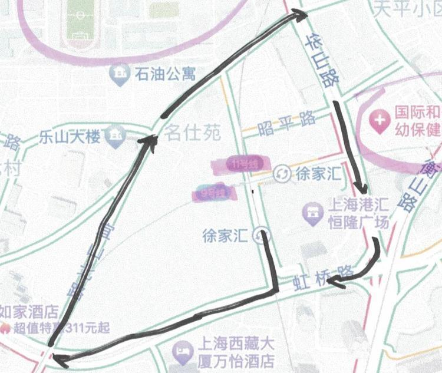

# 没声音的行车记录：上海街头蔚来试驾死伤事故调查

_图：肇事车辆_

记者见到张先生这天，他刚刚为妻子选好墓地，儿子依旧躺在医院里。“看过现场视频，可以用‘惨烈’来形容。”张先生当晚没有陪同妻子儿子外出散步，因此躲过了一劫，悲痛之余坦言，对事发原因产生越来越多的质疑。

**从天而降的车祸**

儿子硕士毕业，刚从国外回来，张先生一家正在为家庭、事业做更进一步的规划，不料祸从天降。时间回归到2月3日，一家人吃过晚饭，按照往常习惯，儿子陪同妻子到附近散步。这日恰好是周五，原本张先生也打算外出一起，但因事未能成行，便留在了家中，却无论如何也想不到，这次散步竟使得夫妻二人天人永隔。

警方资料显示，2023年2月3日20时15分许，肇事者刘某某试驾牌号为沪AB79**7的小型轿车沿恭城路由北向南行驶至虹桥路口，恰遇朱某某（死者）、张某某（伤者）沿路口北侧人行横道由西向东横过恭城路，小型车辆突然加速，将朱某某、张某某两人顶起，撞坏中央护栏。

车辆撞至虹桥路南侧非经动车道停止，并将朱某某碾压。事故造成朱某某、张某某受伤，朱某某、张某某送至第六人民医院抢救。朱某某经抢救无效死亡。

本次事故由上海市公安局徐汇分局交通警察支队委托上海枫林司法鉴定中心进行司法鉴定。

“技术状况”鉴定意见描述，悬挂车牌为“沪AB79**7”小型轿车安全技术状况（被检验项目）符合GB7258- 2017《机动车运行安全技术条件》有关规定。

_图：事发现场_

“碰撞形态”鉴定意见描述，悬挂⻋牌为“沪AB79**7” 小型轿车头与两行人及固定物(中央隔离护栏)发生碰撞，车底与一行人及固定物 (非机动⻋道上街沿)
发生碰撞可以成立。

“车速”鉴定意见描述，车辆在视频画面时间“20：15：19”时的行驶速度为52公里/小时。

在“车损痕迹”栏中显示：

(1)前保险杠蒙皮左部破损，离地高25- 70cm见绿色加层擦痕。

(2)前车牌左部离地高50- 54cm变形，车牌支架左⻆破损。

(3) 前左下灯组灯离地高61- 65cm破裂。

(4)发动机舱盖左部见两处黑色加层擦痕。

(5)左前轮内挡泥板错位、左前车门下边梁变形。

(6)车底护板前部刮损并见减层擦痕。

**对鉴定意见的质疑**

对于上海枫林司法鉴定中心出具的《鉴定意见书》，张先生观看事发时现场视频后，也不免产生质疑，遂向海报新闻记者表达自己的想法。

“首先，针对新能源汽车的检测只有‘驱动电机安装牢固，驱动系统机械传动部件未见异常’一项，其他全部是针对传统汽车的检测项目。”张先生质疑，为何智能控制系统的检测没有？为何没有把车型蔚来ET5体现出来？事故发生时到底车辆驾驶到底是什么模式？蔚来汽车事故频发，到底是不是存在某方面安全隐患？

为此，张先生日前向上海市公安局徐汇分局提交了《补充鉴定受理书》，申请理由显示，原鉴定意见主要针对事故车辆的机械系统进行鉴定，未对车辆控制系统出具鉴定意见。事故车辆为新能源电动智能汽车，电控系统及其软件是否正常运行，与事故发生有直接因果关系。

申请人对上海枫林司法鉴定中心出具的沪枫林[2023] 痕鉴字第 131- 1 号、沪枫林[2023 ]痕鉴字第 131- 2 号、沪枫林[2023]
痕鉴字第 131- 3号、沪枫林[2023]痕监字第131- 4号鉴定意见提出异议，请求补充鉴定。

具体包括，事故车辆车型、具体配置以及电动智能技术标准；事故发生时使用的是什么驾驶模式；事发时车辆是否启动前向碰撞预警、自动紧急制动、前方穿行预警带制动、紧急主动停车等刹车系统；事发时是否启动制动能量回收系统。

同时，请求补充鉴定电控系统、相关软件、刹车及油门踏板开关、行程传感器、驾驶状态等何处细节并要求各类公布数据与车内外监控视频。“明确事故车辆的系统功能和安全设计是否符合安全标准，是否存在安全隐患。”

2月27日上午，张先生告知海报新闻记者，刚接到警方反馈信息，关于车辆补充检测的行政复议，警方已经提交到上海市司法鉴定中心并受理。

**没声音的行车记录**

记者了解到，肇事司机在宜山北路公交站开始试驾，途经宜山北路、广元西路、恭城路，将车行至事故发生地点。肇事司机至恭城路虹桥路交汇处距人行道约5米处停下静止不动，静止时间长达10秒以上。事发监控视频显示有事发时间2023-02-03及“徐家汇中心工程大门H”字样。

20:15:13时，两行人出现在视频画面左部。

20:15:16时，车头（前保险杠）与两行人发生碰撞。

20:15:18时，车头与中央隔离护栏发生碰撞，行人被铲至发动机舱盖上。

20:15:19时，其中一行人被撞后坠落于车前地方。

20:15:21时，车撞至非机动车道上沿街后停止，行人被压车底。

“车子在恭城路虹桥路交汇处距人行道约5米处静止10秒以上，这10秒以上的时间发生了什么？”张先生分析，如果试驾过程中采用舒适模式，那停下来的10秒+会不会肇事者手动调节了驾驶模式？

“如果在此期间改变了驾驶模式，是肇事司机主动要求改成运动+驾驶模式以追求快感，还是蔚来陪驾人员主动建议改变驾驶模式，以推销蔚来ET5的极致性能！”张先生质疑，“警方提供的行车记录仪只能查到事故发生时该车前方的视频记录，但本应正常提供的车内音频却没有声音！这是正常的吗？当时是否采用止动能量回收系统（类似单踏板模式）？截然不同的驾驶模式对于一个新手来说，是会造成很大的社会危害的。”

事故发生后，有媒体采访蔚来方面，蔚来一名工作人员称肇事司机试驾前已签署试驾协议，且驾照也已满一年，“可能是驾驶经验不足”，故将油门当成刹车。

但针对此说法张先生明确表示不认可，“静止10秒+期间不停有行人经过，并在停止之后试图缓慢起步——肇事司机有足够长的时间在路口观察路况以及作出反应，为何蔚来依旧断言肇事司机是慌乱情况下踩错油门？”

2月27日，蔚来方面也未对海报新闻记者采访作出回应。

同时张先生质疑，蔚来ET5配有并线辅助（BSM/BSD）、车道偏离预警（LDWS）、车道保持（LKAS）、道路交通标识识别、碰撞报警、主动刹车、自动变道辅助、倒车循迹8项辅助驾驶功能，可是，惨剧发生时为何没有介入？

**闹市区的试驾路线**

事故曝出后，“蔚来在闹市区试驾”也一度成为热题，因事发地点在人流量密集的徐家汇商圈。记者梳理了一下，蔚来空间（上海港汇恒隆广场店）试驾车路线经过多个人群密集点。

_图：试驾路线_

其中，大圈起始，恭城路—虹桥路（多条地铁出入口）—宜山北路（途经徐汇中学校区）—广园西路（上海交通大学园区）—华山路（途经医院）—虹桥路—恭城路（大型商业中心）；小圈只是适当缩减外围。

“在警方事故鉴定还没有出来前，直接由非官方的门店人员宣布车没有问题。”张先生表示无法接受。

业内人士建议，希望进一步通过法律政策来规范试驾行为，包括试驾地点、时间、路线等；对于所谓的高性能新能源车所用危险的驾驶模式，在市区内应禁止使用；对于试驾中一些免责条款是否属于霸王条款，应经从法律角度上进行专业论证。

**海报新闻记者 于明效 上海报道**

