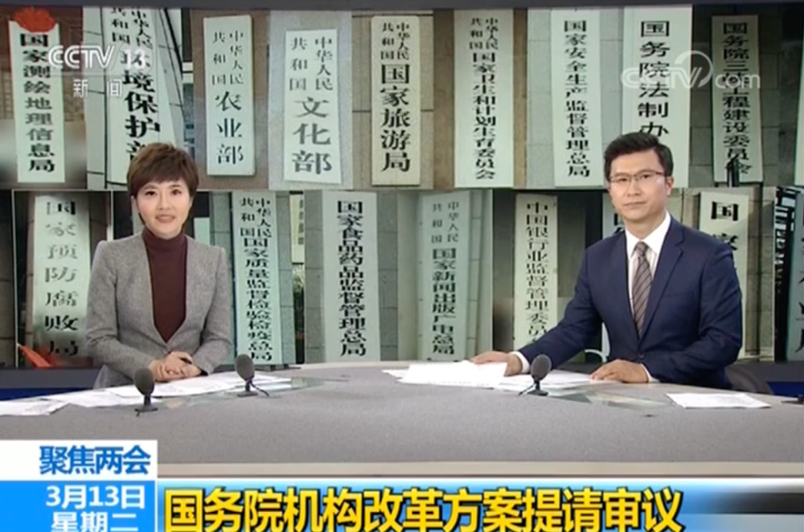
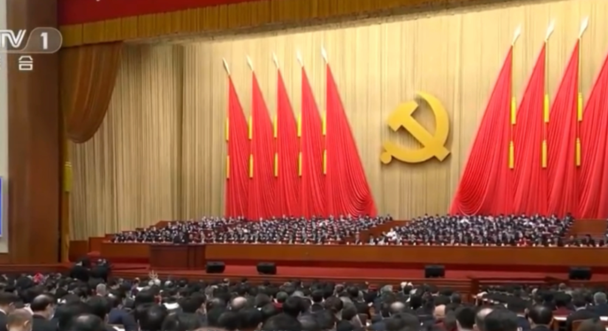

# 重磅！党和国家机构改革有最新进展

**撰文 | 董鑫 高语阳 李岩**

一年一度的全国两会即将如期而至。

今年，一项备受关注的议程就是审议《党和国家机构改革方案》。

**据新华社消息，中国共产党第二十届中央委员会第二次全体会议，于2023年2月26日至28日在北京举行。**

**全会审议通过了在广泛征求意见的基础上提出的《党和国家机构改革方案》，同意把《党和国家机构改革方案》的部分内容按照法定程序提交十四届全国人大一次会议审议。**

1982年至今，党和国家机构改革不断推进。

党中央部门分别在1982年、1988年、1993年、1999年、2018年进行了5次改革；国务院机构改革5年进行一次，分别在1982年、1988年、1993年、1998年、2003年、2008年、2013年、2018年进行了8次改革。

今年这次将成为改革开放以来第九次机构改革。

政知见（微信ID：bqzhengzhiju）注意到，40多年间8次政府机构改革，有两个关键字值得注意。

**第一个关键字是：“减”。**

1982年机构改革之前，国务院共有100个部门，人员编制超过5万人，一个部委的副部长最多的时候能有20多位。

当年机构改革之后，国务院所属部委由52个裁并为42个，工作部门从100个减为61个。

此后，机构设置一直不断优化。

1988年，国务院部委由原来的45个减为41个，直属机构从22个减为19个，非常设机构从75个减到44个。

1993年，国务院原有组成部门由42个调整为41个。

1998年，国务院组成部门由40个精简为29个。

2003年，除国务院办公厅外，国务院设置组成部门28个。

2008年，除国务院办公厅外，国务院设置组成部门27个。

2013年，除国务院办公厅外，国务院设置组成部门25个。

2018年，除国务院办公厅外，国务院设置组成部门26个。

_△2018年机构改革后，除国务院办公厅外，国务院设置组成部门26个_

尤其2018年的机构改革，在中央和国家机关层面，改革涉及180多万人，核减部级机构21个，核减班子正副职数58名，减少设置部长助理部门9个，减少职数25名。

中央层面，有39个部门重新制定了“三定”规定、25个部门调整了职责。重新制定“三定”规定的部门，同划入基数相比，共精简内设机构107个，精简15.4%；精简司局领导职数274名，精简10.8%；精简编制713名，精简3.1%。

舆论评论称，当时的改革力度之大，影响面之广，触及的利益关系之复杂，都是少有的，是一场系统性、整体性、重构性的变革。

**第二个关键字是：“转”。**

历次机构改革并不只是在部门数量上做加减法，还同时伴随着政府职能的不断转变。

来看2018年的机构改革。

改革之后，国务院机构优化调整，经济调节、市场监管、社会管理、公共服务、生态环境保护职能得到加强。

按照一类事项原则上由一个部门统筹、一件事情原则上由一个部门负责，重点对自然资源确权登记、国土空间规划、城乡污染排放监管、农业投资项目管理、反垄断执法、城乡医疗保障、退役军人服务保障、应急管理、援外工作协调、自然保护区监管、国家物资储备等职责作了调整优化，解决了60多项长期存在的部门职责交叉、关系不顺事项。

比如：

为改善“看病难、看病贵”，组建了国家医疗保障局；为更好保护“绿水青山”、治理污染，组建了生态环境部；为破解“几个大盖帽管不住一个破草帽”，组建了国家市场监督管理总局，将此前分散在多个部门的监管职能进行了合并等。

_△2018年全国两会期间，媒体报道机构改革方案_

今年是全面贯彻落实党的二十大精神开局之年。

此次机构改革在机构设置、职能配置、体制机制和运行管理等方面又将有哪些新变化？

新华社发布的二十届二中全会公报中有几个重点。

_党的二十大会议现场_

全会指出，党的二十大对深化机构改革作出重要部署，对于全面建设社会主义现代化国家、全面推进中华民族伟大复兴意义重大而深远。

必须以习近平新时代中国特色社会主义思想为指导，以加强党中央集中统一领导为统领，以推进国家治理体系和治理能力现代化为导向，坚持稳中求进工作总基调，适应统筹推进“五位一体”总体布局、协调推进“四个全面”战略布局的要求，适应构建新发展格局、推动高质量发展的需要，坚持问题导向，统筹党中央机构、全国人大机构、国务院机构、全国政协机构，统筹中央和地方，深化重点领域机构改革，推动党对社会主义现代化建设的领导在机构设置上更加科学、在职能配置上更加优化、在体制机制上更加完善、在运行管理上更加高效。

**资料 | 新华社、中国新闻社等**

**【版权声明】本文著作权归政知新媒体独家所有，未经授权，不得转载。**

