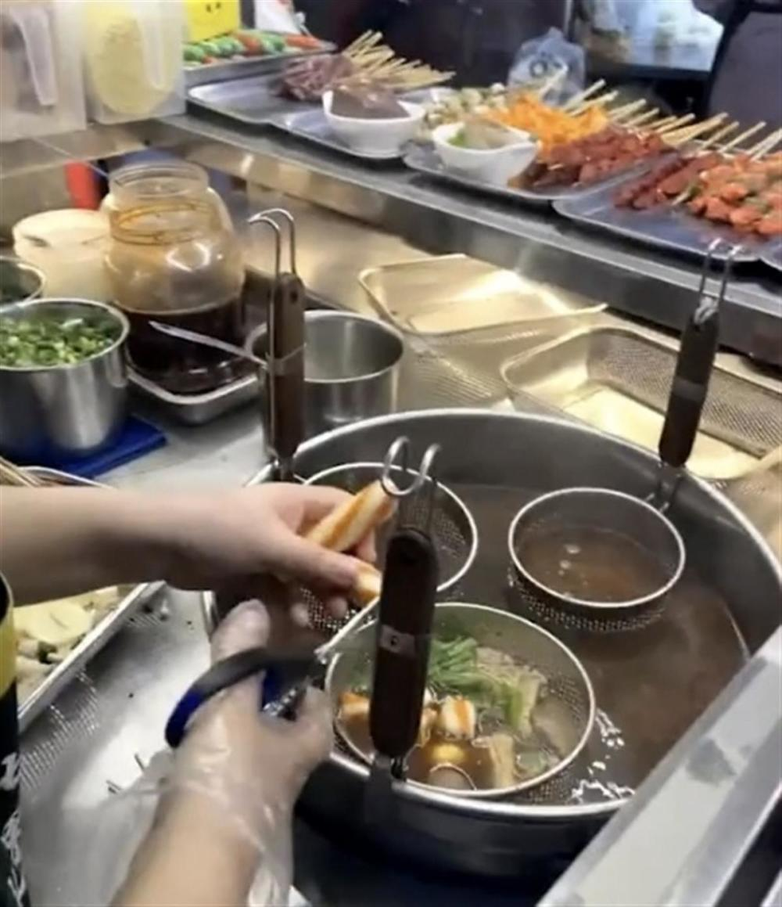
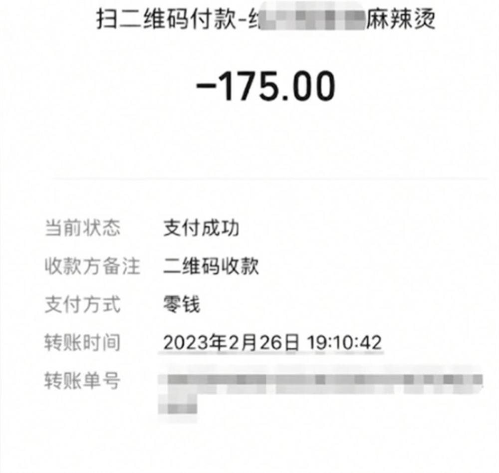

# 麻辣烫刺客？女子吐槽3人吃麻辣烫花175元，官方：已去现场调查

2月28日，顾客吐槽四川自贡“三女子吃麻辣烫花175元”的视频引发关注。当日下午，自贡市市场监督管理局有关负责人回应极目新闻记者，工作人员已前往现场，目前正在调查中。

_视频截图_

一女顾客吐槽称，2月26日晚，她们三个女子一起去自贡的一家路边摊吃麻辣烫，每个菜也没有标明价格，店主说素的每串1元，荤的没有明确说价格。她们拿的菜也不是很多，其中许多是带菜叶子的菜，下锅后老板说178元，她吓了一跳，老板最后收了175元。因为菜已经下锅了也不好退，她吃的时候一点心情都没有了。她说，自己发视频是为了提醒大家，以后遇到这种路边摊一定要先问清楚价格，事后他们向商城反映了，要求问一下这个价格是否合理。

_视频截图_

上述网友发布的视频显示，这是一家路边摊，摊位顶部宣传称是“正宗麻辣烫”。28日下午，极目新闻记者将上述视频发给了疑似顾客所说的商城，但该商场的黄经理表示，应该不是他们的商户。

_视频截图_

极目新闻记者向当地多家麻辣烫了解消费行情，工作人员称，顾客人均消费数十元不等，就像吃火锅一样，素菜便宜一点，荤菜比如鳝鱼等就贵多了。至于“三份麻辣烫175元”贵不贵不好评论，要看具体吃了些什么。

_视频截图_

28日下午，自贡市市场监督管理局有关负责人回应极目新闻记者，该局没有接到当事顾客的投诉。关注到网上舆情后，下午工作人员已前往疑似地点走访调查，因为是路边摊，商户有可能还没有出摊，晚上他们会继续走访调查，也会和顾客反映问题的疑似商城联系核实，待调查清楚了会向社会通报。

（来源：极目新闻）

