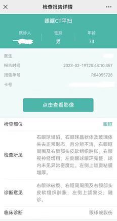
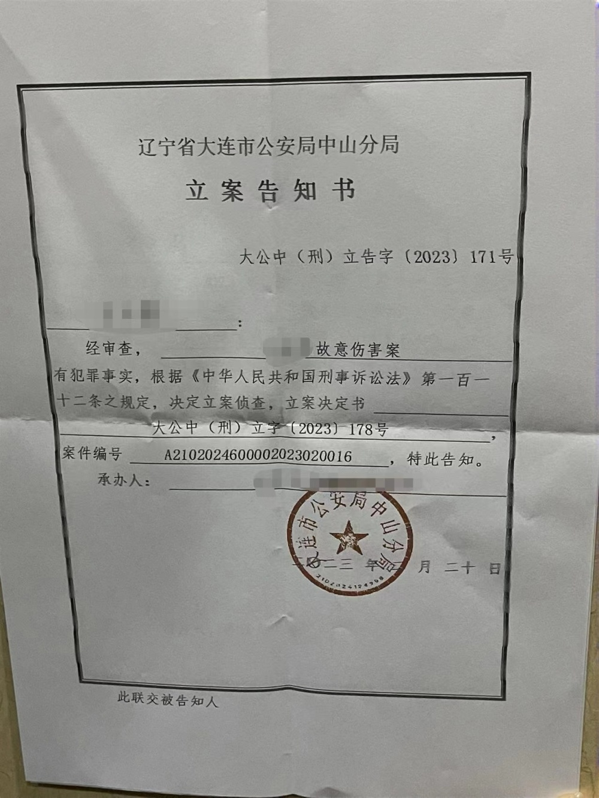

# 73岁痴呆老人被养老院护工打爆眼球？大连警方：已受理此案

顶端新闻记者 胡瑞

近日，有网友爆料，辽宁大连一养老服务中心殴打73岁患有老年痴呆症老人，致使其右眼球爆裂，现仍在ICU病房。

据了解，该养老院为大连市中山区禄盛养老服务中心。3月1日，爆料人杜先生告诉顶端新闻记者，老人已暂时脱离生命危险，“今日可能会从ICU出来。”

杜先生称，该事发生于2月19日下午6点20分，据事后所看监控显示，一名女护工在给老人强制换衣服时，老人不配合，另一名男护工便上前给了老人两拳，直接造成老人右眼球爆裂。

“一开始出事儿后，养老院一直在掩盖真相，说是换衣服时不小心碰的。”杜先生表示，直至报警，养老院那边才承认是被护工打的。

杜先生提供的一份辽宁省大连市公安局中山分局立案告知书显示，目前该事件已于2月20日以故意伤害案进行刑事立案并侦查。

杜先生称，殴打老人的护工已被取保候审，等老人伤情鉴定结果出来之后才能量刑。

3月1日，顶端新闻记者多次拨打涉事养老院电话，均无法接通。

随后，记者联系事发辖区派出所大连市公安局中山分局，一工作人员表示已经受理此案，“还正在调查处理中。”

顶端新闻记者注意到，该养老服务中心官网显示，大连禄盛认知症照护中心是大连一家专业的认知症照护中心/多功能型养老机构，于2018年11月，经大连市中山区民政局批准成立，是一家非营利性的民营养老院。

该养老服务中心表示，中心采用科学的现代管理理念，实行优质高效的人性化管理，努力为入住的每一位老人营造一个舒适安心、自由、尊严、祥和幸福的养老环境。

**新闻多一点**

在2023年全国两会召开之际，政协委员谢文敏提出建议，要加强养老服务质量安全管理，建立健全养老服务机构服务标准和评价体系，建设全国养老护理员信息和信用管理系统。

谢文敏称，要持续开展养老企业服务质量检查，对养老服务中虐老欺老等行为，对养老机构在收取保证金、办理会员卡和发行金融产品等活动中的违法违规行为，要依法严厉查处。加强养老设施和服务安全管理，建立定期检查机制，确保老年人人身安全。

