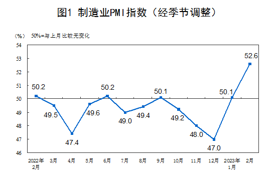

# 中国2月官方制造业PMI 52.6，创2012年4月以来新高

中国2月官方制造业PMI 52.6，预期50.5，前值50.1。

2月份，制造业采购经理指数（PMI）为52.6%，比上月上升2.5个百分点，高于临界点，制造业景气水平继续上升。

2月份，非制造业商务活动指数为56.3%，比上月上升1.9个百分点，高于临界点，非制造业恢复发展态势向好。

**相关阅读：**

国家统计局解读：2月份采购经理指数持续扩张

2月份，制造业PMI升至52.6%，各分类指数均高于上月，调查的21个行业中有18个位于扩张区间，比上月增加7个，制造业景气面继续扩大。

产需两端同步扩张。随着春节假日因素和疫情影响消退，制造业企业生产恢复加快，市场需求继续改善，生产指数和新订单指数分别为56.7%和54.1%，高于上月6.9和3.2个百分点。从行业情况看，木材加工及家具制造、金属制品、电气机械器材等行业两个指数均升至60.0%以上高位景气区间，行业产需活跃度回升。

市场预期继续改善。生产经营活动预期指数为57.5%，高于上月1.9个百分点，升至近12个月来高点，企业信心继续增强。从行业情况看，调查的21个行业生产经营活动预期指数全部位于景气区间，其中农副食品加工、纺织、通用设备、专用设备、汽车等10个行业位于60.0%以上高位景气区间，企业对近期行业恢复发展较为乐观。

2月财新中国制造业PMI为51.6，去年8月来首次升至扩张区间

随着防疫政策优化和春节后经济活动逐渐恢复，2月制造业生产经营持续回暖，结束此前六个月的收缩态势，重回扩张区间。3月1日公布的2月财新中国制造业采购经理指数（PMI）录得51.6，较1月上升2.4个百分点，2022年8月来首次高于临界点，为2022年7月来最高。

财新智库高级经济学家王喆表示，2月经济加快修复，供求扩张，外需提振，就业开始复苏，物流恢复提速，制造业企业对未来景气度信心增长，显示疫情“过峰”后，经济开始进入后疫情时代修复期。不过，疫情影响重大深远，目前经济恢复基础尚不牢固，社会生产生活完全正常化尚需时日。中央提出，要把恢复和扩大消费摆在优先位置。收入和预期是消费的基础和前提，未来一段时期，相关政策的制定和落实还应更多着力于增加居民收入和改善市场预期。

