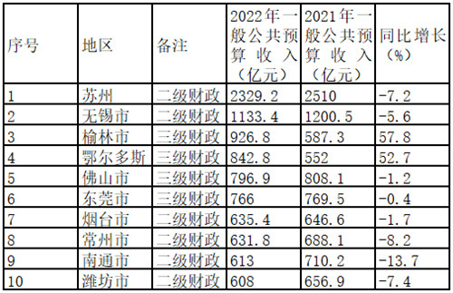

# 全国地级市财力10强城市出炉：苏州居首，榆林、鄂尔多斯、烟台逆袭

中国经济周刊—经济网讯（记者
王红茹）2022年全国各地级市财力谁最强？《中国经济周刊》记者梳理财力10强地级市发现，江苏有4座城市入围，分别是：苏州、无锡市、常州市和南通市；广东有两座城市入围，分别是佛山市和东莞市；山东也有两座城市入围，分别是烟台市和潍坊市；陕西和内蒙古各有一座城市入围，分别是榆林市和鄂尔多斯市（见下表）。此外，2022年受疫情等因素影响，财政收入10强地级市中除了榆林和鄂尔多斯两个产煤大市实现正增长之外，其余8座城市均为负增长。

2022年全国地级市财政收入10强城市

在财力10强地级市中，苏州财力居首。从数据看，2022年苏州财政收入增速虽然相比2021年下降了7.2%，但是其财政收入总规模依然庞大，2022年一般公共预算收入达到2329.18亿，在继续稳居江苏省第一位的同时，甚至在全国各城市排名中，也稳居第六位。

排名第二位的是无锡市。无锡市2022完成一般公共预算收入1133.4亿元，比上年同期下降5.6%。虽然增速有所下降，但是无锡在江苏省的排名仅次于苏州和南京，依然位居第三位。与此同时，无锡也是江苏省3个财政收入总量超千亿的城市之一。这得益于无锡规模以上企业所作出的贡献。数据显示，2022年无锡规模以上工业增加值达5585.97亿元，同比增长5.4%，对无锡经济发展的“压舱石”效应进一步凸显。

除了苏州市和无锡市，江苏省还有两座入围10强的地级市，分别是排名第八位的常州市（631.8亿元）和排名第九位的南通市（613.0亿元）。

值得一提的是，两个产煤大市——陕西省榆林和内蒙古的鄂尔多斯，成为2022年地级市财政收入“黑马”。其中，榆林2022年完成一般公共预算收入926.8亿元，排名第三位，鄂尔多斯紧随其后，以842.8亿元排名第四位。在去年同期，榆林市排名第九位，鄂尔多斯排名第十位，双双实现逆袭。

之所以实现跨越式发展，从这两座城市的财政收入增速可见一斑。2022年榆林市财政收入增速为57.8%，鄂尔多斯为52.7%。业内分析认为，主要是因为这两座城市的煤炭等资源能源产品量价齐升，带动了财政收入大幅增长。

烟台的表现可圈可点。烟台是山东的重要经济城市，也是北方地级市中的领军城市。2022年烟台的财政收入为635.4亿元，以超过潍坊27.4亿元的领先优势，“夺回”全省第三的位置。从排名看，相比去年同期，烟台也从第八位晋升到了第七位，实现逆袭。

一审：郑扬波 二审：王新景 三审：周琦

