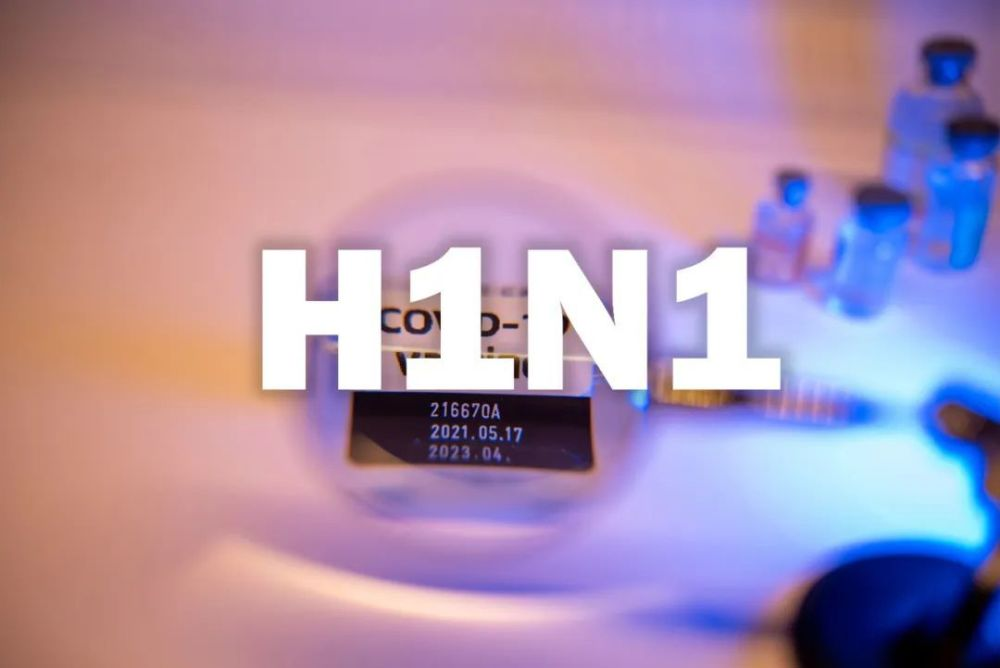
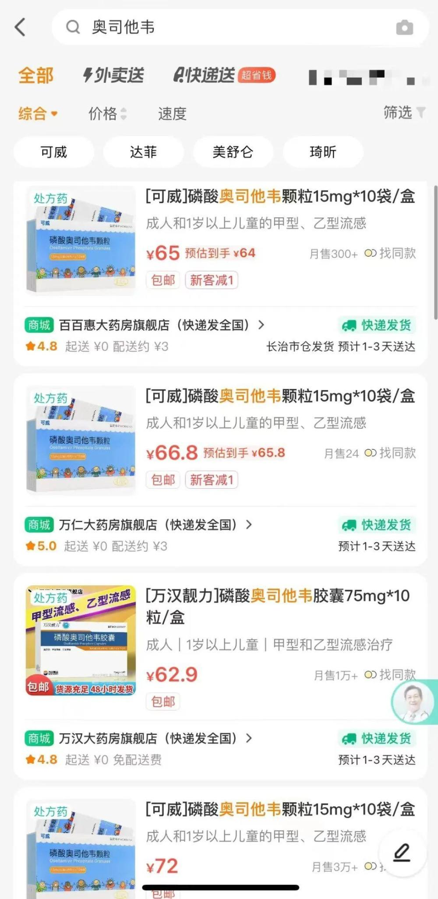

# 全国多地出现甲流疫情，专家称或与新冠防控有关

近日，北京、上海、浙江等地均出现学校因学生感染甲型流感病毒（以下简称甲流），所在班级停课的情况。据2月23日国家流感中心发布的《流感监测周报》，当周全国南、北方省份流感病毒检测阳性率继续上升，共报告108起流感暴发疫情，其中甲流占比87%。

激增的流感病例，也带动药店相关药物的热销甚至断货。2月28日，《中国新闻周刊》致电北京多家药店，药店工作人员表示，最近电话咨询流感药物“奥司他韦”的人特别多。其中一半药店表示，目前这款药已断货。

_甲流H1N1
图/图虫创意_

**门诊病例是一周前5倍**

“今天上午，幼儿园收到3名家长的告知，孩子被医院诊断为甲型流行性感冒，不来上课。”2月27日，吴筠所在的班级家长群里，班主任老师发送了这条信息。吴筠家住北京，她儿子今年3岁多。吴筠说，尽管有3名学生感染甲流，但班级并未停课。

同一天，北京市疾控中心发文称，上周流感样病例数量较2019年同期水平上升78%，在流行的流感病毒中，甲型流感病毒占绝对优势，其中甲型H1N1亚型占64%、甲型H3N2亚型占35%，乙型流感占1%。

北京一名三甲医院感染科主任医师告诉《中国新闻周刊》，他注意到，最近一周医院门诊，被列为“流感样病例”的人数是上一周的四五倍左右，其中16%的患者最终确诊为流感。“流感样病例”即出现发烧、咳嗽、咽痛等症状或症状组合的患者。

除了北京，其他多地的甲流病例也在“冒头”。

2月20日，一则“北辰有学校因学生发烧停课2天”的消息在网络流传。当天，公众号“天津发布”回应称，北辰区华辰小学部和中学部确实有个别班级因学生发烧而暂停线下教学的，停课时间为2月20日和21日，发烧是因甲型流感引起。

2月21日，江苏镇江丹阳市疾控中心通报，今年开学以来，该市陆续有22个班级出现发热、咳嗽等聚集性疫情，3个班级出现发热、呕吐、腹泻等聚集性疫情。经检测，结果为季节流感。此外，近日上海、宁波、金华等城市也出现了个别学校班级因出现甲流而停课的现象。

华中科技大学同济医学院附属同济医院感染科副主任医师郭威向《中国新闻周刊》表示，流感多发生于冬春季，目前看来没有达到暴发的程度，无需过度紧张。

流感是由流感病毒感染引起的呼吸道传染病，主要是通过呼吸道分泌物的飞沫和密切接触传播。轻症流感常与普通感冒表现相似，但其发热和全身症状更明显。重症病例可出现病毒性肺炎、继发细菌性肺炎、急性呼吸窘迫综合征、休克、弥漫性血管内凝血等肺外表现及多种并发症，甚至死亡。

分类上看，流感分为甲型、乙型、丙型和丁型四类，人流感主要是甲流病毒和乙流病毒引起。甲流和乙流每年呈季节性流行。中国疾控中心2019年曾发文指出，甲流理论上可进一步分为198个亚型，一旦发生重大变异或重组可能引发流感大流行。

前述感染科主任医师告诉《中国新闻周刊》，往年部分人群感染流感后，会在人群中建起一定的免疫屏障，对流感流行有延缓作用。但过去三年，为应对新冠疫情而采取的相关防控措施，使流感一直处于低流行状态。因此，一旦放开此前严格的防控措施，在频繁的人员流动下，甲流也会迅速在人群中传播起来。

“感染新冠对感染流感存在一种压制作用，当新冠感染减少时，感染流感的比例就会高起来。学校容易出现聚集，也是往年流感流行的重点场所。”该感染科主任医师说。

2月28日，北京市疾控中心发文提醒，甲流患儿应尽量单间居住，在家庭共同区域活动时需佩戴口罩；体温恢复正常、其他流感样症状消失48小时后，可复课。此外，家庭成员近距离接触患儿时应佩戴口罩，在接触患儿呼吸道分泌物后，应使用清洁剂洗手或者使用消毒剂消毒；流感高危人群应尽可能避免与流感患儿密切接触。

**多地奥司他韦缺货**

百度指数显示，从2月20日～27日8天时间，“甲流”的搜索及报道量显著上升，27日的搜索指数增加至20日的9倍多。与之对应的，是奥司他韦的供不应求。

“药店刚从进货渠道购到了10多盒奥司他韦胶囊，现在只剩5盒了。”北京市一家药店工作人员2月28日告诉《中国新闻周刊》。该工作人员说，这几天，买奥司他韦的人，大多是给孩子提前准备应对甲流。

_美团买药截图_

另一位北京海淀区某药店的工作人员表示，现在药店进不到这款药。医药公司告诉他，至少还要一两天才有货。他所在药店是一家连锁药店，一共有10多家医药公司给其供货。该工作人员表示，平时药店储备奥司他韦最多也就是二三十盒，一遇到“挤兑”的情况，根本不够。

《中国新闻周刊》搜索某医药电商购药平台，发现奥司他韦全部断货。在美团买药平台，虽然能搜到奥司他韦这款药，但大部分药店均显示“1～3天可送达”。而武汉一名三甲医院药师告诉《中国新闻周刊》，目前他所在医院奥司他韦的供应量充足。

前述感染科主任医师分析说，据他了解，这类药从原料生产至成品需要大半年时间。近几年，“因为流感病例少，用药不多，药品生产厂家也在缩减产量。有些药厂的相关销售部门已经解散。这种情况下，买不到药也正常。”他说。

“奥司他韦以减轻症状为主。未感染甲流的人，没有必要囤药。”郭威表示，奥司他韦属于处方药，一些肾功能不好的人需慎重服用。现在比较担心的是，大家都去“抢”这款药，导致真正需要用药的人反而用不上。没有感染流感服用奥司他韦，还可能会引发皮疹、心律失常、胃肠道不适等不良反应。此前，还有专家接受《中国新闻周刊》采访时表示，只有近期明确接触过确诊流感病人的人及高危人群可服用奥司他韦来预防。

据《流行性感冒诊疗方案（2020年版）》，奥司他韦、扎那米韦、帕拉米韦等神经氨酸酶抑制剂对甲型和乙型流感有效，阿比多尔可用于成人甲、乙型流感治疗。其中，磷酸奥司他韦制剂也被世卫组织推荐作为治疗流感病毒的基本药物，被美国和欧洲疾控中心推荐为主要的抗流感病毒药物。

该诊疗方案提到，重症或有重症流感高危因素的流感样病例，应尽早给予抗流感病毒治疗，发病48小时内进行抗病毒治疗可减少并发症、降低病死率、缩短住院时间。非重症且无重症流感高危因素患者，应充分评价风险和收益，考虑是否给予抗病毒治疗。

多名感染科专家提到，除了药物，提前接种流感疫苗也很重要。郭威建议，一般每年10～11月份接种流感疫苗最合适，可以为个体提供几个月的保护时间，以度过流感高发季节。美国疾控中心2月22日发文指出，数据显示，今年的流感疫苗将儿童因甲流相关住院的风险降低了近四分之三，成人的风险降低了近一半。

不过，国内流感疫苗的接种水平并不算高。以北京为例，据新华社2020年12月12日报道，截至当年12月11日，北京市当年累计接种流感疫苗240.4万支，重点人群接种176.4万支。据《北京市2021年国民经济和社会发展统计公报》显示，截至2021年末，北京常住人口2188.6万人。按2020年北京市流感疫苗接种量来算，当年接种流感疫苗总人数占比仅11%。

多名感染科专家告诉《中国新闻周刊》，面对甲流，在做好疫苗接种同时，还应坚持避免人群聚集、戴口罩等非药物措施。

郭威表示，日常生活也要注意加强营养、合理膳食、适当运动，增强个人免疫力。对于学校等重点场所，做好日常校园传染病的监测，建议学生坚持做好个人防护。对于65岁以上的老年人、孕妇等脆弱人群，也应注意防护，戴口罩。一旦出现发热、肌肉酸痛等流感症状，要及早治疗。

（文中吴筠为化名）

作者：牛荷

