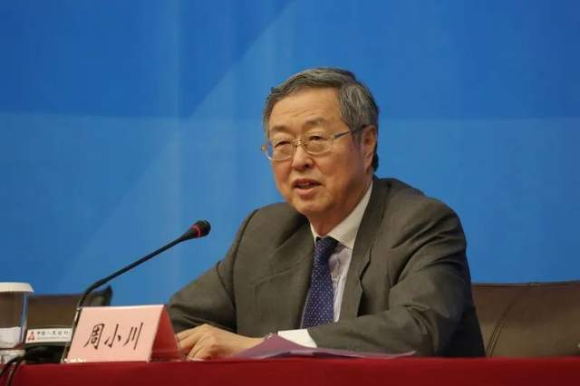

# 养老金告急，连周小川都不淡定了

**周小川对解决目前养老金问题的紧迫性有清醒的认识，开出的“药方”也有针对性。但是，养老金问题是复杂的，不是套用哪种模式就能简单解决的。**

**冰川思想库研究员丨关不羽**

2月25日，中国人民银行原行长周小川在第五届全球财富管理论坛分享了关于养老金政策体制的看法与建议。澎湃新闻的报道《周小川：不要认为养老问题还有拖延的机会，以后再做选择会更艰难》，内容比较全。

前些日子延迟退休的话题超热，周小川此番讲话备受瞩目。

01

**养老金缺口问题的迫切性，不容回避**

周小川对解决养老金缺口问题的迫切性是很清醒的，“不回避难题”，“不要认为养老问题还有拖延的机会，以后再做选择会更艰难”。确实有直面问题的勇气，直击要害。

养老金缺口有多大，时间上有多迫切，可以参考三个数据：

第一组数据是养老金的社保家底。2022年，我国城镇职工基本养老保险基金总支出为6.2万亿元，超过全国一般公共预算收入的四分之一。

同年，我国企业职工基本养老保险基金累计结余约为5万亿左右（2022年8月份《新京报》报道的数据为5.1万亿）。
**这组数据清晰地显示，我国养老金的家底很薄，这在周小川讲话中也专门指出了。**

图/网络

第二组数据是养老金资金池的变化趋势。中国社会科学院发布的《中国养老金精算报告2019-2050》认为，我国的基本养老保险基金将在2027年达到峰值，在2035年前后累计结余耗尽。显然，养老金的资金池已经没有增长空间，消耗殆尽的速度超出很多人的想象。

第三组数据是人口年龄结构变化。国家卫健委数据显示，2035年左右60岁及以上老年人口将破4亿。按照目前的生育率预测，2057年，中国65岁以上人口将达到4.25亿人的峰值，占总人口比重32.9％-37.5％，接近甚至超过日本。
**人口年龄结构是养老金收支的决定因素，其他都是技术性因素。**

这三组数据都说明现有的养老金模式亟待完善，周小川强调养老问题无法拖延的紧迫性，是有充分依据的。

02

**美国基本养老保险的运作**

周小川给出的解决办法是“国家统筹的基本养老金+个人养老金账户”

中国的一个现实情况就是人口多，同时养老金面不断扩大。总体来讲，由于老龄化，养老金资金池很容易有缺口。这种情况下，国家统筹安排的养老金是保基本，不会太高，或者说比较大的缺口会较大程度依靠个人养老金加以补充。

这一方案是否能有效解决目前的养老金问题呢？ **理论上讲，是有可行性的。这可以参考“国家统筹+个人养老”模式的典型——美国。**

美国联邦政府统筹的基本养老金全称叫做“老年、遗属和残障保险”，始于1935年罗斯福当政时期。名为“保险”，实际上是一种国家统筹、现收现支的专项税收制度。

“保险”的资金源于政府向个人征收社会保障税，覆盖就业人口的90%以上，税率为年收入的12.4%，略低于个人所得税的基本税率15%。但与个税不同，社会保障税不采取累进税制，而且缴税收入设有上限，约为人均收入的2.5倍到3倍，超过部分就不计税了。

足额领取基本养老金年龄是65岁，不分性别。可以提前5年申领，但是要打七折。发放基本养老金的标准和缴纳年限、缴纳量相关，目前大部分领取者每月可以领到1500美元左右，最高不超过2500美元，整体较为平均。

▲1935年罗斯福总统签署《社会保障法》（图/网络）

**美国基本养老金的养老金替代率只有40%，即养老金收入为在职收入的40%左右。**
这一比例低于世界银行等国际组织建议的70％到80%（周小川在这次讲话中也引用了这一标准），而且在发达国家中是偏低的。这是美国长期被归类于“半福利制国家”的重要原因之一。

美国人的另一半养老金就得靠企业和个人，最有代表性的是雇主雇员共同出资的401K计划和IRA等个人养老金账户。联邦政府主要以税收减免、缓征等措施支持这些私人性质的养老金计划。

这种公私各半的模式，最大的优点是财政的可持续性。美国的社会保障税和基本养老金常年实现收支平衡，不少年份还有盈余。2022财年，社会保障税收入为1.484万亿美元，基本养老金支出为1.219万亿美元，盈余两千多亿美元。

03

**如何实现基本养老金的财政可持续性**

美国基本养老金的财政可持续性，得益于合理的收支结构。

美国社会保障税缴纳人数常年保持在1.5亿人左右，目前的领取人数不到7000万。2.14:1的人数比例，12.4%的税率，平均的养老金替代率至少达到了26.5%。再加上高收入人群超过平均收入水平的超额缴纳部分统筹，就能实现40%的平均养老金替代率。

要维持这一可持续的平衡结构，要避免收入减少和支出激增的技术性风险。

收入端，要避免大规模失业导致税收流失，所以控制失业率、增加就业岗位是美国政府和社会最重视的经济指标。

需要强调的是，只有充分的有效就业才能保证基本养老金的财政可持续性， **也就是能够创造税收的企业就业，而不是财政供养人数。**

图/图虫创意

在支出端，则是控制基本养老金发放的规模。养老金领取人数无法人为控制，那就只能严控发放标准。因此美国基本养老金不追求超出财政能力的养老金替代率，尽管政客有讨好选民的本能，但是提高基本养老金发放标准意味着社会保障税的税率大幅提高，没有多少“选票收益”。

更重要的是，美国基本养老金的发放标准较为平均，上限约为中位数的1.5倍，这样才能统筹得过来。

可以说美国在基本养老金收支管理的技术性问题上都处理得比较好。不过，仅仅技术手段还不足以保持可持续性。基本养老金收支平衡还存在两大结构性威胁。

**最大的威胁是人口老龄化问题。**
无论怎么技术腾挪，都无法避免深度老龄导致福利收支失衡的结果。婚育观念保守的美国在2010年才进入老龄化，比其他发达国家要晚了几十年。

而且，美国是全球最大的移民到达国家，每年吸引大量年轻人口入境就业，缓解了老龄化进程对基本养老金的冲击。美国的老龄化冲击较为缓和，是美国基本养老金的可持续性优于大多数发达国家的主要原因。

**另一个威胁来自货币购买力下降。**
相对其他全球主要货币，美元长期维持了明显的相对强势地位。1987年到2022年，美元购买力下降64%，平均每年下降1.8%。这对美国的养老金领取者谈不上什么好消息，但是比其他主要货币已经好太多了。

图/图虫创意

而美国政府统筹之外的个人养老（包括企业出资的养老金计划），也同样受到“经济-
人口”的影响。归根结底，个人养老投资是一种长期投资，能否成功赚到另一半的养老钱，取决于经济的长期前景。美国经济确实存在很多问题，有结构性的，也有技术性的。

但不可否认的是，美国依然是世界主要经济体中最有活力的一员， **尤其是科技创新能力、金融实力、移民吸引力三大优势，**
激励了个人养老长期投资。在此宏观背景下，政府的税务鼓励才能起到了锦上添花的作用。

归根结底，从宏观角度看，个人养老也好、国家统筹的福利也罢，都需要人口-经济的长期支撑。

就技术层面而言，个人养老的长期投资需要良好的金融市场秩序，国家统筹的养老福利更需要合理的制度安排。分析“国家统筹的基本养老金+个人养老金账户”能否成功解决目前的养老问题，需要对标这些要素。

04

**治本难，治标也不易**

周小川对解决目前养老金问题的紧迫性有清醒的认识，开出的“药方”也有针对性。但是，养老金问题是复杂的，不是套用哪种模式就能简单解决的。

周小川也强调“要注意治本，不要只治标，至少治标治本相结合”。这个“本”其实就是人口-
经济的结构性问题，解决的办法无非是激发经济活力、提高经济效率，和提高生育率。方向是明确的，难在操作。

**治本难，治标也不易。我国的基本养老保险还有很多问题有待解答。**
官方数据显示，我们的基本养老保险缴纳人数到2022年底已经高达10.5亿人，覆盖面不可谓不广。

我国基本养老保险的在工资收入中的实际占比并不低，企业负担工资的20%，个人负担工资的8%，合计占工资的28%，汲取度远高于美国12.4%的税率。目前我国企业职工的养老金平均替代率约为40％，与美国基本养老金相当。

那么，参照美国基本养老金2.14:1的供养比例，理论上讲，我国基本养老保险基金以即收即支的方式，也足以支付5亿左右的养老人群，而2022年中国60岁以上老人的数量为2.8亿，其中还有大量福利养老支出水平很低的农村老人。

也就是说，我们的基本养老基金应该还有相当的余裕，但是实际缺口却很大，是何原因？未来搞“国家统筹的基本养老金+个人养老金账户”，国家统筹资金的使用效率、收支平衡依然是整套体系的基础。

▲中国养老金体系（图/网络）

**至于个人养老金账户，也不可能一蹴而就。** 复杂的税收制度问题即直接税和间接税之争，最起码二三十年的长期投资需要稳定有效的机制保障。

最基本的是个人权益保障，个人账户里的钱到底是不是个人的，可不能在未来存在“误解”的空间。到时候又要麻烦专家出来解释，就不太好了。至于长期投资的经济环境、投资安全的金融体制保障，都需要匹配。

总之，周小川说：“我们现有的基础并不太好，所以未来的挑战是很大的”，是清醒的。那么，当务之急就是要把基础打好。

