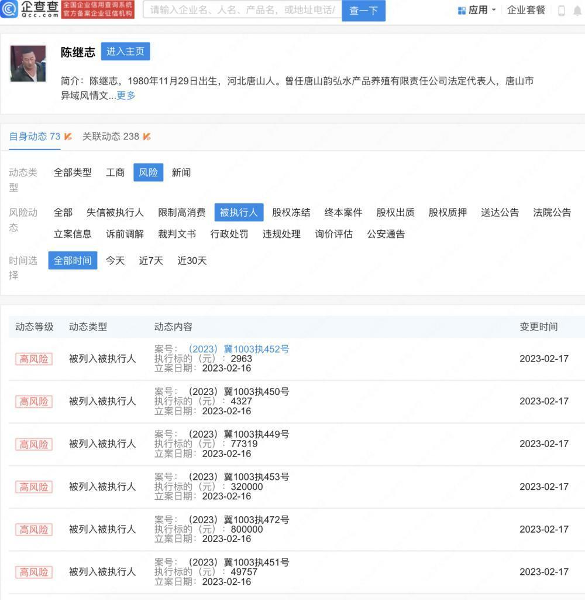
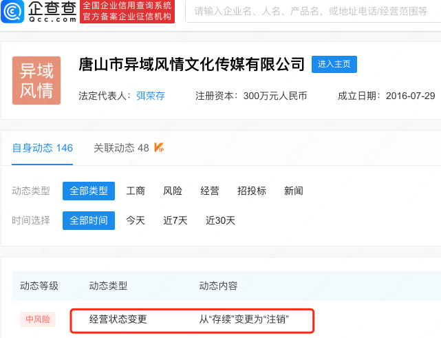
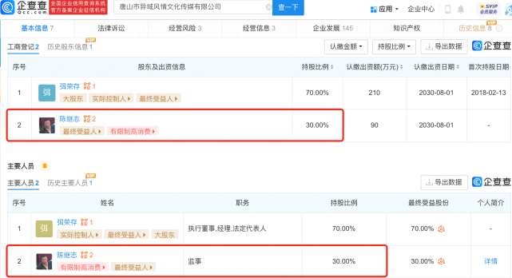
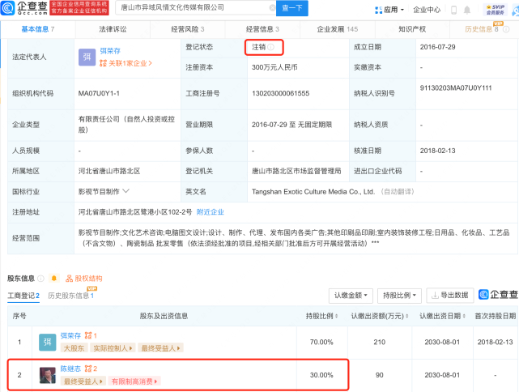

# 唐山打人者陈继志成被执行人 名下公司已注销

3月1日，上游新闻从企查查官网获悉，“唐山烧烤店打人事件”主犯陈继志新增6条被执行人信息，执行标的分别为80万元、32万元、77319元、49757元、4327元、2963元，执行法院为河北省廊坊市广阳区人民法院。

2月15日，据企查查APP显示，唐山市异域风情文化传媒有限公司经营状态由存续变更为注销，注销原因为决议解散。企查查信息显示，该公司成立于2016年，注册资本300万元人民币，由陈继志持股30%并担任监事职位。目前，陈继志名下关联的2家公司均已被注销或吊销。

此前，唐山打人事件引发舆论高度关注，陈继志等多名主要人员被捕，陈继志最终因犯寻衅滋事罪、抢劫罪、聚众斗殴罪、开设赌场罪等，数罪并罚，一审获刑24年，并处罚金32万元。

综合来源：企查查官网、正观新闻

编辑：杨雁琳

责编：周尚斗

审核：冯飞

