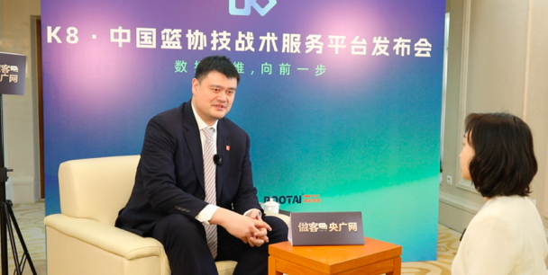
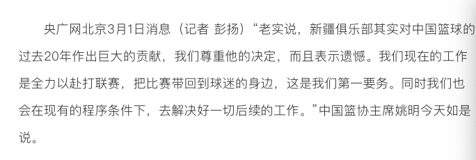
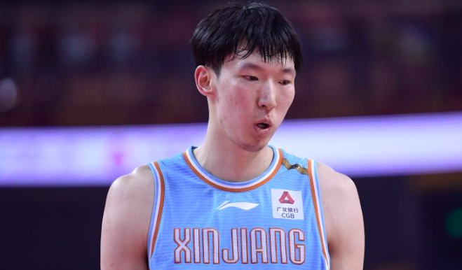
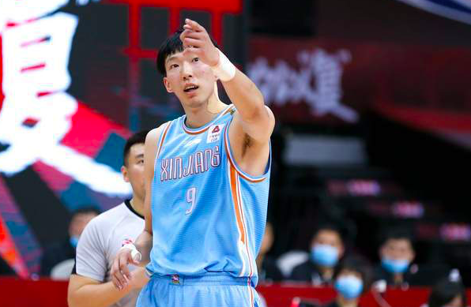

# 姚明回应新疆男篮退出CBA：尊重他们的决定 解决好一切后续工作

北京时间3月1日，在新疆决定退出CBA之后，姚明接受采访，首度进行了回应。

姚明在采访中表示，在过去的差不多10天里，中国篮协做了大量的工作。直到昨天，仍然有篮协的同事为此事专程飞往新疆。并且，他说道，“老实说，新疆俱乐部其实对中国篮球的过去20年作出巨大的贡献，我们尊重他的决定，而且表示遗憾。我们现在的工作是全力以赴打联赛，把比赛带回到球迷的身边，这是我们第一要务。同时我们也会在现有的程序条件下，去解决好一切后续的工作。”

此前，新疆男篮已经决定退出CBA，他们在公告中表示，篮协纪律与道德委员会认为新疆广汇篮球俱乐部“注册违规”，做出严重错误、无理荒诞的“处罚”，对此，球队无法认可，并且绝不接受。

新疆男篮还怒斥周琦多次采取不同方式对球队进行抹黑诋毁，直言其如此执着离开，完全是巨大的利益驱使。新疆男篮还表示，“管办不分”是阻碍中国篮球事业健康发展的现实障碍，并且点名姚明，认为篮协的管理职能与CBA联盟的办赛业务交叉混同，篮球行业乱象丛生。对此，新疆男篮郑重决定，退出本赛季比赛，并且退出CBA联盟。

在新疆发出公告之后，周琦也发长文进行了回应，声称在集训和比赛期间，收到广汇篮球俱乐部董事长的短信，对方表示，“别做白日梦了，豁出命来也不会让你走的！”

周琦还怒斥广汇俱乐部欺上瞒下，两任董事长郭舰、侯伟及广汇管理层对其长年欺压蒙骗、肆意揉搓、弄虚作假，周琦表示，他希望通过自己的事能让CBA联盟更加规范。

