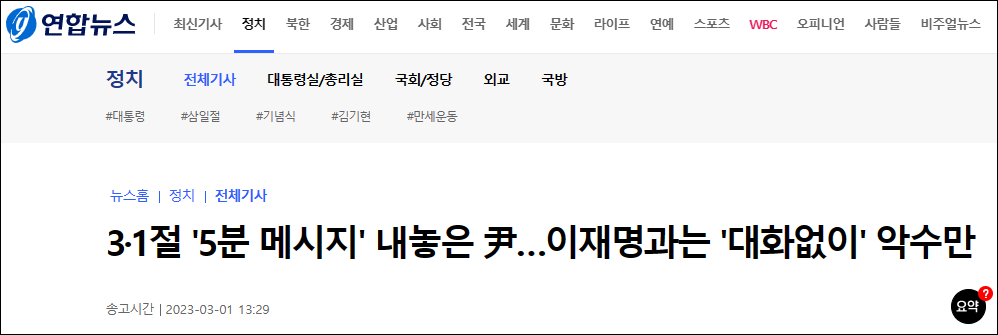

# 尹锡悦在韩国抗日独立纪念日讲话：日本从军国主义侵略者转为合作伙伴

【文/观察者网
熊超然】当地时间3月1日，韩国总统尹锡悦出席在首尔中区柳宽顺纪念馆举行的“三一抗日独立运动”104周年纪念仪式并致辞。韩联社当天报道指出，这是尹锡悦就任总统以来首次发表“三一节”讲话，讲话时间异常简短，但其中一些细节十分值得关注。

比如，尹锡悦谈及日本时，认为日本已从过去的“军国主义的侵略者”转变为“携手合作的伙伴”，且并未特别敦促日本反省历史问题，他不仅强调韩日合作，而且还强调了韩美日三国合作的重要性。

而值得注意的是，在其强硬的对朝政策背景之下，尹锡悦讲话中也并未特别提及朝鲜问题，他在讲话末尾才提及“和平”一词，与前任总统文在寅2019年“三一节”讲话中提及“和平”一词30次，形成了鲜明的对比。

_韩联社报道截图_

“三一节”，是韩国纪念“三一运动”的节日。日本在1910年到1945年间对朝鲜半岛实施殖民统治。1919年3月1日，朝鲜半岛爆发反抗日本殖民统治的“三一运动”。1949年，韩国政府将3月1日定为国家法定纪念日。每年3月1日，韩国都会举办各种类型的纪念活动，一些民众还会举行反日的游行示威运动。

同时，“三一节”与“制宪节”（7月17日）、“光复节”（8月15日）、“开天节”（10月3日）和“韩文节”（10月9日）是韩国的五个“国庆日”。

据报道，尹锡悦此次“三一节”讲话突出“自由”、“献身”、“记忆”、“未来”和“繁荣”等价值，讲话时长约5分25秒，共1300字，是其去年8月15日“光复节”讲话（3620字）的三分之一。

尹锡悦表示，他谨向为祖国的自由和解放献身的殉国英烈和爱国志士致敬，104年后的今天，韩国人应回顾未能应对世界历史之变而丧失国家主权、饱受痛苦的过去历史，如果不把握世界历史的变化趋势，不为未来做准备，就必将重蹈历史覆辙。

他强调，忘记历史就没有未来，无论是光荣的历史，还是耻辱悲伤的历史，韩国人都不能忘记。

同时，尹锡悦又指出，“三一抗日独立运动”距今过去一个世纪，如今日本从过去军国主义的侵略者转变为与韩国共享普世价值、在经济安全及全球问题上携手合作的伙伴。

韩联社注意到，寻求改善韩日关系的尹锡悦，讲话中多次提到“未来”一词，而对于历史问题，他并没有单独敦促日本反省。

_3月1日，韩国总统尹锡悦发表“三一节”讲话
图自韩联社_

尹锡悦还表示，面对全球复合型危机和严重的朝核威胁、俄乌冲突等安全危机，不仅是韩日合作，韩美日三国合作也比以往任何时候都要重要。他指出，韩国应与共享普世价值的国家团结合作，为扩大世界公民的“自由”、实现全球共同繁荣贡献力量。

韩联社还注意到，尽管对朝政策非常强硬，但尹锡悦此次讲话没有特别提及朝鲜问题。相比于前总统文在寅2019年“三一节”讲话中30次提及“和平”一次，尹锡悦此次纪念讲话仅仅是在最后才出现了“和平”一词。

对此，韩国总统府一名高级官员在电话中告诉韩联社，尹锡悦的纪念致辞内容已经“尽可能清晰地精简了”，并称尹锡悦当天讲话的基本观点还是“韩日应当面向未来合作”。

**本文系观察者网独家稿件，未经授权，不得转载。**

