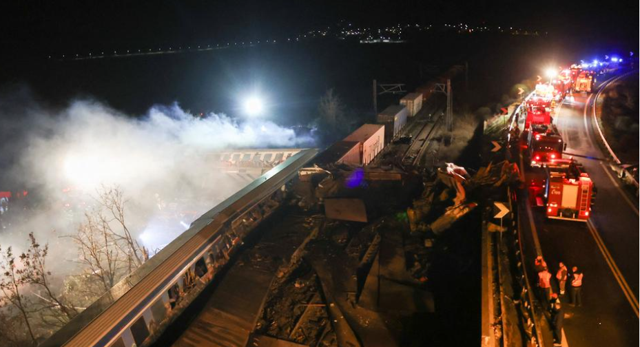
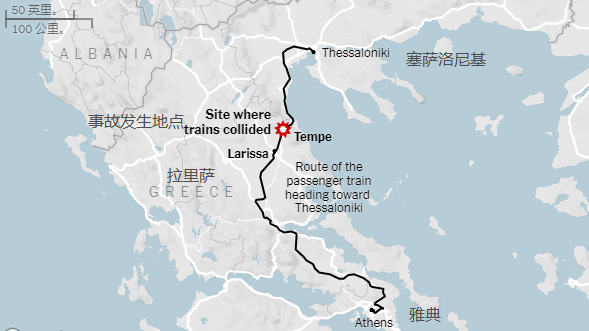
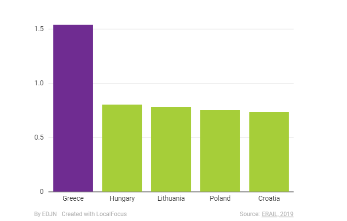
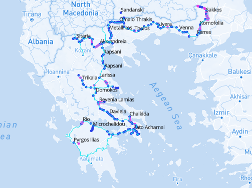
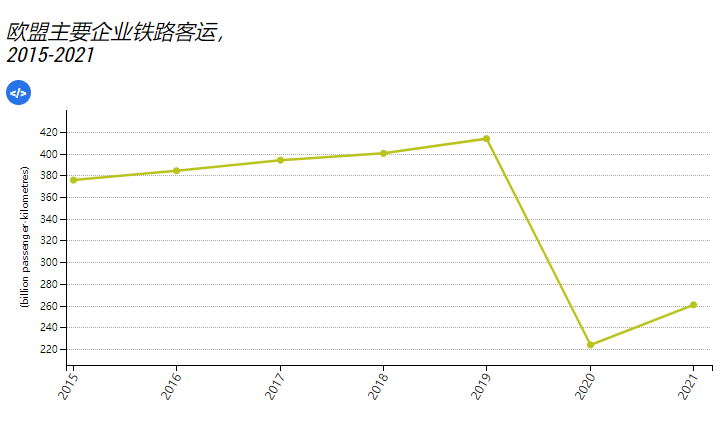

# 希腊列车相撞：欧洲铁路一天3起事故，欧盟至今未建立统一铁路网

据环球网报道，28日晚，希腊中部城市拉里萨附近发生了一起严重的列车相撞事故，一列从雅典开往北方城市塞萨洛尼基的客运列车，撞上了从塞萨洛尼基出发的货运列车，造成4节车厢出轨，至少有3节车厢起火。

_事故现场照片_

色萨利大区州长阿戈拉斯托斯表示，客运列车前2节车厢几乎完全被摧毁，大约有250名乘客已经疏散到安全地带，事故已造成32人死亡，当地政府已经联系希腊军队协助消防队搜救被困人员。

这起列车相撞事故被当地媒体称为希腊1968年最严重的铁路事故，具体原因尚不清楚。不过，这并非雅典-
塞萨洛尼基铁路线第一次出事，2017年一列载有70名乘客的列车在塞萨洛尼基脱轨，造成4人死亡，5人重伤。事后调查显示，希腊政府将责任归咎于列车速度过快。

列车相撞不外乎两种原因：铁路调度中心错误指挥，导致两趟列车迎面相撞，类似的事故发生概率较低，更常见的还是第二种情况：正在行驶的列车撞上另一趟静止的列车，2021年英国一起列车相撞事故就是因为司机没有来得及踩刹车，再加上雾气使铁轨打滑，最终导致列车撞上另一趟列车。

而这次出事的雅典-
塞萨洛尼基铁路线进行现代化改造，但有铁路员工向当地媒体表示，控制轨道线的电力调度依然存在重大问题。由此看来，调度中心出错或者调度系统出故障的可能性很大，但具体原因依然需要希腊政府详细调查。

_事故发生地点_

**“欧洲最致命的铁路”**

值得注意的是，2017年和2019年欧盟铁路局提交了两份对希腊铁路系统的评估报告，2017年的报告使欧盟委员会决定向即将破产的希腊铁路系统援助10.79亿欧元，帮助希腊唯一的国家铁路公司进行重组，不久后这家公司被意大利铁路集团收购。

2019年的报告则评估了两年后希腊铁路系统的状态，结果令欧盟大失所望。报告显示，2018年希腊因铁路事故死亡的人数位居欧盟第一，被称为“欧洲最致命的铁路”。欧盟铁路局认为，这一情况与2018年希腊非法移民激增和希腊铁路平交道口过多有关，当地民众和非法移民经常破坏铁丝网穿越铁路。

_希腊铁路事故在所有事故占比位居欧盟第一_

**一个人干不了三个人的活**

但根本原因还是与希腊铁路系统缺少维护有关。意大利收购希腊国家铁路公司后，并没有用心运营，希腊铁路系统每年只能收到1500万到1700万欧元，用于开展维护工作，然而这笔资金仅限于“做表面功夫”。由于缺乏人手、再加上铁轨年久失修，为了赶时间载客运货，希腊列车只能超速行驶，2017年欧盟铁路局曾就列车超速对希腊提出警告。

按希腊铁路工会的说法，从希腊中部城市利瓦迪亚到雅典机场的铁路线需要75名员工才能维持正常运行，而在2019年这条铁路线上只有47名工作人员，这还是算上铁路工会主席本人，他表示：“即使把我们分成三份，也无法满足整条铁路线的需求。”

_希腊铁路网，蓝色是可用车站_

**一天3起事故**

希腊的铁路状况只是欧洲铁路的缩影。

2021年欧盟接到了1389起铁路事故报告，事故造成683人死亡，事故频率接近美国的每天3起，但不同之处在于，欧盟的铁路事故主要集中于自杀，2021年自杀人数超过因事故造成的受害者人数。

而且从整体来看，欧盟铁路事故发生频率自2010年已经大幅降低。不过，随之下降的还有铁路客运和货运量，2020年欧盟铁路客运量下降到历史最低值，货运份额从50年代的60%下降到现在的15%。

_欧盟铁路客运在2020年腰斩，与疫情有一定关系_

**德国阴影挥之不去**

分析机构“调查欧洲”认为，这一现象与欧洲复杂的铁路网有关，特别是高速公路和航空兴起后，欧洲人更愿意驾车或乘飞机出行，而不是选择驳杂的铁路系统。之所以会出现这一现象，是因为时至今日，欧盟都没有建立统一的铁路网。

欧洲各国之所以仍将铁路视为重要的战略基础设施与二战有关。德国在二战中依靠铁路快速运输装甲部队，给欧洲国家带来的阴影至今挥之不去，所以他们更希望独立掌握本国的铁路网。

即使有些国家同意建立统一的铁路网，但也设置了不少障碍，比如A国铁路司机驶入B国，那么他的外语水平至少要达到欧标B1级别，否则不能入境；亦或者两国的联合铁路网虽然建成，但安全标准始终无法达成一致。

因此这种分歧造成一些有趣的现象：一列从英国出发的跨海列车要想抵达荷兰，需要经过9种不同的列车控制系统；德国ICE4动车组的供电系统只能在本国、奥地利和瑞士运行，无法前往法国或波兰。

2021年欧盟曾制定了一项野心勃勃的计划，准备在2030年建立一站式铁路系统，得到了各成员国口头支持，但到了谈钱的时候，西欧发达国家与东南欧国家一拍两散，这项计划也就不了了之，德国、法国等发达国家继续“荒废”着铁路运力，希腊等国家只能小心翼翼地维护本国年久失修的铁路。

更有意思的是，对于欧洲铁路现状，著名的“麦肯锡”咨询公司一位顾问曾建议欧洲向美国铁路公司学习。这篇文章发布于今年1月，不知道如今这位顾问看到俄亥俄事故后，会作何感想？

