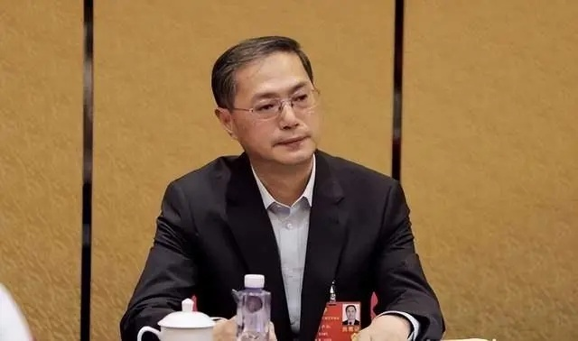

# 建议消除罪犯子女考公限制，政协委员周世虹回应：不能把人一棍子打死

最近，全国政协委员周世虹建议，取消对罪犯子女考公的限制，废除有关直系亲属、旁系亲属等有过被刑事处罚等处分而影响考生或被政审人政审的规定。他认为，政审应当以被政审人的现实表现为主，注重以实证证据予以证明。

提案经报道之后，有人提出疑问，认为这样的限制是对犯罪的震慑和约束，取消限制是对犯罪的纵容，是对被害人的不公。

周世虹接受九派新闻采访时表示，打击犯罪和保护人权应当并重。被告人犯罪，其子女受到处罚，这样的思维与罪责自负的法律原则相违背。

他谈到，去年曾参加一场刑事案件的听证会，一个四十多岁的男人当场痛哭流涕。他因为醉驾，面临刑事处罚，担心这会影响即将高考的女儿。“这个父亲因为喝酒，可能会影响子女参军、考公、就业，这太不可思议了，完全不符合现代法制文明。”

还有人认为，子女受到父母教育的影响，家庭环境的熏陶，父母犯罪，其子女也可能“耳濡目染”，担任公务员、警察、军人等重要职务是不合适的。

周世虹提出，考生、学生虽然和被刑事处罚的人有亲属关系，但两者之间在思想上、行为上并没有必然的关联。

他说，没有足够的科学证据证明，被告人犯罪，其子女、被扶养人、受其影响的人等就一定会有犯罪倾向、犯罪意图或者犯罪行为，就一定不适合担任公务人员、公安政法干部和参军。

“我们不能用个别的偶然的现象，作为制度性安排，把人一棍子打死。”他说。

**九派新闻记者王佳箐**

【来源：九派新闻】

版权归原作者所有，向原创致敬

