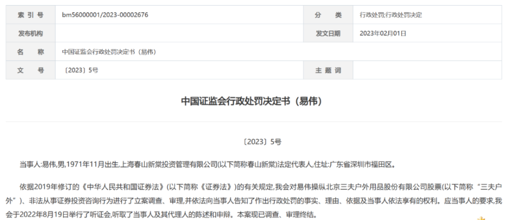

# 微博荐股豪赚2400万，这位大V栽了！自称耶鲁毕业，狡辩是知识付费！

微博大V被罚了。

近日，证监会公布了一份对大V非法荐股的处罚书。易伟注册使用微博账户“易伟”，宣传其毕业于耶鲁大学，富有投资经验，是大型美元基金管理人。“易伟”账号微博内容包含对A股市场、各上市公司发展及股价走势看法，每篇微博均有多个粉丝转发回复。此外，易伟注册使用微博账号“申尚趣”和“古北老江湖”，配合“易伟”微博账号传播投资理论和投资建议。

**2020年5月26日，易伟使用微博账号“易伟”发布招募会员信息，内容为出售“老易投资教育小宇宙”船票及相关联系方式。2020年5月26日至2021年3月15日，共有534人加入易伟投资咨询群，并实际向易伟指定收款银行账户支付会员费。易伟收入合计约2400万元。**

证监会没收了易伟非法从事证券投资咨询违法所得约2400万元，并处以2000万元罚款。券商中国记者注意到，易伟微博粉丝有37.6万人。最新一条微博时间是2022年9月11日。

从事证券投资咨询业务未经核准

依据证券法的有关规定，证监会对易伟非法从事证券投资咨询行为进行了立案调查、审理，并依法向当事人告知了作出行政处罚的事实、理由、依据及当事人依法享有的权利。应当事人的要求，证监会于2022年8月19日举行了听证会，听取了当事人及其代理人的陈述和申辩。本案现已调查、审理终结。

2020年5月26日至2021年3月15日，易伟未取得从事证券投资咨询业务的核准，不具备证券投资咨询从业资格及业务资质。

在微博微信上荐股赚了2400万

2020年5月26日，易伟使用微博账号“易伟”发布招募会员信息，内容为出售“老易投资教育小宇宙”船票及相关联系方式。易伟通过微博、微信提供推荐个股、预测行情、指导操作等证券咨询服务。

通过群发邮件提供投资咨询服务。每周向部分付费会员群发电子邮件，邮件内容包括对上市公司及相关股票的看法、具体买入时点买入价格建议及其本人持有的股票情况。

通过微信向个别付费会员提供投资咨询服务。易伟与个别付费会员通过微信单独交流，回答会员提出的投资问题、分析评价会员的交易行为、针对股票交易提出操作建议。

通过微博公开提供投资咨询。易伟注册使用微博账户“易伟”，宣传其毕业于耶鲁大学，富有投资经验，是大型美元基金管理人。“易伟”账号微博内容包含对A股市场、各上市公司发展及股价走势看法，每篇微博均有多个粉丝转发回复。此外，易伟注册使用微博账号“申尚趣”和“古北老江湖”，配合“易伟”微博账号传播投资理论和投资建议。

通过微信朋友圈公开提供投资咨询。易伟使用微信账户“船长老易”“老易”“俞爷”发布朋友圈，对股票提出明确投资建议，在朋友圈回复微信好友提问。

处罚书显示，2020年5月26日至2021年3月15日，共有534人加入易伟投资咨询群，并实际向易伟指定收款银行账户支付会员费。易伟收入合计约2400万元。

处罚书称，以上事实有微博账户资料、数据截屏、邮件数据、资金流水、询问笔录等证据证明，足以认定。

辩称属于知识付费

证监会认为，易伟的上述行为违反了证券法第一百六十条第二款、《证券、期货投资咨询管理暂行办法》(以下简称《暂行办法》)第三条和第十二条的规定，构成《暂行办法》第三十二条所述“未经中国证监会许可，擅自从事本办法第二条规定的证券、期货投资咨询业务”的行为。

在听证及陈述申辩中以及听证会后，易伟及其代理人提出如下申辩意见。

其一，违法主体并非易伟个人而是公司。其二，邮件咨询内容属于知识付费，而非证券投资咨询。易伟未就微信、微博、微信朋友圈发送的信息向任何人收取费用，与个别会员交流股票并非履行相关合同义务。其三，调查未向付费会员调取证据，当事人提供的调查问卷表明付费会员并不认为易伟提供的服务属于证券投资咨询。其四，截至证监会调查时，合计有13名会员退费，不应计入违法所得。其五，本案不能适用证券法进行处罚，而只能适用《暂行办法》，但证监会并非《暂行办法》的适用主体。综上，请求对易伟不予处罚。

**经复核，证监会认为：**

其一，易伟利用个人影响力招收付费会员，并非以公司名义，涉案行为亦无法体现单位意志，且违法所得最终归易伟个人所有，因此违法主体是易伟个人而非公司。

其次，易伟利用微博公开发布证券投资建议为招募会员进行宣传，之后每周定期向付费会员群发包含投资咨询建议的邮件，并与付费会员单独添加微信，通过私信或者朋友圈提供投资咨询建议。从整体来看，前述一系列活动构成证券投资咨询。

其三，易伟向会员群发邮件的内容包括对上市公司和相关股票的看法、具体买入时点、买入价格建议及其本人持有的股票情况等，客观上构成证券投资咨询。

其四，当事人及其代理人并未提交会员退费的相关证据，证监会在计算违法所得时已根据在案证据剔除了退费会员对应的金额。

最后，《暂行办法》发布时地方证管办与证监会分立的背景已发生变化，其规定的由地方证管办行使的相关职能已经被合并进证监会。因此，证监会有权适用《暂行办法》的相关规定。综上，维持对易伟的处罚。

证监会表示，根据当事人违法行为的事实、性质、情节与社会危害程度，决定依据《暂行办法》第三十二条，没收易伟非法从事证券投资咨询违法所得约2400万元，并处以2000万元罚款。

