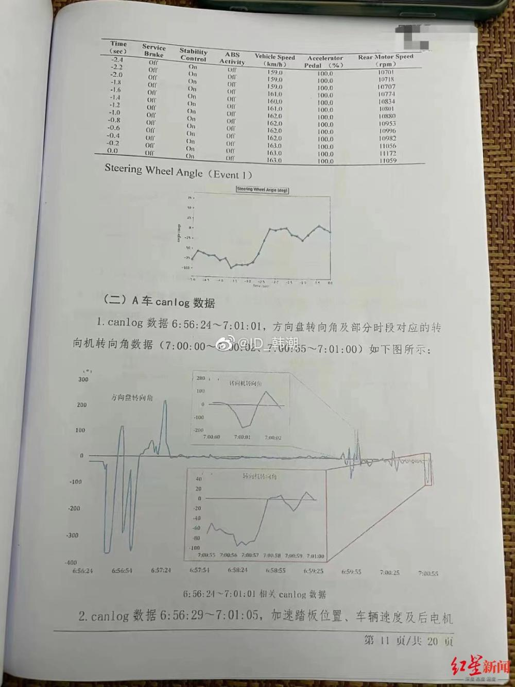
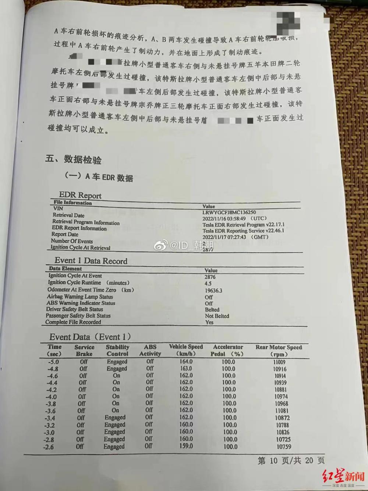

# 有博主曝光特斯拉潮州事故EDR数据：撞车前5秒内，电门被踩死，未有效制动

2月28日，汽车博主@ID_韩潮公布了两张特斯拉潮州事故的EDR（汽车事件数据记录系统）数据报告。特斯拉（TSLA.US）相关负责人向红星资本局表示：“目前网络传播的鉴定报告中的车架号与潮州事故车辆的车架号一致。”

有交通事故车辆鉴定的业内人士告诉红星资本局，曝光的两页EDR报告并不完整，只能说明：
**撞击前的5秒内，该车的电门被踩死，车辆未得到有效制动。不能据此得出是驾驶员原因还是车辆问题。**

_资料配图
图据IC Photo_

EDR数据显示，事故发生时主驾驶人员系有安全带，安全气囊未弹出，ABS防抱死系统未开启。在撞击前5秒车速为164km/h，随后方向盘角度有25度变化，Stability
Control显示车身稳定系统介入，车速稍降低到159km/h。随后在方向盘稳定后，车辆速度稍有上升，发生车辆撞击时，时速为163km/h。

_博主曝光的EDR数据文件_

值得关注的是：撞击前5秒，该车电门一直是100%，刹车踏板一直处于Off状态。

有交通事故车辆鉴定的业内人士告诉红星资本局，曝光的两页EDR报告并不完整，不能完整还原事故，只能说明：
**撞击前的5秒内，该车的电门被踩死，车辆未得到有效制动。**
“不能据此得出是驾驶员还是车辆的问题。最好有‘刹车踏板位移、油门踏板位移、动能回收工作状态、ibooster工作状态、ESP hav工作状态’等数据。”

据《汽车事件数据记录系统》（GB
39732）规定，EDR需要记录的数据项分为A、B两类，分别有17项和43项数据。A类数据包括：车辆识别代号、速度、发动机转速、制动状态、加速踏板开度、安全带使用状态、碰撞产生速度变化等；B类数据主要包括：碰撞产生加速度、制动踏板开度、方向盘转角、转向灯开启状态、安全气囊/气帘展开情况、ABS/ESC/TCS/AEB/ACC等主动安全系统作用情况等。

“事故的深入分析和精细化重建需要A+B类数据。”该业内人士表示，EDR也存在一定的局限性。EDR只记录了碰撞前5秒的车辆数据，不会主动记录触发前的碰撞数据。“特斯拉潮州事故车辆，疑似失控高速行驶2公里多，远超过5秒，EDR无法记录碰撞前的数据，无法证明驾驶员有没有踩油门或刹车。”

此外，EDR对于数据的采集依赖于车辆加装的传感器，传感器、信号传输系统故障可能导致数据出错。

@ID_韩潮表示，他拿到的EDR数据报告有限，不清楚报告的最终结果。红星资本局了解到，潮州警方选定的第三方鉴定机构司法鉴定科学研究院，已经向警方提供了鉴定报告，最终结果有待警方披露。

红星新闻记者 吴丹若

编辑 杨程

