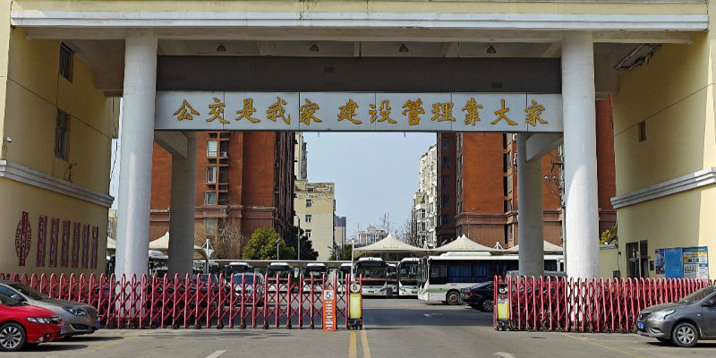
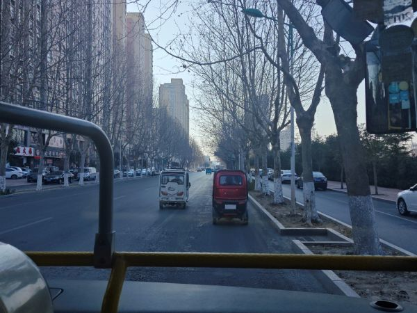
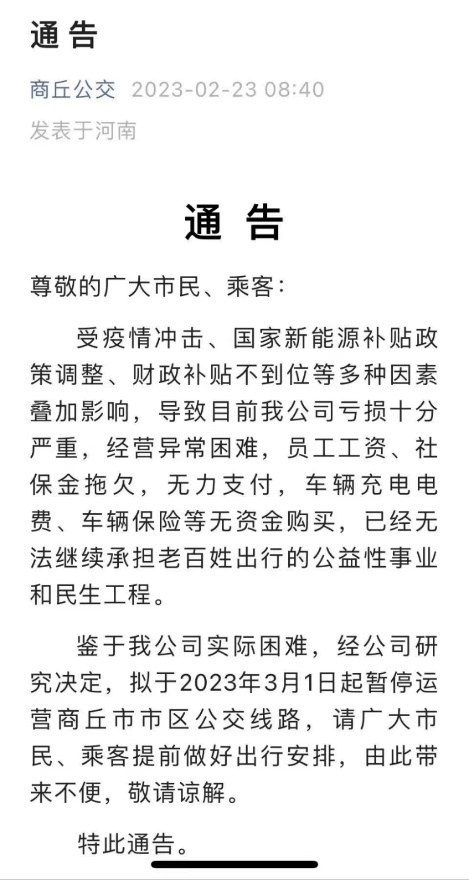
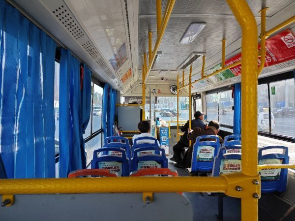
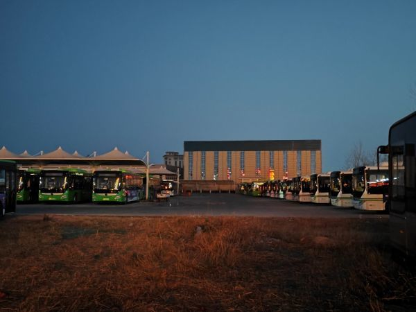

# 河南商丘公交车停运风波：此前购入千台纯电公交，补贴调整打破收支平衡

_（图片来源：张英/摄）_

**经济观察网 记者 张英**
2月27日下午5点半，正值中国很多城市的晚高峰。商丘市中心文化东路上挤满了小轿车和电动三轮，路边公交站台一位70岁老太独自候车，等待近10分钟后公交车靠站，车内空无一人。

这是一条自西南向东北斜穿市区繁华路段的公交线，起终点站分别是高铁站、火车南站,在记者乘坐的16站区间，全程仅有3人乘车。由于很多站点无人，空载的公交车跑得更为轻快。

在商丘，这样的场景并不少见。许多线路需要候车半刻钟甚至20分钟。“路途近骑电动车，路途远了会开车。”一位正在幼儿园门口接小孩的年轻家长说，她近一两年没搭过公交。

_图：空载的商丘公交车与同路行驶的电动三轮（张英/摄）_

乘客稀少带来的运营收入少，是2月23日商丘公交公司发布“停运通告”的背景之一。根据该公告，商丘公交公司受疫情冲击、国家新能源补贴政策调整、财政补贴不到位等多种因素叠加影响，导致公司亏损严重，经营异常困难，已经无法继续承担老百姓出行的公益性事业和民生工程，拟于2023年3月1日起暂停运营商丘市区公交线路。

商丘公交公司是商丘公交系统最重要的运营企业，截至2022年，先后购买了2103台纯电动新能源车，运营线路59条。仅此一家公司的公交车辆规模，大大超过周边同人口体量的周口、南阳等城市。

经济观察网记者采访发现，在2015年——2021年大量购入电动公交车，给商丘公交公司带来了巨大的成本。但其间国家对新能源补贴的突然调整，也在很大程度上打破了原来的收支平衡。

商丘公交公司的一位退休高管、股东告诉经济观察网，停运风波钱，公交公司早已资金枯竭，董事长黄玉波曾向银行等多方筹资未果，在23日“停运通告”前，公交公司申请政府补贴的方案已获相关管理部门同意，但一直未得到市级领导答复。

23日中午，商丘公交公司又通告称，将克服困难，确保公交不停运。当天下午，商丘市政府发布声明，商丘市公共交通有限公司是由2006年改制的民营公司，市财政一直按约定予以补贴。受疫情影响，该公司经营确实遇到困难，市政府工作组已进驻，将依法依规查明情况，进一步纾困解难，确保市区公共交通正常运营。

据经济观察网记者了解，目前商丘市政府工作组仍在商丘公交公司。截至3月1日，记者致电商丘市交通运输局、商丘公交公司及常务副总张维峰，未能就双方是否达成长期补贴方案、如何保证公司持续运营等问题获得回复。

**艰难2022**

2月25日，在工作组进驻两天后，商丘市公交公司的员工们收到了拖欠5个月的工资，司机李梅立即把钱转去归还贷款。

李梅已在公交公司服务多年，她所跑路线正属于商丘公交公司计划暂停的“市区线路”。

商丘公交分为市区线路和城郊线路，市区线路车费1元，60岁以上老年人可免费乘车。而城郊线路的所有乘客均是2元起步，最远路程车价可达10元。

据公交公司一位工作人员了解，市政府每年都设有资金补贴市区线路，以支持老年人免费乘车，不过并不清楚2022年这一补贴是否到位。公交公司曾在市区路线的停运公告中，强调“无法继续承担老百姓出行的公益性事业和民生工程”。

李梅说，相比于市区线路乘客稀少、常年亏损，城郊线路乘客更多、收益更高，是公交公司的主要收入来源。

事实上，城郊线路收益也谈不上理想。2月27日，记者从火车站搭12路车到终点站商丘工学院新校区，全程15公里共有5名乘客。这趟线路的司机介绍，这条线路从早6点到晚7点，周一到周四每天拉不满30个人，经常空车往返，只有到周五、周末因搭载学生每天能载一两百人。

“现在的乘客量大约只有2019年的四分之一。”城郊线司机说，算下来这条城郊线路每月可收车费大约5.8万元左右，除去司机们约3.5万元的工资，仅余下1万多元，还需支付10多台车（10台车上路，余下几台车充电备用）的保险及充电费用。

_图：全程15公里仅有5名乘客的公交车（张英/摄）_

相比于城郊路线，市区路线受到新冠疫情的冲击更大。在新冠疫情期间，在防疫政策要求下，乘客锐减，商丘公交公司停掉了不少市区线路的车辆，尤其是在2022年。

这年年初，商丘市因出现1例新冠无症状阳性感染者，连续开展了三轮市区全员核酸，暂停运营城区公交车，10天后才恢复除封控区、管控区外的公交线路。此后，因城区断断续续封控，公交运行受到极大影响。以跑主干道的1路车为例，疫情前有30辆车运营，2022年减到了10台。到2022年12月疫情高峰期，商丘公交车全部停运。

一位老年市民介绍，2022年时由于车少，候车半小时、一小时很常见，有的线路甚至完全停运，他便更不愿乘坐公交了。

市区运营车辆减少后，公交公司变得人多车少，司机们轮流上班，最多一天只能排一个班次，每班收入80-100元，一整月收入2400-3000元。到2022年时则要好几天才轮得上一个班，不少司机每月工资低至千元以下，直至完全停发。同时，公交公司无法为员工缴纳职工医保和公积金。

为了归还每月近三千元的房贷，李梅只得请假寻找兼职机会，期间曾面试过销售、收银员等工作，“只会摸方向盘”的她因缺乏工作经验被拒，待业在家数月，夫妻俩依靠父母的养老金生活。她的很多同事选择离开商丘，到苏州、常州等地的运输行业打工，或者到工地上做小工。

年关后，疫情高峰期过去，李梅原以为会有好转，但公司连车辆保险也无法缴纳了，甚至提出一旦出现车辆事故，由司机自行承担责任。

**特许经营往事**

就在2022年商丘公交的“艰难时刻”，不少市民投诉，甚至有人称其为“商丘私交”。

商丘公共交通有限公司确是一家私营企业，董事长黄玉波控股67.6%，商丘市公共交通有限公司工会委员会持股15%，其余10名股东持股17.4%。

商丘公交的私营化是从2002年起步，直到2006年正式改制完成。

2002年底，国家出台《关于加快市政公用行业市场化进程的意见》，明确市政公用事业可以实行特许经营，随后民间资本和外资纷纷抢滩公交行业。

当时的商丘公交步伐还没有太大胆，只是实行经营承包制，将各条线路分包给私人经营，商丘公交公司仍是事业单位，通过向各个承包商收取管理费。

商丘公交董事长、总经理黄玉波此时还是供销社员工，2002年后因商丘一条主干道公交线路罢运，政府撤掉了商丘公交原负责人，调派黄玉波上任。据当时一位高管回忆，到2005年，省政府要求对公交公司进行改制，“倒排工期，规定必须在一定时间内完成改制。”

这位退休高管介绍，改制时公交公司资产为负，欠债一千多万。黄玉波筹集了大笔资金接管公司，并逐渐将外包的线路全数收回，成为了大股东，其他高管每人出8万共占股17.4%，中层干部每人出4万共占股份15%，由此形成了目前的股权结构。

至于改制时商丘市政府为何未选择出资占股，这位退休高管并不清楚原因。因公交公司持续亏损，过去16年作为股东的他从未分得过利润。

停运事件，让公交公司民营化问题再次受到争议。

**新能源车狂飙**

部分公交司机和市民在与记者交流时，将该公司的亏损与公司经营者“出于私利套取新能源补贴”挂钩。

商丘公交公司早在2015年就开始购买新能源车，是全省率先实现中心城区公交车辆全部电动化的城市，到2017年已拥有纯电公交车1777辆，平均月用电量超过200多万度。

2017年，商丘公交公司被河南省交通运输厅授予“河南省十佳公交企业”，2018年商丘成功入选河南省“公交优先”示范创建城市。

截至2022年，商丘公交公司已先后购买了2103台纯电动新能源车，运营线路59条。

与相近人口规模的南阳市（962.6万人）、周口市（885.3万人）相比，商丘市（772.3万人）所拥有的公交车数量是最多的。南阳市在2022年初的公交车辆共有1041辆，运营44条线路；周口市在2021年时中心城区公交车有650台，周口市公交总公司总经理海林献曾表示这个数量基本保证了中心城区市民出行需要。

商丘公交公司的新能源车曾享受国家购置补贴和运营补贴。国家购置补贴主要通过补贴厂家的形式，让购车方享受优惠价格，按照商丘公交披露的数据来看，其购买的大容量纯电动公交车价格大概在37万左右。

在运营补贴方面，2015年至2019年，10米及以上的纯电公交车每年可获补贴8万元，8米至10米每年补贴6万，6米至8米每年补贴4万。以此计算，商丘公交公司的10米纯电公交连续补贴5年或可回收购车成本。

_图：停放在市立医院附近的商丘公交车辆（张英/摄）_

在部分公交司机看来，或许并不需要这么多车辆。

一位司机回忆，为了跑够补贴要求的3万公里，许多司机下班后带车空跑，有时甚至夜晚12点还在路上转公里数。“校车最多跑20公里，但公司规定一天必须100公里，很多司机周末还带着孩子在路上跑公里数。”

新能源补贴政策滑坡，一定程度上打乱了黄玉波的经营节奏。

商丘公交公司曾在2016年、2017年分别购入纯电动公交车608台、832台，若以其中一半为10米车计算，这部分车辆需获得运营补贴至2021、2022年或可能打平账目。但在2019年5月，财政部等四部委下发《关于支持新能源公交车推广应用的通知》，对于新能源公交车运营补贴，提出从2020年开始采取“以奖代补”方式，暂停了此前的运营补贴政策，对于此后具体如何奖励也并未明确。

运营补贴暂停后，黄玉波没有马上停止购进新能源车，2021年继续新增了近300台电动公交，享受当时的购置补贴政策。到2022年商丘公交车辆数才放慢脚步，保有量从2153台降至2103台。这一年，新能源车的购置补贴退坡了20%，相关部门还表示购置补贴将在该年底暂停。

叠加新冠疫情，商丘公交如此多的新能源车更难产生运营效益，由此产生线路减少、车辆停运事件。

**公交优先与补贴有限**

停运事件后，部分市民和公交司机寄希望于商丘公交被重新收归公有，这在此前乌鲁木齐市等地曾有过先例，不过对于当前的商丘而言这显然困难重重。

商丘市政府在近期公告中称，市财政一直按约定予以公交公司补贴。据2020年、2021年商丘市交通运输局公布的部门决算，“公共交通运营补助”项分别是330万元、653万元。

对于2020年以前的政府补贴，商丘公交公司办公室主任宋振宇曾发文介绍，2013年市政府提出从2013年城市建设资金中列出5%支持公交事业发展；2014年市政府计划投资1000万购买纯电动空调公交；2015年市政府增加公交老年人免费乘车补贴至每年250万元；2016年市政府投资了1000万元购买纯电动空调公交，并提出2017-2019年计划完成投资约3.985亿元，基本确立公共交通在城市交通体系中的主体地位。

2021年商丘市发布的《关于城市优先发展公共交通的实施意见》，其中提及“我市对城市公共交通优先发展的支持力度在黄淮四市不能落后，市公交公司继续享受改制前与改制后政府给予的优惠政策。要统筹资金，用于支持城市公共交通基础设施建设、车辆购置、政策性补贴等。”

政府部分补贴计划是否落到实处，经济观察网记者多次拨打宋振宇电话，未获接听。

在上述同一篇文章中，宋振宇提到2016年、2017年商丘市公交公司曾先后自筹资金3亿多元购置了纯电动公交车辆1400多台，欠债严重，由于种种原因政府的公交优先发展政策落实不到位。

2020年，商丘市交通运输局在答复政协提案“进一步完善公交候车亭的建议”时称，商丘市公交车辆和公交候车亭基本都是企业自筹资金购买、建设，2015年以来公交企业先后自筹资金3亿多元，购买了1826台纯电动空调公交车辆，同时自筹资金超5000余万建立候车亭。目前公交企业已经负债严重，但由于种种原因，市财政对公交车辆和公交站牌、候车亭等设施建设几乎没有任何投入。

2021年12月，商丘市交通运输局在答复“优化公交运行，服务人民群众出行的建议”提案时表示，2019年5月市政府明确指出要健全管理机制和公共交通政府补贴的机制，
“但由于种种原因，我市还没有参考学习外地经验，也没有建立公共交通政府补贴机制和激励机制。”

在同一年，商丘市发改委在回应“关于我市公交车统一定价1元的提案”时也曾表示，由于种种原因，没有对城市公交企业运营亏损给予补贴补偿，公交企业一直是负债亏损经营。受新冠肺炎疫情、持续减税降费和房地产市场的影响，预计2021年及近几年市本级一般公共预算收入、土地出让收入和城市基础设施配套费下降较大。由于市本级财力有限，一些必保支出尚有资金缺口，目前落实“借鉴郑州市的经验，由政府补贴一部分，把原先的2元票价统一改成1元”事项压力较大。

2022年，商丘市财力更加有限。根据2022年12月30日公布的《2022年商丘市市级第二次预算调整方案（草案）》，2022年市级预算执行中，受新冠肺炎疫情、持续落实减税降费政策和经济下行等因素影响，市级一般公共预算收入、政府性基金预算收入短收较多。

市级一般公共预算收入年初预算54.9亿元，预计短收3.1亿元。而与房地产市场紧密联结的市本级政府性基金收入短收形势更为严峻，年初预算127.5亿元，预计短收81亿元。

2022年商丘市政府在推动公交优先方面并非毫无行动。自2022年8月起，商丘市就开始分时分路段对市区普遍存在的电动（燃油）三轮车、电动四轮车划定禁行范围。商丘政府称，禁行后，将在市区大力发展城市公共交通，最大限度方便群众出行。

