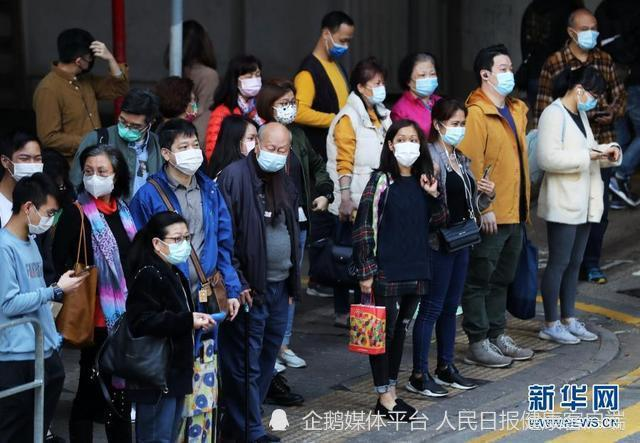

# 澳门香港相继取消“口罩令”，专家：当前可以相应调整和优化

**健康时报 刘颖琪**

据香港电台等多家港媒报道，香港特区行政长官李家超2月28日宣布，由于目前香港疫情整体风险可控，从3月1日起解除所有场所的“口罩令”，在室内、户外及乘坐公共交通工具时均不用戴口罩。此前，澳门特区政府宣布，2月27日取消户外口罩令。

_12月26日，市民在香港街头戴口罩出行。新华网
图_

健康时报注意到，内地多省市的商超、餐饮场所等已不强制要求来往人群必须佩戴口罩，但乘坐公共交通工具及进出养老院、幼儿园等特殊场所仍旧需要佩戴口罩。

“‘口罩令’是新型冠状病毒处在‘乙类甲管’时期的要求，经过2022年12月新型冠状病毒感染高发期，我国人群的免疫力屏障已较为牢固，半年内二次感染的可能性较低，从这方面而言，口罩的佩戴要求的确可以调整和优化。”2月28日，中山大学附属第三医院感染科副主任、主任医师林炳亮在接受健康时报采访时指出。

复旦大学公共卫生学院流行病学教研室主任、教授王伟炳在接受健康时报采访时也表示：“目前新冠回归到乙类乙管，我国新冠疫情处于低水平流行阶段，现在多数地区确实已符合‘摘口罩’条件。”

但同时两位专家也都强调，鉴于目前处在春季传染性呼吸道疾病的高发时期，如甲流等，口罩的佩戴仍然是非常有效的自我保护措施，建议未感染新冠的老人、幼儿及免疫力低下的人群，仍要继续佩戴口罩。“虽然新型冠状病毒的免疫屏障已基本建立，但每个人免疫力存在一定差异性，短期内还是需要提高警惕，防止类似传染性呼吸道疾病的感染。”林炳亮教授表示。

王伟炳建议，内地可以参考香港的操作，即放宽口罩佩戴的规定，但在老人院、医院等机构，仍要求继续配戴，尤其是在一些医疗可及性较差的地区，建议根据当地具体情况具体评估，保持灵活性，及时根据疫情防控形势的发展，动态调整“口罩令”。

林炳亮也指出，个人可以根据自身健康情况、所在地区传染性呼吸道疾病流行情况等选择是否佩戴口罩，尤其在密闭空间内，从个人卫生角度而言，换季时期自觉佩戴口罩是为己为人，做好自己健康的第一负责人。

