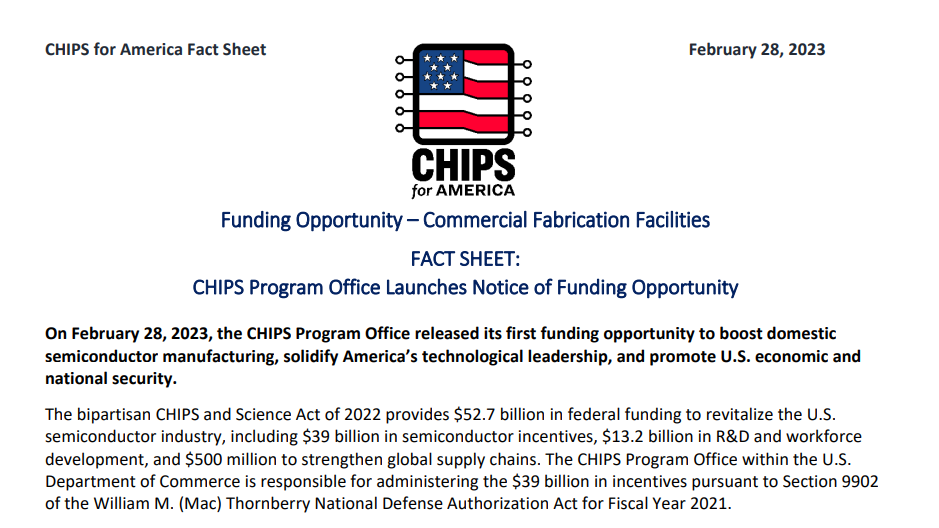

# 美芯片法案申请细则出炉：部分企业将与政府分享利润、限制分红回购

**财联社3月1日讯（编辑 史正丞）** 当地时间周二一早，美国商务部在官网发布了一系列文件，标志着500亿美元芯片产业补贴的申请流程即将启动。

_（来源：美国商务部）_

作为背景，在美国国会去年通过的《芯片与科学法案》中，授权联邦政府提供527亿美元补贴半导体产业。
**其中390亿美元将用于扩建和新建半导体工厂的补贴、132亿美元用于研发和劳工培养，还有5亿美元与增强全球产业链有关。**

美国商务部透露，具体的补贴将以现金、联邦贷款或债务担保的形式发放。具体补贴的比例仍需要根据个案进行评估。不过美国商务部在指引中也提及，
**各项补贴加起来预计不会超过项目整体开支的35%，大多数项目的直接现金补贴会落在资本支出的5%-15%之间。**

对于申请者来说，除了项目本身要符合拜登政府的“半导体愿景”外，还需要证明自身的财务状况、融资能力，以及项目本身的长期商业可行性等。申请者还需要承诺培养并维持高技术和多元化的人才队伍。
**对于申请补贴金额超过1.5亿美元的公司，还需要在项目附近为项目的建筑工人和员工提供“负担得起的高质量儿童保育服务”。**

如果说搞定托儿所对于绝大多数半导体公司来说都不算难题，接下来的一系列要求将令不少公司感到难受。

美国商务部在文件中表示，
**接受资金超过1.5亿美元的申请人需要与政府达成协议，如果项目的盈利情况超过预期，申请人需要在达到约定的门槛后向政府返还一定比例的资金。** 更为重要的是
**，禁止申请人用芯片法案的补贴进行分红和股票回购，所以申请人需要向政府提供未来5年的股票回购计划。同时申请人“抑制和限制股票回购”的努力也是审核环节中的一个考量点。**

在美股半导体公司中，德州仪器曾向投资者承诺将所有富余的现金流，都用于分红或股票回购，英特尔也以分红慷慨著称。为了拿到美国政府的补贴，这些公司也需要调整回馈股东的举措。

美国商务部也强调， **补贴将会按照建设和运营里程碑分批发放。如果申请人未能实现承诺，将视情况采取暂停拨款、终止补贴或要求返还所有资金等举措。**

美国商务部长雷蒙多表示，细则的申请条件，可能会比许多企业最初预计得难一些。商务部需要看到每个项目的财务模型，确信项目的可持续性和财务上的可行性。

对于非美国本土的半导体公司而言，颇为关心的限制性条款也在周二的文件中粗略提到过几句。例如申请人如果与“受关注的海外实体”进行联合科技研发或技术授权，将需要返还所有补贴资金。同时申请人在成功拿到资金后，未来10年内不能在“受关注的国家”进行扩产等“显著规模的交易”，
**但没有对“显著”给出明确的定义** 。美国商务部也表示，将在近期对这些要求给出进一步的解释。

美国商务部宣布，企业可以从即日起提交申请兴趣的声明，预申请流程将从今年3月底正式开始，提交完整申请的流程则会从6月底开始。

（财联社 史正丞）

