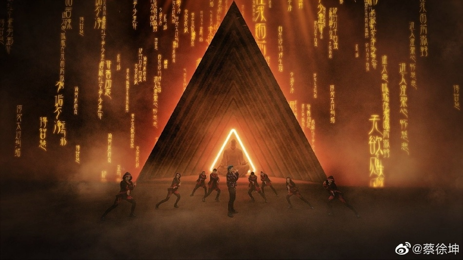
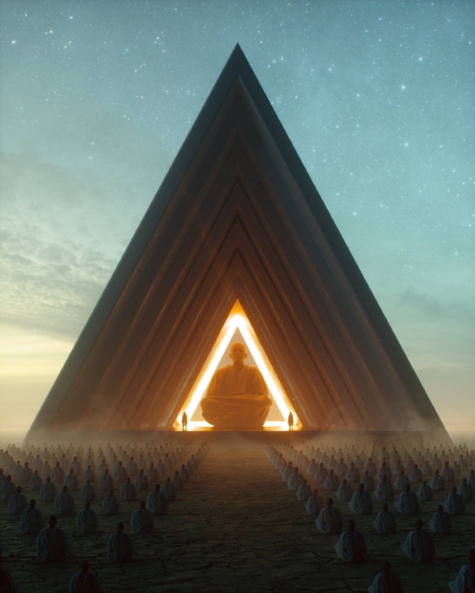

# 蔡徐坤工作室回应舞台背景抄袭争议：将对责任方严肃追责

2月28日，有网友在社交平台晒出两张对比照，质疑蔡徐坤舞台背景抄袭了他的设计，隔空喊话：“我不知道蔡徐坤是谁，但请不要这样。”

对此，担任此次蔡徐坤线上演唱会后期团队的视效总监王志远在社交平台发文道歉，称在该项目的创作过程中，由于经验不足造成错误， 谎称该设计为原创作品。

事件发生后，王志远作为唯一责任人，已第一时间与原作者、收藏者取得联系，郑重道歉，并经专业人士指导从最新持有收藏家处完成对该作品的授权。

蔡徐坤工作室也转发并表示：“我方始终尊重原创和知识产权，在所有涉及知识产权的合同中严格明确要求原创及版权。发现问题后，我方第一时间敦促后期团队妥善处理版权问题。在此，向原作者及收藏者和所有歌迷朋友诚挚致歉。目前已启动维权程序，将对责任方睛致传媒严肃追责！”

上游新闻

编辑：邓晞

责编：吴忠兰

审核：冯飞

