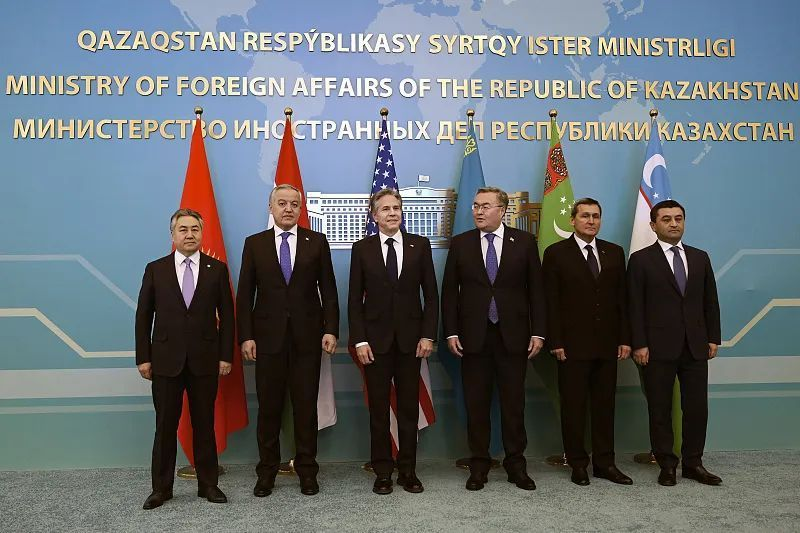

# 见缝插针！美国务卿布林肯首次中亚之行，企图挖莫斯科墙脚

美国务院上周宣布，国务卿布林肯将于2月28日至3月3日对哈萨克斯坦、乌兹别克斯坦和印度进行访问。当地时间28日，布林肯如期而至，抵达他中亚之行的第一站哈萨克斯坦。

此行是布林肯的首次中亚之行，也是他与该地区外长第四次以“C5+1”部长级会议形式举行的会晤。

“C5+1”指的是哈萨克斯坦、吉尔吉斯斯坦、塔吉克斯坦、土库曼斯坦和乌兹别克斯坦这五个中亚国家加上美国。

美国负责南亚和中亚事务的助理国务卿唐纳德·卢表示，布林肯将表明美国是一个“可靠的伙伴”，不同于俄罗斯。

有多可靠呢？

在中亚期间，布林肯将在一天内火速与五国外长以及哈萨克斯坦和乌兹别克斯坦总统分别举行双边会晤，而后赶赴印度参加3月1日的G20外长会。

算起来，平均每人只有不到1小时的时间同布林肯对话，这还没排除寒暄时间。

而且，根据美国国务院发言人办公室发布的电话会议实录，唐纳德·卢在宣布此访时，连访问对象都说错了。

卢宣布，“这是国务卿第四次会见QUAD（美日印澳四方安全对话）外长，这是我们成立的第七年……对不起，不是QUAD，是C5+1七周年”。

_28日，布林肯同中亚五国外长举行“C5+1”机制部长级会议。图源：视觉中国_

那么，布林肯为什么会选择中亚？

**首先，见缝插针。**

上周，联合国大会在俄乌冲突一周年之际，就“在乌克兰实现全面、公正和可持续和平的《联合国宪章》原则”进行决议，中亚五国选择弃权票或干脆没投票，在俄乌冲突问题上保持中立。

当地时间2月27日，哈萨克斯坦总理斯迈洛夫签署命令，关闭哈萨克斯坦驻俄罗斯贸易代表处。对此，俄罗斯外交部发言人扎哈罗娃表示，俄方不会关闭俄罗斯驻哈萨克斯坦贸易代表处。

一系列动作，让美国嗅到了“挖墙脚”的机会。

《华尔街日报》称，美方正将中亚与俄罗斯关系中的立场模糊视为一个风向转变的迹象，几十年来，中亚地区一直优先考虑与俄罗斯的密切关系，现在或许是美国深化在该地区参与度的好机会。

**其次，俄罗斯战后实力受损，美国乘虚而入。**

长安街知事（微信ID：Capitalnews）注意到，在与五国外长的会面中，布林肯一连打出了政治挑拨、经济诱惑和价值观输出的“组合牌”，但作用似乎不大。

根据美国国务院发布的新闻稿，布林肯对中亚五国每位外长都承诺，美国将致力于维护其主权、独立和领土完整。

有所不同的是，他在与哈外长会谈前额外指出，有关主权这些话，“有时我们只是说说罢了，它们实际上没有任何意义，当然，在这个特定的时刻，它们比平时更能引起共鸣”。

“这个特定的时刻”，显然指的是俄乌冲突延宕的当下，无非是想让哈萨克斯坦联想乌克兰。

在经济方面，此次“C5+1”峰会正值俄乌冲突一周年，这场战争对全世界的经济体都造成了打击，中亚也不例外。

唐纳德·卢在布林肯出访前对记者表示，“我们看到了这些经济体所面临的困难——高粮价、高油价、高失业率、货物出口困难、新冠疫情之后经济复苏缓慢等等。”

“我们已承诺今年向中亚提供4150万美元的援助，帮助这些国家探索新的出口路线、对劳动力进行再培训、减少失业并刺激私营部门的增长。”唐纳德·卢说。

然而，在经济诱惑之下，是美国从未放弃的“美式价值观”输出。

美媒称，推销美式民主一直是美国的首要任务，“促进中亚的人权”成为他们挂在嘴边的“漂亮话”。

**最后，背刺俄罗斯，一箭双雕。**

中亚地区具有至关重要的战略意义，与俄罗斯有着密不可分的政治和防御关系。去年3月的“C5+1”线上会议上，布林肯甚至已经急不可耐地提出了美国重新在中亚设立军事基地的可能性，令中亚五国“困惑不已”。

这次布林肯换了话术，在代表拜登政府向中亚五国示好之外，他致力于促进这些国家与俄罗斯脱钩。

唐纳德·卢表示，劝说中亚五国“不要成为俄罗斯逃避制裁的同伙”是布林肯在该地区谈话的一部分，“由于这些制裁，我们在中亚经济与俄罗斯脱钩方面取得了真正的进展，我们将继续鼓励中亚国家沿着这个方向发展。”

实际上，虽然美国在离间中亚国家和俄罗斯这件事上忙了几十年，可成效一直微茫。

半岛电视台称，去年1 月，应托卡耶夫的要求，俄罗斯向哈萨克斯坦部署军队以阻止反政府抗议活动就是明证。

而且，哈萨克斯坦外长特列乌别尔季2月28日在与布林肯举行的联合记者会上表示，哈萨克斯坦没有因乌克兰事件看到来自俄罗斯的风险或威胁。

他还强调，哈萨克斯坦继续执行多方位外交政策，我们以此努力维持制衡体系，以确保与世界所有国家的互利合作和相互关系。

