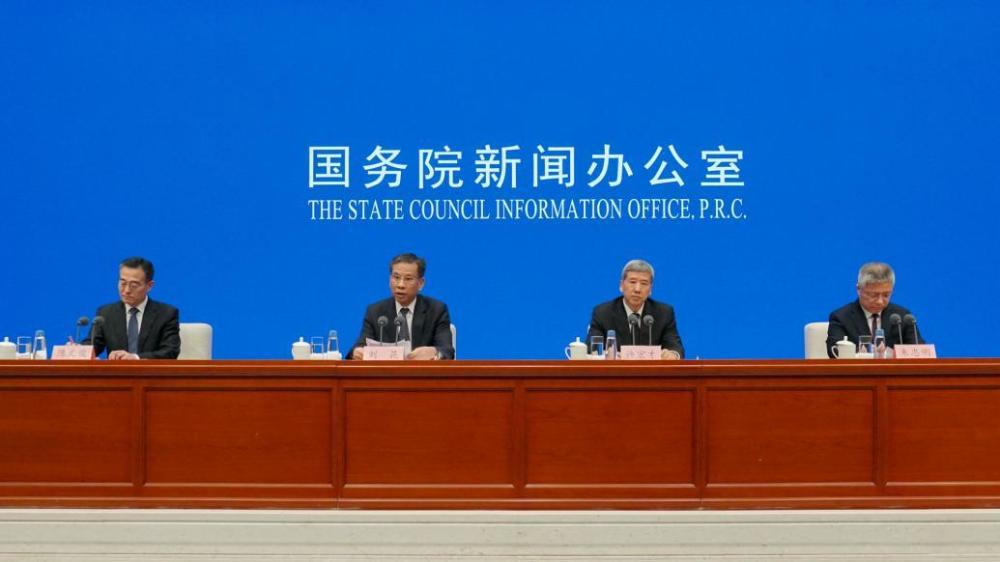

# 财政部长：政府过紧日子应长期坚持，以政府过紧日子换老百姓过好日子

_发布会现场 澎湃新闻记者 周頔 摄_

3月1日，国务院新闻办举行“权威部门话开局”系列主题新闻发布会，介绍“财政贯彻落实党的二十大重大决策部署”。会上，财政部部长刘昆表示，近年来，各级财政部门始终把艰苦奋斗、勤俭节约作为财政工作指导方针。坚持党政机关过紧日子不动摇。“紧”是通过提高资金的有效性来实现的。以中央为例，中央部门带头严格支出管理，一般性支出连续四年压减，2022年，中央部门支出预算安排下降了2.1%。实际执行中下降了3.5%，把钱花在刀刃上，重点支出的保障反而是强化了。

刘昆表示，政府过紧日子不是短期应对措施，而是应该长期坚持的方针政策，要压减开支，腾出更多财政资源，支持地方保基本民生、保市场主体，以政府过紧日子，换老百姓过好日子。在财政的实践上，行政性费用、“三公”经费增加了，用于民生保障的支出就减少了。中央本级的经费增加了，用于对地方的转移支付资金就少了。财政部在这方面“作文章”，保障了疫情三年来全国财政收支的平衡，把钱用在刀刃上，花出效果来，总体情况是好的。全国的财政保障情况并没有受到一些地方收入下降的影响。

刘昆表示，财政部门继续严格落实过紧日子的要求，当好“铁公鸡”、打好“铁算盘”，把每一分钱都用在刀刃上、紧要处。一是编紧预算。二是硬化执行。三是盘活存量。四是做好常态评估。

具体来说，将 **从严从紧编制预算，削减和取消低效无效支出** ，集中财力保障国家的重大战略任务。

将把牢预算支出关口，从严控制部门预算追加调剂事项，除应急救灾等特殊事项外，原则上不出台新的增支政策。严禁超预算、超标准安排支出。

将 **及时清理收回结余资金，不让资金趴在账上睡觉** 。对结转资金较多的项目相应减少预算安排。

将按季评估中央部门落实过紧日子要求的情况，强化评估结果应用。督促地方积极推进过紧日子评估体系建设，努力降低行政运行成本。

