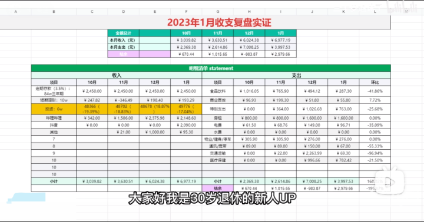
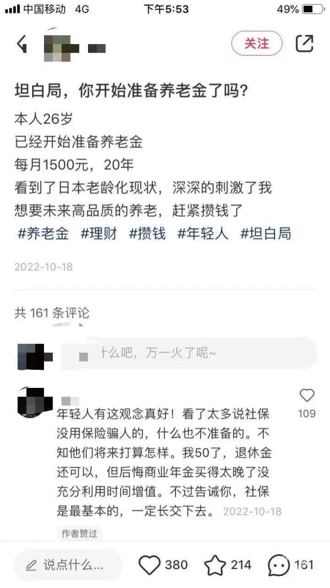
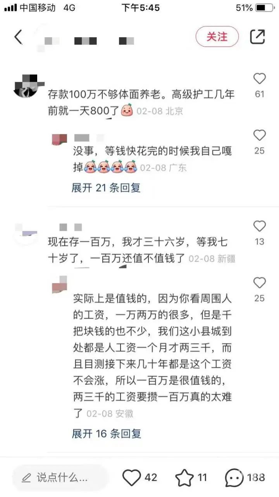

# 30岁硕士100万在云南“躺平式养老”，晚年想体面生活要多少钱？

你考虑过养老吗？你觉得积攒多少钱，可提前退休过上安详的退休生活？在网上，
**一位30岁的年轻硕士拿着100万元的本金，在云南过上了吃利息的“躺平式养老”生活，** 通过分享养老经验他成了B站养老区UP主，并吸引了不少年轻人关注。

当我们翻查微博、B站、小红书时，可以发现“养老”已经成为不少年轻人的共同话题，90后、95后甚至00后都在热烈讨论如何提前退休、如何攒够养老钱、如何优雅地过上老年生活，我们突然发现养老不再是一个人到中年才会去规划的议程，而是趁年轻先谋定。

**晚年要过比较体面的生活**

**究竟需要多少钱？**

1994年，麻省理工学院学者威廉·班根提出
**“4%原则”，只要在退休第一年从退休金本金中提取不超过4.2%之后，每年需要提取的金额=总额×(4%+通胀率)。即使到过世，退休金都花不完。**

举个例子，假设目前的通货膨胀率是3%，如果一个人想在晚年每月拿到5000元生活费，按照威廉·班根的公式，他现在至少要先准备857142.86元，才能达到目前标准下，一个看上去相对体面的晚年生活。

可以发现，这位UP主追随的就是这种模式，他将自己的100万元本金分成3份，其中84万存3年定期（接近4%原则下需要的本金数额），利率是3.5%，这样每个月可以得到2450元的固定收入；短期理财部分是10万元，获取相对较高的收益；剩余的6万元做高风险投资（比如股票），用于博取高回报。

看到这里，有不少的网友可能会质疑，每个月2450元的固定利息收入够花吗？如果是在北上广深或者杭州，相信99%的人都会回答不够，但如果这个人选择的是一个消费水平相对较低、生活较安逸的小城镇呢？答案或许就不一样了。

95后网友“糖糖”补充道，“过怎样的生活完全是个人选择，
**如果是在大城市，每个月房租就要四五千元，100万元本金养老不现实；但在四五线的小城市，一个月房租才六七百元，每个月花3500元，活得好好的大有人在，100万元养老完全是有可能的。”**

对于年轻人晚年养老究竟需要多少钱的问题，平安人寿浙江分公司相关工作人员陈理栋说，“这事实上是个非常个性化的问题，通常来说，晚年因为缺少了工资收入，很多人日常可用于支出的金额会降到年轻工作时的一半，
**因此年轻人想要规划养老，首先就要去思考现有工资替代率的问题，**
想办法补足晚年收入50%的那部分缺口；其次是对生活品质的追求，如果一个人对晚年生活的要求比较高，比如想在晚年去环游世界、享受高品质的生活，那他
**要在现有用于生活支出的基础上额外做一些规划，比如做更多的投资或者保险；** 最后，对于年轻人来说， **一定要养成强制储蓄的习惯，**
有了一定的经济基础和资本原始积累，才能应对日常生活中的一些不确定性，比如生病、意外，才能更好地达到晚年过上比较体面生活的养老目标。”

**三位年轻人的养老规划**

“我不想当自己老去的时候过着邋遢的生活，要到世界各地去走走，遛遛狗、拍拍照，和朋友喝着咖啡聊着天；绝对不是那种看不起病、叫不起护工，买菜还要斤斤计较的晚年生活。”杭州00后小郑在描述自己未来的老年生活时如是说，因此要早早地做好规划，提前30年甚至40年寻找“养老合伙人”。小郑告诉记者，
**“做养老规划越早越好** 。许多00后工作没多少年，靠投资为自己的晚年带来多少增量不大现实，因此
**对年轻人来说，开源节流可能是更加务实的决定。节省平时日常生活中一些不必要的开销** ，比如双11的一次冲动消费，或者是减少外出聚会社交的次数等等；
**另一方面就是开源，年轻人可以尝试多开拓下副业**
，比如网上接一些收费任务，如PS、电脑绘画、制作PPT、游戏陪练、帮忙摄影等等，趁年轻多学些技能，也为自己的养老生活做准备。”

90后李子坦言，“养老确实已排上了议程。”不过，相比一些同龄人的储蓄养老、基金定投养老，他更倾向 **“买房养老”**
。凭借爸妈给的一部分“启动资金”，他早早在海南买了一套50年产权的酒店式公寓，然后将房子出租给运营公司用作酒店客房。

他说，“ **房子出租收上来的租金，基本可以覆盖每个月买房的月供，等到未来房贷还清之后，剩下的钱全部可以用来养老**
。我现在外出旅游，也会考察一些其他城市的养老机构和房地产，比如云南、贵州等适合老年人生活的地方，如果发现这些地方的房价比较低，那么等到老的时候，我会卖掉自己住的房子和收租的房子，到这些地方居住。”

90后安安刚刚 **开通了自己的个人养老金账户**
。按照个人养老金制度，参加人每年缴纳个人养老金额度上限为1.2万元，并享受税收优惠。在安安看来，“存钱养老”无论从理念上还是实操上，都在影响着现在的年轻人。她说，“从2020年开始，我的工资基本上固定分为三份：一部分买基金，一部分买保险，剩下的‘拿出来花着玩’，而现在又多了个人养老金账户。
**个人养老金账户可以起到强制储蓄的作用，** 通过个人养老金账户取得的投资收益不用纳税。另外 **一些保险公司提供的养老保险产品也不错**
，一份每年交24000元的保险，连续交30年，从60岁开始每年可以领取72000元，也就是每月6000多元，终身领取。”

橙柿互动·都市快报 记者 林司楠

