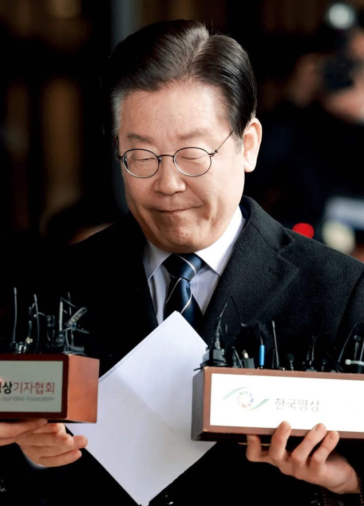

# “逮捕表决”被否，文在寅“接班人”逃过一劫

韩国最大在野党党首、被视为文在寅“接班人”的李在明，暂时躲过了“牢狱之灾”。2月27日，韩国国会就检方提出以涉嫌贪污、受贿、渎职罪逮捕李在明的动议进行表决，赞成139票，反对138票，因赞成票未达当天出席议员的过半数（149票）而未能通过。

_李在明。图/澎湃影像_

此前，韩国检方指控李在明在担任城南市长期间涉嫌在多个开发项目中收受开发商贿赂、泄露政策秘密，造成财政损失。李在明所属的共同民主党则指出，这是与检方关系密切的现任韩国总统、来自保守阵营的尹锡悦对进步阵营的政治报复，其最终目标指向韩国上一任总统文在寅。

值得注意的是，韩国历史上虽有新总统调查前任总统的“传统”，却没有现政府试图逮捕作为“最重要国政伙伴”的现任最大在野党领袖的先例。因此，检方提请逮捕李在明，也被视为韩国“总统魔咒”的一次升级。

考虑到李在明领导的共同民主党是韩国国会第一大党，对他的逮捕案被国会否决，在意料之中。然而，拥有169个席位的共同民主党早些时候宣称逮捕案将以“压倒性优势”被否决，结果却有约30位本党议员选择“背叛”。党内高级官员对韩国媒体透露，这显示出李在明对进步阵营的领导力遭到削弱。

2022年总统选举中，李在明选择了言辞激烈、行事激进的风格，并与文在寅政府“切割”，导致共同民主党内的分裂与“内耗”，最终以微弱劣势输给尹锡悦。大选中双方互相“揭黑”的无底线攻击，也使两人在中间选民中的声誉难以恢复。

如今，韩国国会选举将在2024年到来，而尹锡悦的支持率创下韩国民主化以来历届总统新低，李在明则官司缠身，双方阵营都不断传出“换帅”之声。在此背景下，通过司法调查破坏前人权律师李在明及进步阵营的“清誉”，推动共同民主党内部分裂，同时为自己树立“铁腕反腐”形象，是尹锡悦的策略。

李在明则难以团结共同民主党。曾任金大中秘书、青瓦台国政运营室局长的权起植指出，韩国前总理、曾得到文在寅支持与李在明竞争总统初选的李洛渊，正带领一部分议员谋求削弱李在明的领导权，为本党在明年的议会选举中谋求更大的生存空间。这些议员，正是2月27日表决中最主要的“背叛”团体。而李在明遭检方传唤时，其支持者攻击没有陪同李在明一起前往应讯的共同民主党议员们“不忠”，进一步加剧了这种对立。

虽然目前“内部反对势力规模不到40席”，但只要党内反对派稍稍扩大，李在明就难逃牢狱。《韩国先驱报》援引资深政治分析师的话说，检方可能会二次发出逮捕令，以寻求更多共同民主党议员“倒戈”。此外，检方还可以在不拘捕的情况下直接对李在明提起公诉。保守阵营议员们则纷纷呼吁李在明主动辞去国会席位，到案应诉。

文在寅执政后期，法务部长、前人权律师曹国案引发的丑闻，已经让韩国社会对进步阵营“袪魅”。共同民主党议员们必须权衡利弊：如果李在明卷入越来越多的腐败指控，本党是否会在即将到来的选举中失去中间选民的支持？2月27日投票后，共同民主党党鞭朴洪根坦言，党内对李在明有不同看法，领导层“将努力听取他们的意见”。

除了以“腐败”罪名攻击李在明，尹锡悦针对文在寅政府对朝友好政策的调查也在迅速推进。2月28日，韩国检方以“强制遣返弃朝渔民案”对文在寅政府的两任国家安保室长郑义溶、徐薰及前总统秘书室长卢英敏、前统一部长官金炼铁正式提起公诉。

“当前，尹锡悦政府在经济、安全等事务上难有建树，而明年的议会选举有对尹锡悦进行信任投票的性质，如果执政党不能超过半数议席，韩国政治将转变为‘大选政局’。”权起植指出。不过，对进步阵营的攻击能否转变为保守阵营的选票，尚未可知。分析人士多认为，共同民主党内的“背叛”指向李在明个人，而非进步阵营。2022年12月，检方提出对共同民主党议员卢雄来的逮捕案时，国会曾以161票的绝对多数予以否决。

发于2023.3.6总第1082期《中国新闻周刊》杂志

杂志标题：文在寅“接班人”逃过一劫

记者：曹然

