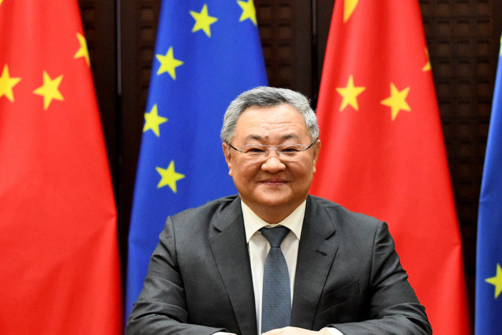

# 中国驻欧盟大使傅聪接受《环球时报》专访，信息量很大！

2023年2月21日，中国驻欧盟使团团长、特命全权大使傅聪接受《环球时报》独家专访，谈及中欧关系前景、乌克兰危机、台湾问题等热点话题。下文为专访实录：

_中国驻欧盟大使傅聪
使馆供图_

**欧盟领导人有望上半年访华**

**环球时报：您对今年中欧关系止跌回稳持乐观态度吗？**

**傅聪：** 虽然现在中欧关系依然面临一些困难，但我对中欧关系回暖持非常乐观的态度。

首先，中欧关系发展的政治基础非常牢固。习主席多次强调，中国和欧洲是维护世界和平的两大力量、促进共同发展的两大市场、推动人类进步的两大文明。中共中央政治局委员、中央外事工作委员会办公室主任王毅也多次强调，友谊是中欧关系的主基调，合作是中欧关系的总目标。不久前，王毅主任还在慕尼黑安全会议的讲话中专门提到，中欧如何作出选择将影响世界的走向，我觉得这体现出了我们对中欧关系的重视程度。

从欧方的角度，无论是欧盟的领导人还是欧盟成员国的领导人，也都对中欧关系给予了高度重视。二十大结束后不久，德国总理朔尔茨就访问北京。去年12月，欧洲理事会主席米歇尔也访问北京。目前，我们正在布鲁塞尔同欧方一道积极筹备欧洲理事会主席米歇尔、欧盟委员会主席冯德莱恩在今年上半年访华（举行中欧领导人会晤）的事宜。此外，一些副总理级等高级别磋商机制也将很快恢复。未来中欧间的高层互访将非常频繁。

其次，从经济方面来讲，中欧是天然的经济伙伴。我来到布鲁塞尔后，经常对欧方说，我们是合作伙伴，不是竞争对手，更不是所谓的制度性对手。中欧非常牢固的经济基础是进一步发展中欧关系的压舱石。

[if !supportLists]第三，中欧在外交理念上有很多相通之处，例如我们都倡导多边主义，在气候变化、军控、防扩散等领域，实际上中欧合作很好。

当然，中欧之间的确有一些具体的问题需要处理，这也是为什么我们双方的外交官应该尽最大的努力来排除障碍，解决这些具体问题，但中欧关系积极发展的大趋势应该是很明显的。

**中欧投资协定“解冻”需双方共同努力**

**环球时报：大家很关注目前仍处在“冻结”状态的中欧投资协定。今年我们有望看到中欧投资协定的重启吗？重启这份协定的关键有哪些？**

**傅聪：**
在当前全球经济不景气的大背景下，应尽早将《中欧全面投资协定》付诸实施，这对双方的经济和全球经济都会起到良好的推动作用。这也是为什么我来到布鲁塞尔后一个非常重要的工作就是推动欧方尽快批准这一重要协定。

我们提出，在这个问题上，要向前看，不纠结于过去，双方同时取消制裁，使协定能够重启。目前，欧方的反应是mixed（不一的），有的欧方人士认为这是一个好主意，但有人则认为时机尚未成熟。

《中欧全面投资协定》能否在年内实现“解冻”，我不敢打包票，但我可以从中方的角度说，我们是很诚恳地希望推动这一问题尽快解决。

我也向欧方说过，如果你们觉得中方的建议难以实施，也希望你们能提出你们认为可以解决这个问题的方法。中方的态度是开放的，只要建立在平等互利基础上的任何解决方案，中方都愿意积极考虑。

目前，我们正在和欧方积极沟通，应该说，我们收到了一些积极的回馈，但还需要双方更多的共同努力。

**环球时报：现在困难主要在哪方面？**

**傅聪：**
双方同时解除制裁，这是一个最直截了当的方案。但欧洲一些人士出于意识形态上的偏见，不愿意对中方解除制裁，因为他们在中国所谓的人权问题上有一些关切，并主张除非中方在人权问题上有改进，他们很难解除对中方的制裁。

但我们告诉欧方，首先你们对中国所谓的人权问题很多都是基于误解和偏见，本身就没有道理，在这个基础上又对我们进行制裁。我们是出于维护国家尊严的角度采取的反制，这是理所当然的。

同时，我们认为，在人权问题上，中欧之间有分歧是很正常的。我们可以心平气和地讨论，推动一些具体问题的解决，减少双方在人权问题上的分歧，或是澄清一些问题，我们愿意在这些方面作出努力。这也是为什么中欧重启了人权对话。我们希望这些努力有助于投资协定的“解冻”。

我常和欧方说，如果要等到中欧间所有政治和人权分歧都解决了，你们才和中方发展经贸关系，那要等到什么时候？所以我们呼吁欧方采取更理性的态度。人权方面的疑虑和关切另有渠道可以讨论，没有必要和经贸问题挂钩。

**欧方无权擅自解释一个中国政策**

**环球时报：谈到中欧关系这两年遇到的挑战，台湾是一个很难绕开的话题。您觉得，欧洲在台湾问题上的举动有没有已经接近动摇中欧关系的根基了？**

**傅聪：** 关于台湾问题，我特别想强调一点，那就是欧方在台湾问题上的立场必须得到中方的同意和认可。这一点很重要。

现在欧方有些人总说“欧方的一个中国政策”，好像他们的一个中国政策和我们的一个中国原则不是一回事一样，或者他们有权单独解释他们的一中原则。但我跟他们强调，中欧建交时欧方的承诺实际上包括了一项很重要的原则，就是欧盟的一个中国立场必须得到中国的认可。

欧盟机构的一些高官、反华议员去台湾窜访，都违反了一个中国的基本原则。还有欧洲议会议员提出要同台湾签署所谓的投资协议，如果这种事情发生，显然是对中欧关系政治基础的一次重大挑战。

至于这些消极的动向是否已经动摇了中欧间的政治基础？我的回答是，我们必须防微杜渐，防止它动摇中欧间的政治基础。如果不在最初的时候就遏制这种危险的态势，它就会不断发展。所以我们每次都非常明确地向欧方表明，这是中国的“红线”，你们不要触碰，否则中欧关系将面临严重的问题。

我想对方也接收到了这一信息。在欧方和我们的每一次会谈中，他们几乎都要强调说，他们不会改变一个中国原则。许多欧盟的官员说，他们成为外交官后上的第一堂课，就是一个中国原则，说已经融入他们的基因，请我们放心。但确实有些人会千方百计地不断虚化、掏空一个中国原则，这是我们需要随时保持警惕的，并及时跟欧方提出交涉。这是我们在前方的一项重要工作。

**王毅主任访欧传递的是和平信号**

**环球时报：不久前，中共中央政治局委员、中央外事工作委员会办公室主任王毅访问了欧洲多国，也访问了俄罗斯。现在正值俄乌冲突爆发一周年，这样的行程安排很受外界关注。您认为王毅主任的出访安排旨在向世界传递什么信号？**

**傅聪：**
首先是一个和平的信号。王毅主任说得很清楚，在乌克兰问题上，我们的立场归结为一句话，那就是劝和促谈。既访问欧洲又访问俄罗斯，传递的信息就是中国在劝和促谈，因为中方对目前的局势感到十分担心，现在危机显然在升级，双方都在准备着所谓的春季攻势或反攻，而这就意味着更多的杀戮。

王毅主任的访问安排也在传达另一个很重要的信息，即中欧关系不应该受到乌克兰问题的影响。受各种因素的影响，欧洲现在反俄情绪很高，很多情绪化的东西也反映在他们的政策中，同时有迁怒于中国的迹象。我觉得这很不理性。

中国是一个大国，有自己独立自主的外交政策，不会盲目跟随某一方的立场和政策。要求中方在乌克兰问题上同欧方采取完全一致的立场，这本身就不是很理性。而且对于欧方在乌克兰问题上的一些立场，我们也确实不是百分之一百同意，比如欧方许多高层说现在不是谈判的时机，这是理性的做法吗？我们不可能完全和欧方站在一起，但我们不希望乌克兰问题影响到中欧关系的发展。

我们也向欧方提出建议，推动和谈。外交不是一种情绪化的东西，人们可以有愿望，但也必须面对现实。外交的艺术，就是在两个比较困难的选择中，选择相对好一点的那一个，这是我们要努力的。否则这场战争将旷日持久。

**环球时报：我们注意到，美国总统拜登近日也访问乌克兰。中美前后脚分别访问俄乌成为很多媒体关注的焦点。这两个访问的性质是否类似？**

**傅聪：**
（中美前后脚分别访问俄罗斯和乌克兰）显然不是计划好的。拜登总统对乌克兰的访问是一种突然的访问，直到他出现在基辅，外界根本不知道他要去。而王毅主任对俄罗斯的访问是事先早就宣布了的。不应该在时机上把两个访问相提并论。

其次，双方的立场也有很大区别。拜登的访问聚焦在乌克兰危机上，意在支持这场战争继续。王毅主任访问俄罗斯则不止聚焦乌克兰问题，而是涉及到中俄关系的方方面面，乌克兰问题只是其中之一。在乌克兰问题上，我们采取的也是一个更加公正合理的立场，不会偏袒任何一方，而是劝和促谈，我想这是王毅主任在俄罗斯谈及乌克兰问题的主基调。

**乌克兰危机最终要在谈判桌上解决**

**环球时报：您认为俄乌冲突还有谈判解决的可能性吗？在您或者中国政府看来，结束冲突现在最大的障碍是什么？**

**傅聪：**
任何一场战争，都是在谈判桌上结束的。但我个人感觉，好像有关方面现在并没有和谈的愿望，所以我对短期内启动和谈比较悲观。不过我相信，经过一段时间的折冲，最后肯定还是要走到谈判桌上。

现在俄乌冲突已经是一种消耗战，很多场景很像一战期间的堑壕战，这意味着大量的前线士兵会战死，大量平民流离失所。与其到那时才意识到这场战争打不赢，到那时才谈判，不如现在就坐下来谈，而不是继续在战场上较量。

但显然一些人在拱火浇油。在我看来，幕后最大的黑手就是美国，最大的受益者也是它。只要乌克兰冲突存在一天，就有助于美国所谓的弱俄、控欧、遏华的基本战略，美国的军火工业就会发大财。

**环球时报：美西方似乎希望通过这场战争不断消耗俄罗斯的实力，把它逼回一个“二流地区国家”。在您看来，如果俄罗斯真的从一个大国衰落为一个“二流地区国家”，对世界秩序到底是灾难还是好事？**

**傅聪：**
首先能不能击垮俄罗斯，这要打一个很大的问号。如果西方以击垮俄罗斯为战争目标的话，这将是一场非常残酷的旷日持久的战争，而且会给世界带来极大风险，俄罗斯毕竟是一个核大国。

我常同欧洲同事讲，你们真的愿意冒这么大的风险继续这场战争吗？我们需要冷静和现实地分析当前的形势，然后采取合适的政策。

至于一厢情愿地说要把俄罗斯打回“二流国家”，甚至寻求在俄罗斯发生政权更迭，我认为这些都是很危险的言论，只能使战争不断升级。这意味着完全排除了和谈的可能，会造成更大的破坏和杀戮，是极不妥当的。

**美国用导弹打“气球”就如同用大炮打蚊子**

**环球时报：虽然您专注于欧洲事务，但是我们真的很想问一个中美关系的问题，因为全球真的太关注中美关系了。在这次慕尼黑安全会议上，王毅主任和布林肯进行了非正式接触。您觉得在非正式接触之后中美关系是能够翻过“气球事件”这一篇继续往前走？还是说“气球事件”还会继续对中美关系有一个比较长期的负面冲击？**

**傅聪：**
我觉得，从中方的角度，维护良好的中美关系是我们的政策目标，这点是不容置疑的。但是，要想维护好中美关系需要双方共同努力。而我们看到，美方无论是维护中美关系的诚意还是能力都让人产生疑问。

所谓的“气球事件”完全是偶发事件，中方在第一时间就向美方作出了解释。美方说中方没有与美方进行沟通，这本身就是虚假信息。而且，美方在最开始的时候，也不认为这是什么了不起的事。如果不是这样的话，为什么它不在气球进入它所谓的敏感地区上空之前把它击落，而是等它已经飞出美国大陆之后才击落？这就意味着它对所谓的“侦查”作用，也不是很在意。

但是，这个问题炒作成这个样子，是因为它成了美国党派之争的牺牲品。在党派之争的压力之下，美国采取了极为非理性的做法——用导弹打气球。这跟用大炮打蚊子也差不多了。它是非理性的，美国现政府如果真的重视中美关系的话，即使面对国内的一些压力，它也应该采取更加理性的解决办法。所以，我们对它的诚意首先表示怀疑。

第二，我们对它维护中美关系的能力也是产生了一些疑问。从整个问题的处理来讲，美国对国内非理性言论，不仅没有采取控制或者进行更清晰的解释，反而添油加醋、火上浇油，这样只能使国内的舆论场更加的反华。所以，我们对它的诚意和能力都表示怀疑。

“气球事件”是不是能够翻篇，首先取决于美方是不是还要继续炒作这个问题。它如果认识到自己的错误，不继续炒作，就会为这个问题的逐渐软着陆产生积极的影响。

**《概念文件》是中方全球安全理念的“集大成者”**

**环球时报：最后想请您谈一谈中方最近发布的《全球安全倡议概念文件》，您觉得它在这样一个时机发布，它的意义是什么？**

**傅聪：**
首先，我觉得这是中方的一个重要的文件，是对去年4月份习近平主席提出全球安全倡议的进一步阐释。应该说，从这个文件中我们能够看出，它首先是对联合国宪章和国际法基本原则的弘扬和继承。

第二，我的感受是，这是我们在国际安全领域立场主张的“集大成者”，把我们在不同场合提出的有关国际安全的立场和看法，形成了一个有机整体和完整方案。

第三，这个文件的提出也是习近平主席关于人类命运共同体理念的进一步升华，实际上是在国际安全领域进一步阐释了习主席提出的这一重大理念。

第四，这跟现在的局势密切相关，我觉得这是它最大的亮点。在这时提出《概念文件》，跟我们当前所面临的国际安全形势密切相关。当前，百年变局加速演进，国际格局正在经历深刻变化，许多不安定因素叠加，在欧洲乌克兰危机面临着升级的危险，在东北亚地区核扩散的风险也在急剧上升。在一些非传统安全领域，粮食安全、能源安全等也都日益凸显。所以，我们提出《概念文件》，全面阐述了我们在国际安全领域的一些重大主张，对解决当前所面临的国际安全困局具有很重要的指导意义。

